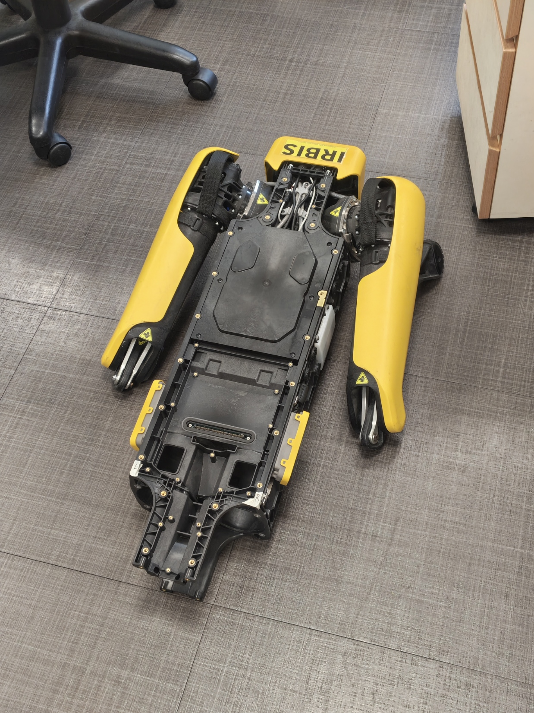

<div align="center">

# 🐾 Spot Rehabilitation

**Diagnosing & repairing a Boston Dynamics _Spot_ quadruped robot**
NUS · Undergraduate Research Opportunities Programme (UROP)

</div>

---

## 📖 About

The Spot robot dog in NUS has not been a very good boi lately. This repository documents the abuse of Spot and hopefully a full recovery 🦴.

---

## 🤖 Robot Status

> [!WARNING] AMPUTATED
> **❌🦵 Crippled:**  Currently a single amputee 😢😢



| | |
|---|---|
| 📅 **Last session** | 17-07-2026 — Attempt to read offset encoder, unsuccessful due to inability to power on driver STM32 to initiate clock signals. |
| 🎯 **Current focus** | Software SDK exploration |
| 🚧 **Blocking issue** | Unable to perform empirical tests to determine root cause of sensor read faults |

---

## 📊 Subsystem Status

| Subsystem | Flag | Active | Notes |
|-----------|:----:|:------:|-------|
| 🔋 **Power & Battery** | ✅ Complete |  | Pack #1, #2 rebuilt & verified (full charge, firmware updated) |
| 🦿 **Actuators & Legs** | 🔧 `WIP` | 👈 | Root cause CONFIRMED — defective LEFT secondary output-encoder Hall-IC (eL); encoder replaced, but occasional "sensor misread" warning causes stutters when walking backwards. Unable to empirically determine fault. |
| 🧠 **Compute & Mainboard** | ⬜ `N/A` |  | Not yet assessed |
| 📷 **Sensors & Cameras** | ❌ `FAIL` |  | Rear (back) RealSense camera firmware mismatch (running 5.17.0.10, needs 5.11.3.50) — root cause confirmed, blocked on sourcing correct firmware from Boston Dynamics |
| 📡 **Comms & Networking** | ⬜ `N/A` |  | Not yet assessed |
| 🦴 **Chassis & Mechanical** | ⬜ `N/A` |  | Not yet assessed |

<sub>**Flags** — ✅ `Complete` functional & verified · ❌ `FAIL` confirmed fault, needs repair · 🔧 `WIP` currently being worked on · ⬜ `N/A` not yet assessed</sub>

---

## 🗒️ Repair Log

Full logs in [`docs/battery/`](docs/battery/), [`docs/motor/`](docs/motor/), and [`docs/software/`](docs/software/).

> [!TIP]
> 📄 **Consolidated subsystem report:** [Battery pack repair](docs/subsystems/battery/battery-repair.md)

| Date | Session | Outcome |
|------|---------|:------:|
| 02-07-2026 | [Encoder EEPROM probe — root cause confirmed](docs/motor/2026-07-02-encoder-eeprom-probe.md) | ✅ |
| 01-07-2026 | [SpotCheck diagnosis + magnet swap](docs/motor/2026-07-01-spotcheck-diagnosis.md) | ✅ |
| 30-06-2026 | [Output encoder PCB swap](docs/motor/2026-06-30-output-encoder-swap.md) | ✅ |
| 25-06-2026 | [Hip motor teardown — secondary encoder identified](docs/motor/2026-06-25-motor-disassembly.md) | ✅ |
| 19-06-2026 | [Hip motor driver & cable swap — drivers and connections cleared of fault](docs/motor/2026-06-19-leg-component-swap.md) | ✅ |
| 18-06-2026 | [Battery #2 SoC cable repair & hip motor driver diagnostics](docs/motor/2026-06-18-driver-disgnostic.md) | ✅ |
| 17-06-2026 | [Battery pack #2 assembly at Sodion](docs/battery/2026-06-17-battery-2-assembly.md) | ✅ |
| 16-06-2026 | [Battery pack #2 design optimisation (V2)](docs/battery/2026-06-16-battery-design-v2.md) | ✅ |
| 15-06-2026 | [SPOT teardown & battery pack #2 disassembly](docs/motor/2026-06-15-robot-teardown.md) | ✅ |
| 12-06-2026 | [Actuator diagnostics — left hind leg encoder fault isolated](docs/motor/2026-06-12-joint-diagnosis.md) | ✅ |
| 11-06-2026 | [Battery fault diagnosis & re-weld](docs/battery/2026-06-11-battery-assembly-5.md) | 🔧 |
| 05-06-2026 | [Battery diagnostics & Spot update](docs/battery/2026-06-05-sw-update-and-test.md) | 🔧 |
| 04-06-2026 | [Battery assembly — BMS & charge test](docs/battery/2026-06-04-battery-assembly-4.md) | ✅ |
| 02-06-2026 | [Replacement battery assembly (3)](docs/battery/2026-06-02-battery-assembly-3.md) | 🔧 |
| 29-05-2026 | [Replacement battery assembly (2)](docs/battery/2026-05-29-battery-assembly-2.md) | 🔧 |
| 28-05-2026 | [Replacement battery assembly (1)](docs/battery/2026-05-28-battery-assembly.md) | 🔧 |
| 25-05-2026 | [CAD design of battery spacer](docs/battery/2026-05-25-cad-battery-spacer.md) | ✅ |
| 25-05-2026 | [DIY Li-ion pack design & safety](docs/battery/2026-05-25-battery-pack-design.md) | ✅ |
| 21-05-2026 | [Battery disassembly & sourcing replacement](docs/battery/2026-05-21-battery-disassembly-sourcing.md) | ✅ |
| 20-05-2026 | [Battery restoration attempt](docs/battery/2026-05-20-battery-restoration-attempt.md) | ✅ |
| 13-05-2026 | [Battery & controller inspection](docs/battery/2026-05-13-battery-controller-inspection.md) | ✅ |

---

## 🗂️ Repository Layout

```
Spot/
├── README.md                  ← Project overview & status board (this file)
├── templates/
│   └── dev-log-template.md     ← Copy this to start a new session log
├── data/                       ← Knowledge & reference pages
│   ├── electrical/             ← Encoder PCB, EEPROM, connector reference
│   └── software/               ← SDK, GraphNav/Autowalk, spot_ros2, setup guide, lit review
└── docs/
    ├── assets/                 ← Shared images & media, referenced by all docs
    ├── battery/                ← Battery repair session logs
    ├── motor/                  ← Motor / actuator / encoder session logs
    ├── software/               ← Software / setup / SDK session logs
    └── subsystems/             ← Consolidated per-subsystem reports
        └── battery/battery-repair.md
```

## 🔗 References

- [`spot_diagnostics`](https://github.com/Kmyming/spot_diagnostics) — our ROS 2 joint-feedback diagnostics node + web dashboard (see [software log](docs/software/2026-06-10-diagnostics-script.md))
- [Spot Battery Safety Data Sheets (SDS)](https://support.bostondynamics.com/s/article/Spot-Battery-Safety-Data-Sheets-SDS-49922)

---

## 👥 Team

| Name | Role |
|------|------|
| @eggsacc | UROP Researcher |
| @Kmyming | UROP Researcher |
| @NickInSynchronicity | Project Supervisor |

---

<div align="center"><sub>Last updated: 2026-07-17</sub></div>
