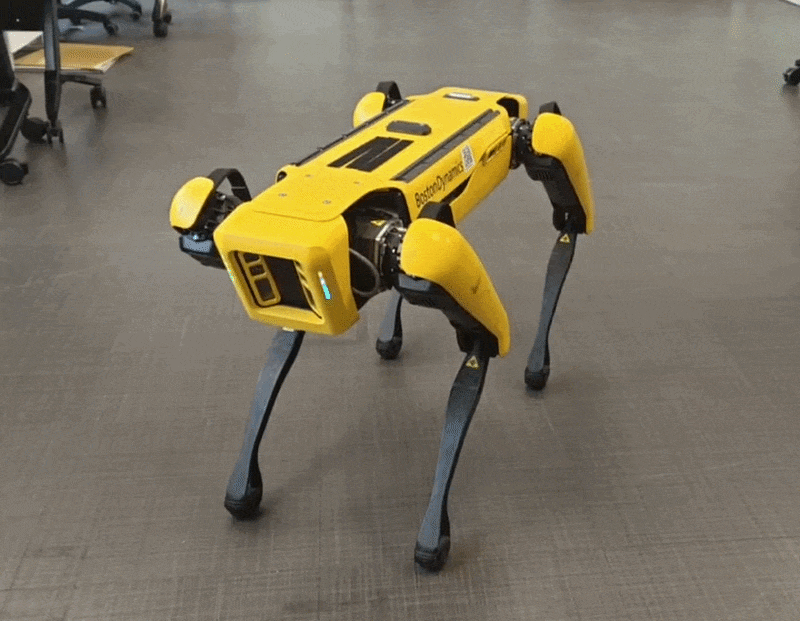
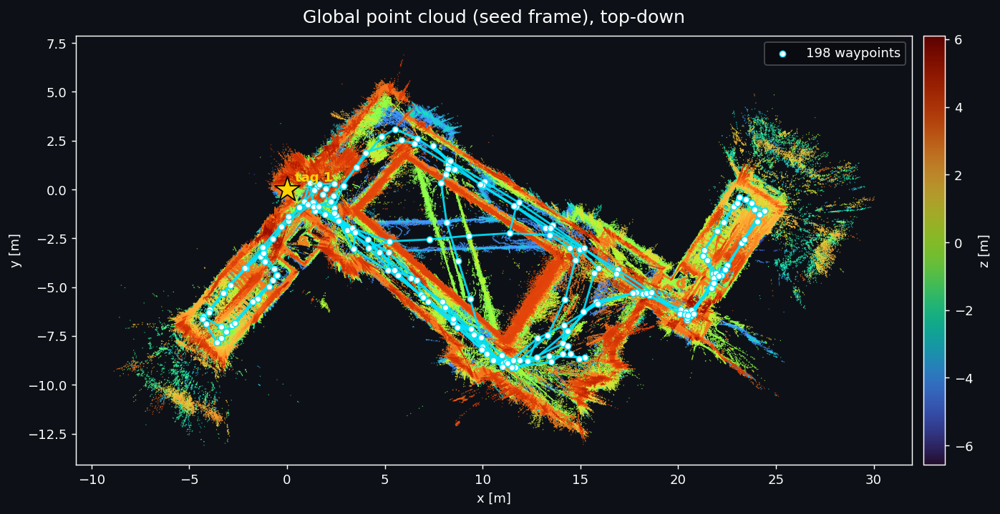
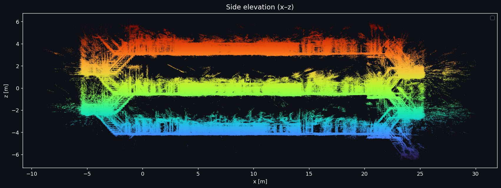
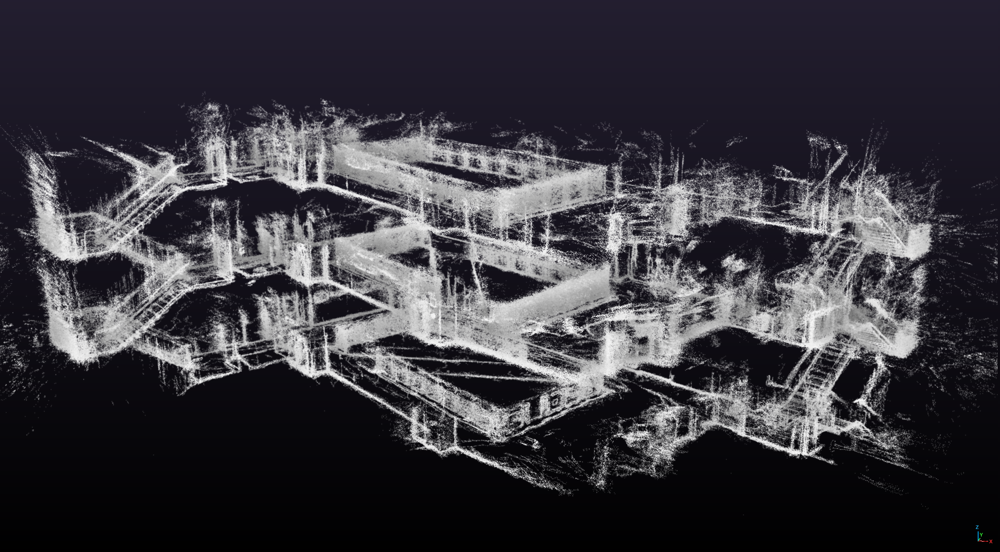

<div align="center">

# 🐾 Spot Rehabilitation

**Diagnosing & repairing a Boston Dynamics _Spot_ quadruped robot**

NUS · Undergraduate Research Opportunities Programme (UROP)


</div>

> [!NOTE]
> **🏁 This project wrapped up on 27 July 2026.**


## 📖 About

Years of neglect left Spot in a pitiful state: dead batteries and a broken leg. Instead of surrendering him to the shelter, we volunteered to bring him back and give him the love every dog deserves ❤️🦴. This repository documents the diagnostics and repair process of this big yellow dog.

## 🐶 Dog Status
>✅ Fully operational!

<div align="center">
  
</div>

---

## 👀 Overview

| | 🩻 On arrival | 🏁 At close |
|---|---|---|
| **Power** | Both battery modules refused to charge | Both packs rebuilt on their OEM BMS, full charge verified |
| **Mobility** | Left hind hip-X fails to move | Walks forward & backward, climbs stairs |
| **Perception** | Rear depth camera bricked (StereoProto fault) | Firmware transplanted from side camera, camera successfully inits |
| **Autonomy** | — | Autowalk missions + SDK mission behaviour trees |


## 📊 Subsystem Status

| Subsystem | Flag | Notes |
|-----------|----|-------|
| 🔋 **Power & Battery** | ✅ Complete | Pack #1, #2 rebuilt & verified (full charge, firmware updated) |
| 🦿 **Actuators & Legs** | ✅ Complete | Output stage encoder repaired |
| 🧠 **Compute & Mainboard** | ✅ Complete | Successful AutoWalk missions |
| 📷 **Sensors & Cameras** | ✅ Complete | Rear RealSense camera firmware fixed |
| 🦴 **Chassis & Mechanical** | ✅ Complete | Fully reassembled with new screws + threadlock |

---

## 🚶 AutoWalk

Multiple AutoWalk missions were performed to test Spot's capabilities. Below is an example mission using Spot to map out 3 levels of a building. The global map is reconstructed by transforming each waypoint snapshot's sensor payload into the common seed frame using the anchoring solution stored in the graph.

Recorded missions can be found in [/spot-autowalk-collections](./spot-autowalk-collections/).

>**Top-down view.** White circles represent waypoints recorded by Spot; blue lines are the connecting edges.



>**Side view.** 3 stories and staircases visible.



>**3D point cloud render** using [CloudCompare viewer](https://www.cloudcompare.org/).



🔍 [Autowalk decode deep dive](data/software/spot-autowalk-deep-dive.md) · 🌲 [Custom mission behaviour tree](data/software/autowalk-mission-behaviour-tree.md) · 🐍 [Scripts](spot-autowalk-collections/)

---

## 🗒️ Repair Log

Every session is written up as a dated log, grouped by subsystem:
[`docs/battery/`](docs/battery/) · [`docs/motor/`](docs/motor/) · [`docs/software/`](docs/software/)

> [!TIP]
> 📄 **Final UROP report:** [`report/urop-report.md`](report/urop-report.md)
> 📄 **Consolidated subsystem report:** [Battery pack repair](docs/subsystems/battery/battery-repair.md)

---

## 🔭 Future Work

Spot is fully usable as it stands, but is showing signs of component degradation.

>**Issue:** Spot check warns that the right hind hip-X encoder is <20% health. Testing has confirmed the issue to be the degraded ferrite Nonius magnetic ring that is tracked by the output stage encoder.

>**Recommended fix:** Purchase new Nonius ring from [Hutchinson](https://precisionsealingsystems.hutchinson.com/wp-content/uploads/2023/11/NoniusRing_datasheet.pdf), which was researched to match the dimensions of the OEM encoder ring. Opt for the rubber version for longer operation life.

---

## 🗂️ Repository Layout

```
spot-rehab/
├── README.md                   ← Project overview & status board (this file)
├── report/                     ← Final UROP report (Markdown, DOCX & build script)
├── templates/
│   └── dev-log-template.md     ← Copy this to start a new session log
├── data/                       ← Knowledge & reference pages
│   ├── electrical/             ← Encoder PCB, EEPROM, connector reference
│   └── software/               ← SDK, GraphNav/Autowalk, spot_ros2, setup guide, lit review
├── spot-autowalk-collections/  ← Recorded missions, decode & behaviour-tree scripts
└── docs/
    ├── assets/                 ← Shared images & media, referenced by all docs
    ├── battery/                ← Battery repair session logs
    ├── motor/                  ← Motor / actuator / encoder session logs
    ├── software/               ← Software / autonomy / SDK session logs
    └── subsystems/             ← Consolidated per-subsystem reports
        └── battery/battery-repair.md
```

## 🔗 Extras

[`spot_diagnostics`](https://github.com/Kmyming/spot_diagnostics) — our ROS 2 joint-feedback diagnostics node + web dashboard (see [software log](docs/software/2026-06-10-diagnostics-script.md))


## 👥 Team

| Name | Role |
|------|------|
| [@eggsacc](https://github.com/eggsacc) | UROP Researcher |
| [@Kmyming](https://github.com/Kmyming) | UROP Researcher |
| [@NickInSynchronicity](https://github.com/NickInSynchronicity) | Project Supervisor |

---

<div align="center">

**🐾 Spot is a good boi again 🦴**

<sub>Last updated: 2026-07-27 · Project concluded</sub>

</div>
