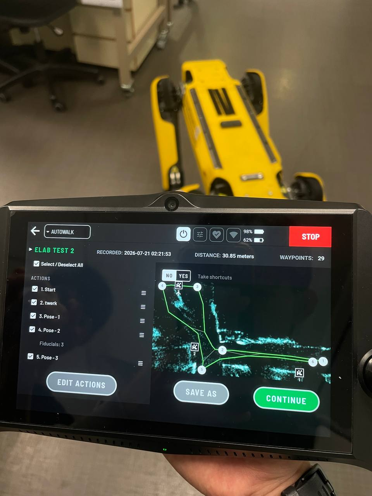
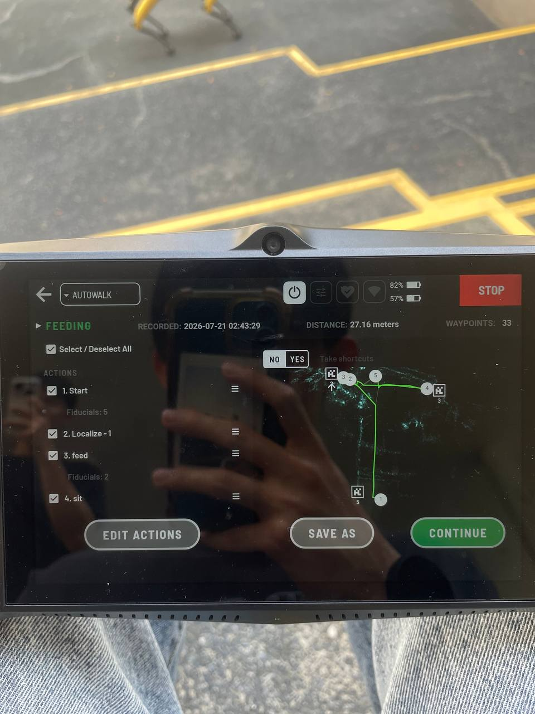
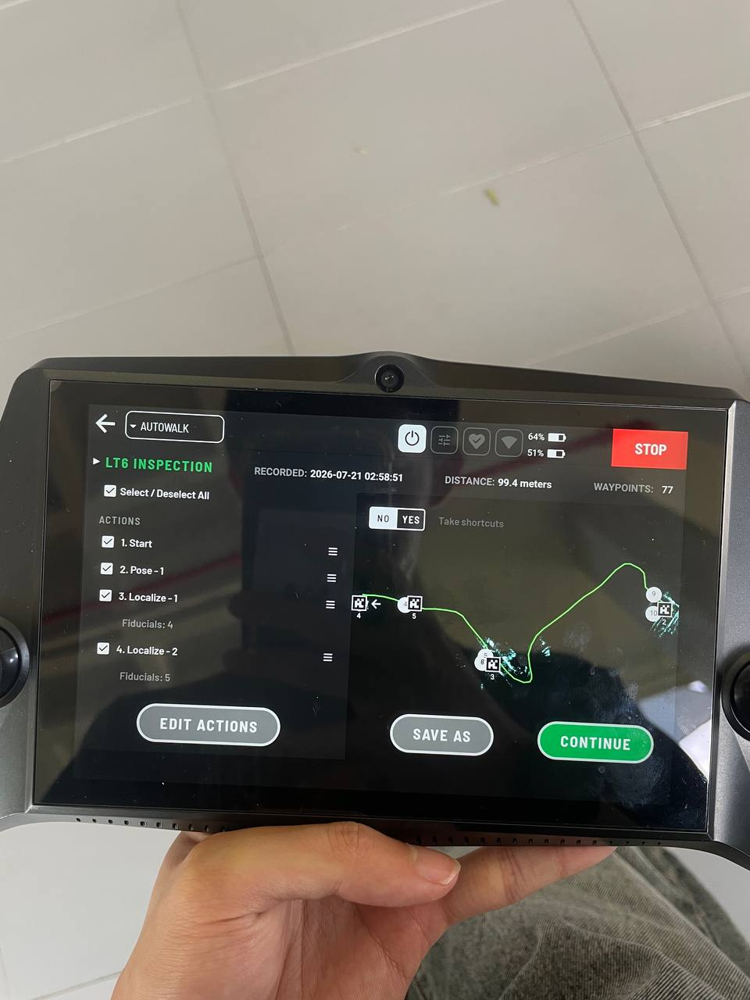

<div align="center">

# 🐾 Spot Rehabilitation

**Diagnosing & repairing a Boston Dynamics _Spot_ quadruped robot**

NUS · Undergraduate Research Opportunities Programme (UROP)


</div>

---

## 🏁 Project Concluded

> [!NOTE]
> **This project wrapped up on 27 July 2026.**
> 
> Spot came to us dead. Ten weeks later it walks, reverses, climbs stairs and runs autonomous missions on its own rebuilt packs.
> No further sessions are planned.

## 📖 About

The Spot robot dog in NUS has not been a very good boi lately. This repository documents the abuse of Spot which led to a full recovery 🦴.

## 🤖 Robot Status
>✅ Fully operational!

<div align="center">
  
</div>

---

## 👀 Overview

| | 🩻 On arrival | 🏁 At close |
|---|---|---|
| **Power** | Both battery modules refused to charge | Both packs rebuilt on their OEM BMS, full charge verified |
| **Mobility** | Left hind hip-X wouldn't track commanded positions | Walks forward & backward, climbs stairs |
| **Perception** | Rear depth camera bricked (StereoProto fault) | Firmware transplant side camera, SpotCheck clean |
| **Autonomy** | — | Autowalk missions + hand-built SDK mission behaviour trees |


## 📊 Subsystem Status

| Subsystem | Flag | Notes |
|-----------|----|-------|
| 🔋 **Power & Battery** | ✅ Complete | Pack #1, #2 rebuilt & verified (full charge, firmware updated) |
| 🦿 **Actuators & Legs** | ✅ Complete | Output stage encoder repaired |
| 🧠 **Compute & Mainboard** | ✅ Complete | Successful AutoWalk missions |
| 📷 **Sensors & Cameras** | ✅ Complete | Rear RealSense camera firmware updated |
| 🦴 **Chassis & Mechanical** | ✅ Complete | Fully reassembled with new screws + threadlock |

---

## 🚶 AutoWalk

Three missions were recorded and replayed end to end, each with fiducial localisation and pose actions at its waypoints — all three passed with no issues. A recorded walk was then decoded into a stitched global point cloud, and rebuilt as a hand-written Mission behaviour tree with operator branching.

| Mission | Map | Run |
|---|---|:--:|
| **Controlled indoor loop** — a room loop with pose actions at waypoints |  | [▶️](docs/assets/autowalk-elab-indoor.mov) |
| **Stairs** — a steep flight, up and down |  | [▶️](docs/assets/autowalk-stairs.mov) |
| **Patrol inspection** — a longer route, extended navigation + stairs |  | [▶️](docs/assets/autowalk-lt6-inspection.mov) |

🔍 [Autowalk decode deep dive](data/software/spot-autowalk-deep-dive.md) · 🌲 [Custom mission behaviour tree](data/software/autowalk-mission-behaviour-tree.md) · 🐍 [Scripts](spot-autowalk-collections/)

---

## 🗒️ Repair Log

Every session is written up as a dated log, grouped by subsystem:
[`docs/battery/`](docs/battery/) · [`docs/motor/`](docs/motor/) · [`docs/software/`](docs/software/)

> [!TIP]
> 📄 **Final UROP report:** [`report/urop-report.md`](report/urop-report.md)
> 📄 **Consolidated subsystem report:** [Battery pack repair](docs/subsystems/battery/battery-repair.md)

---

## 🔭 Future Work

Handover notes: known residuals, not open faults. Spot is fully usable as it stands.

- **Right hind hip-X encoder health** sits below the 20% SpotCheck threshold. Misreads are intermittent and does not inhibit operation; the durable fix is replacing the worn magnet discs.

> [!WARNING]
> Never accept `realsense-viewer`'s firmware-update prompt on a Spot camera - that is exactly what bricked the rear one.

---

## 🗂️ Repository Layout

```
spot-rehab/
├── README.md                   ← Project overview & status board (this file)
├── report/                     ← Final UROP report (Markdown, DOCX & build script)
├── templates/
│   └── dev-log-template.md     ← Copy this to start a new session log
├── data/                       ← Knowledge & reference pages
│   ├── electrical/             ← Encoder PCB, EEPROM, connector reference
│   └── software/               ← SDK, GraphNav/Autowalk, spot_ros2, setup guide, lit review
├── spot-autowalk-collections/  ← Recorded missions, decode & behaviour-tree scripts
└── docs/
    ├── assets/                 ← Shared images & media, referenced by all docs
    ├── battery/                ← Battery repair session logs
    ├── motor/                  ← Motor / actuator / encoder session logs
    ├── software/               ← Software / autonomy / SDK session logs
    └── subsystems/             ← Consolidated per-subsystem reports
        └── battery/battery-repair.md
```

## 🔗 Extras

[`spot_diagnostics`](https://github.com/Kmyming/spot_diagnostics) — our ROS 2 joint-feedback diagnostics node + web dashboard (see [software log](docs/software/2026-06-10-diagnostics-script.md))


## 👥 Team

| Name | Role |
|------|------|
| @eggsacc | UROP Researcher |
| @Kmyming | UROP Researcher |
| @NickInSynchronicity | Project Supervisor |

---

<div align="center">

**🐾 Spot is a good boi again 🦴**

<sub>Last updated: 2026-07-27 · Project concluded</sub>

</div>
