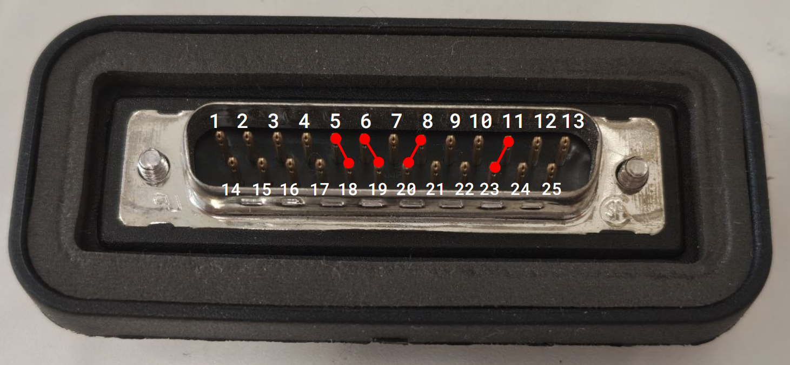

# DB25 port cover

The DB25 payload port covers have a special female connector inside with specific pins shorted. The shorted pins on the cover allows Spot to detect if the port is covered properly or not.

The shorted pins are reverse engineers by probing around with a multimeter for continuity.

We bought a female DB25 header, shorted the highlighted pins and plugged it into the payload ports. This successfully bypassed the "uncovered payload ports" error during motor power up.