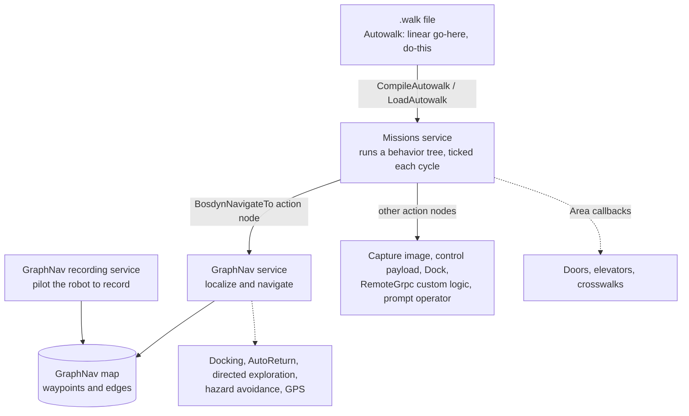
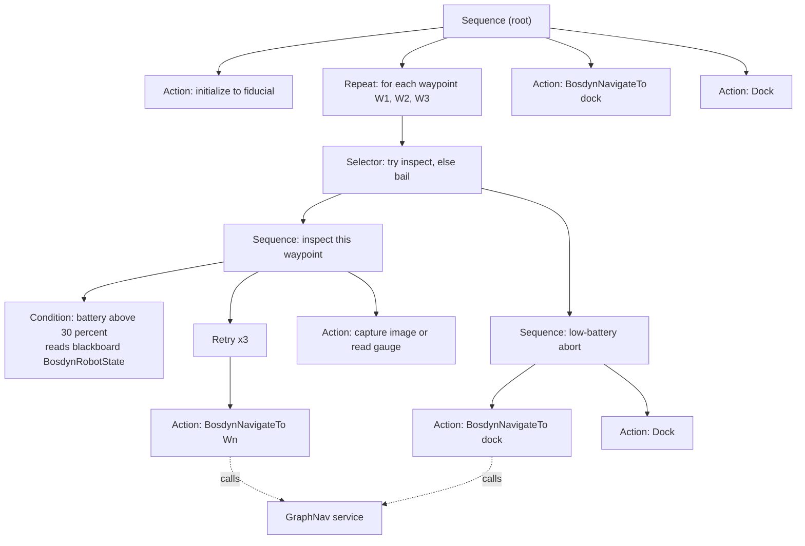
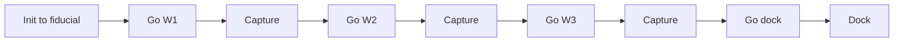

# GraphNav and Autowalk

GraphNav is Spot's mapping, localization and autonomous-navigation system. The model is record-then-replay: an operator manually drives Spot to record a map from the onboard sensors, the map is downloaded and optionally shared to other robots, and any robot in the fleet can then replay it autonomously. Autowalk is the higher, no-code layer on top that the tablet produces. This page covers the concepts, the architecture, the features, and the mission and autonomy capabilities.

For where our ROS 2 wrapper does and does not reach this stack, see [spot_ros2 wrapper](spot-ros2-wrapper.md) and [SDK vs Autowalk vs spot_ros2](sdk-vs-autowalk-vs-ros2.md).

## Concepts

GraphNav represents the world as a **locally consistent graph of waypoints and edges**, not a globally consistent metric map. Localization is feature based (visual, optionally LIDAR), anchored by AprilTag fiducials where features are thin.

> [!WARNING]
> Maps are not persistent across reboot. Snapshot data is cached on-robot (up to about 5 GB) but has to be explicitly downloaded before power-cycling or it is lost.

> [!NOTE]
> There is no global frame. The graph is only locally consistent, so different paths between two points can accumulate to different transforms. Anchoring optimization is what recovers metric consistency for large or multi-floor maps.

## Map structure

The map is a topological graph stored as reference frames plus sensor data.

| Element | What it is |
|---|---|
| **Waypoint** | A reference frame with a unique ID, name and annotations. Auto-created about every 2 m during recording, with manual ones added for mission-critical actions. |
| **Edge** | A directed connection between two waypoints carrying a 3D transform and traversal annotations (for example stair mode, speed limit). Auto-created between consecutive waypoints, also created manually or by loop closure. |
| **Snapshot** | Bundled sensor data on a waypoint (feature clouds, AprilTag detections, imagery, terrain maps). Edge snapshots hold only footstep locations. |
| **Anchoring** | An `SE3Pose` mapping each waypoint into a global seed frame. Anchoring optimization improves metric consistency for large or multi-floor maps and is where GPS `ecef_tform_waypoint` values are computed. |

Topology patterns are chains (linear), branches (off an existing chain), and loops (multiple paths between waypoints, needing manual edges or automatic loop closure). Loop closure lets the robot navigate directly between connected areas instead of reversing the whole recorded path. Downloading a map is two steps: retrieve the graph structure, then stream the snapshot data.

## Localization and initialization

Initialization establishes the initial pose against a loaded map. Localization then maintains it during navigation. They are distinct operations.

**Initialization** has three methods:
1. **Fiducial based (easiest).** AprilTag fiducials (146 mm squares). Localize to the nearest fiducial, the nearest at a target waypoint, or a specific fiducial. Fiducials are required for mission starts and feature-poor areas.
2. **Search based.** A `SetLocalization` RPC with `max_distance` and `max_yaw`, brute-force matched across the map, which can be computationally expensive.
3. **Scan match.** A proprietary local geometry and texture match. It needs a reasonable guess near a known waypoint, is strong in feature-rich areas (corners, doorways) and weak in bland spaces.

**Localization (ongoing)** fuses map priors, odometry and visual or geometric features, updates at 2 Hz or more, and estimates pose relative to specific waypoints. In feature deserts (darkness, texture-poor, changed sites, far from waypoints) it degrades and falls back to odometry alone. `STATUS_LOST` means the environment change exceeds thresholds, so autonomous navigation is blocked and needs an operator re-init. Stuck detection constrains movement to about a 3 m corridor around the recorded route.

> [!TIP]
> Fiducial placement: one at each mission start, mounted low on walls (45 to 60 cm), taped securely, in permanent spots. Avoid repeated identical fiducials within one mission, inconsistent or backlit lighting, and obstruction.

## Navigation commands

Once localized, three RPCs command movement:

| RPC | Behavior |
|---|---|
| **NavigateTo** | Simplest. Go to a map destination, GraphNav auto-selects the fewest-edges route. |
| **NavigateRoute** | The client specifies the exact path (for example to force a longer route). |
| **NavigateToAnchor** | Go to approximate x, y, z relative to the seed frame, or to global and GPS coordinates. |

Clients set the max speed and the goal-region size at the final waypoint. Feedback reports "following route" versus "reached goal", matched by position and yaw at the final waypoint.

## Missions and Autowalk (the service layer)

The three services stack on top of each other. GraphNav does the driving, Missions decides what to do, and Autowalk is just an easy front end that compiles down into a Mission.

**Missions service.** Behavior trees drive autonomous behavior, ticked each cycle.
- *Structural nodes:* Sequence, Selector, Repeat, Retry, ForDuration, SimpleParallel, Switch.
- *Action nodes:* query state, issue commands, `BosdynNavigateTo` (navigate), prompt the operator, control payloads, choreography, `RemoteGrpc` (custom external logic).
- *Blackboard:* scoped variable sharing across the tree (for example a `BosdynRobotState` battery value feeding a `Condition` node).
- *Playback RPCs:* `LoadMission`, `PlayMission`, `PauseMission`, `RestartMission`. Missions are recorded through the GraphNav recording service.

**Autowalk service.** A higher-level abstraction above missions: a linear "go here, do this" sequence of target, action and failure behaviors. It is editable, and is translated into a mission through `CompileAutowalk` and `LoadAutowalk`. Targets live inside a GraphNav map context (the map has to be uploaded first). The `.walk` file is a `bosdyn.api.autowalk.Walk` proto, and since Spot 4.1 it carries a dock-config field. This is what the tablet's Autowalk produces.

### Example mission: behavior tree vs Autowalk

Take a battery-aware inspection loop: visit three waypoints, read a gauge at each, retry navigation if it fails, and abort to the dock if the battery runs low.

As a **Mission**, that is a behavior tree. It is ticked every cycle, and the node types let it branch, loop, retry, and read robot state. A `Selector` runs its children in order until one succeeds, so the inspect branch is tried first and the robot only bails to the dock if the battery condition or the navigation fails.

As an **Autowalk**, the same inspection is a straight line. There is no battery condition, no branching, and no shared retry logic. Each element carries only its own per-action failure behavior, and the system compiles the whole thing into a simple mission for you.

**The difference.** A Mission behavior tree can branch (`Selector`), loop (`Repeat`), retry (`Retry`), and make decisions from live state (`Condition` reading the blackboard). Autowalk is a flat list of target, action and failure-behavior. So Autowalk is the fast no-code path when the inspection is a fixed sequence, and you move to a hand-built Mission (or the SDK) when you need the conditional and looping logic the tree gives you.

## Callbacks, safety and recovery

- **Area callbacks** run predetermined actions whenever the robot traverses annotated edge regions (crosswalks, doors, elevators), independent of any mission. A gRPC service (BeginCallback, UpdateCallback, BeginControl, EndCallback) sets one of three policies at region boundaries: Stop, Control (GraphNav hands over authority through a Lease), or Continue On. In Python we subclass `AreaCallbackRegionHandlerBase` and serve it via `AreaCallbackServiceServicer`.
- **Hazard avoidance.** Clients submit `HazardObservation` messages (our own app detects hazards from sensor data) as PointCloud, image, Box2, Circle or CircleList. Types range from restrictive (`NEVER_STEP_ACROSS`, `NEVER_STEP_ON`) through penalties (`PREFER_AVOID_WEAK` or `STRONG`) to hybrids with margins. Over-specifying hazards can block every path.
- **AutoReturn.** On comms loss, it retraces the recent path in reverse to try to restore operator control, bounded by a maximum displacement. It has to be enabled per operator. E-Stop timeouts still halt it, environmental changes can block the return, and it can run until battery depletion, so set displacement conservatively.
- **Directed exploration.** A last resort when all mapped routes are blocked. It uses onboard sensors to reach nearby waypoints (even unconnected ones), coping with moved or added obstacles and doors.

## Integrations: docking and GPS

**Docking.** The Spot Dock is a charging station (power plus high-speed ethernet) with two indexing cones and a connector interlock, detected via a body fiducial. RPCs are DockingCommand, DockingCommandFeedback, GetDockingConfig, GetDockingState. Docking takes about 30 s to `STATUS_DOCKED` then auto power-off. Undock with `prep_pose_behavior=PREP_POSE_UNDOCK`. Missions integrate docking through post-docking callbacks. Our robot has the Enterprise self-charging dock.

**GPS.** Spot cannot read a receiver directly. A payload translates the receiver into `NewGpsDataRequest` (GCS or ECEF position, satellite count, timestamps, antenna offset). Raw GPS is stored in waypoint snapshots, then anchoring optimization computes `ecef_tform_waypoint` per waypoint. GPS enables autonomous navigation on large outdoor maps with sparse or repetitive features, reverting to cameras, LIDAR and fiducials when signal drops.

## References

- Concepts > Autonomy (GraphNav): https://dev.bostondynamics.com/docs/concepts/autonomy/readme
- Autonomy technical summary: https://dev.bostondynamics.com/docs/concepts/autonomy/graphnav_tech_summary
