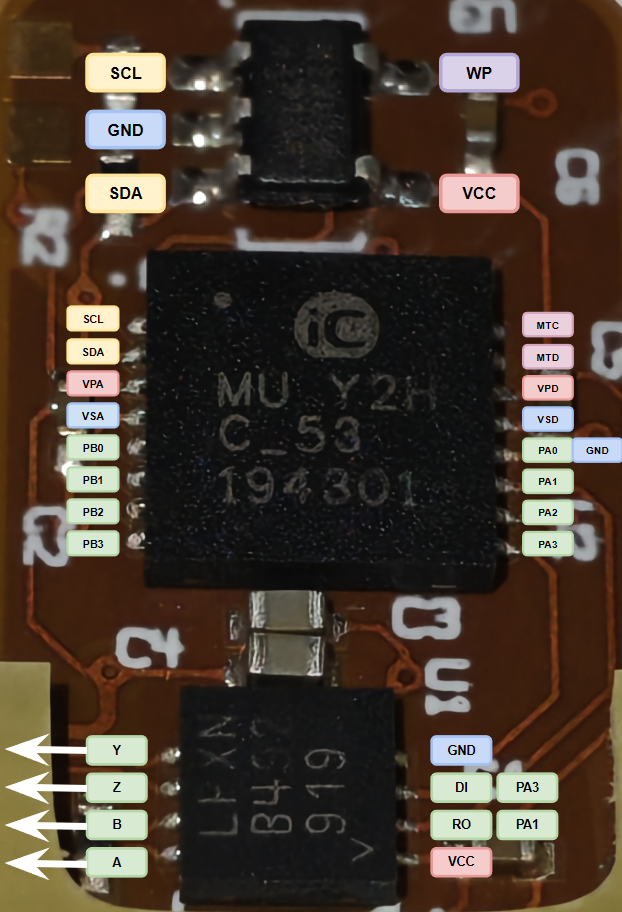

# IC-MU electrical connections 

## PCB components

This PCB section holds the IC-MU encoder, the external EEPROM and a RS485 transceiver IC. Test pads are exposed for the `SDA/SCL` lines, likely used to program the EEPROM.

## Pinout & connections

- `PA0` on the IC-MU is tied to ground, revealing that the fall-back communication protocol defaults to `BiSS`.
- `DI` on transceiver -> `PA3` of IC-MU.
- `RO` on transceiver -> `PA0` of IC-MU.

Wiring is a textbook ExtSSI slave node:

| iC-MU pin | Function (MODEA=7) | Connection |
|---|---|---|
| PA0 | NPRES | floating, 30 µA internal pull-up → high ✅ |
| PA1 | MA (clock in) | ← LTC2863 RO ✅ |
| PA2 | SLI (slave in) | GND ✅ (correct for single slave, no chain) |
| PA3 | SLO (data out) | → LTC2863 DI ✅ |
## Connector PCB testpads

The test pads on the connector flex PCB maps to the voltage supply and the `A/B/Z/Y` outputs from the `LTC2863` transceiver. The presence of these test pads suggests that this offset encoder section is often tested/debugged for issues.

We think the Boston engineers may use these to test for encoder health metrics, since one of the warnings we encountered during Spot check was "Encoder health <20%". We were able to identify some potential metrics the encoder may feedback that the engineers use to gauge "encoder health", but empirical testing is difficult as specialised hardware (2x RS485 transceivers) is required to communicate with the sensor.

## Signal routing

We originally designed a breakout PCB to tap the pins on the main motor connector. However, after some probing, we realised that none of the `A/B/Z/Y` pins from the transceiver connects to the output. Instead, the offset IC-MU encoder board is connected directly to the STM32 MCU on the motor driver.

This explains the initial issue of the motor not entering a lock-out state:
- Driver PCB likely uses the offset encoder reading (the actual absolute joint angle post-reduction) to drive the PID control loop.
- The axial encoder is only used to detect rotor angle for FOC algorithm inverse Park transforms.
- The driver STM32 MCU processes both angle readings and formats a feedback to the main connector through CAN bus (there is a CAN transceiver on the driver).

Hence, the hypothesis of the offset encoder being the root cause is further justified. Frozen reading/constantly dropped data frames from this sensor causes the local FOC PID control loop to see no offset errors and hence generate no correction signal, causing the actuator to remain limp during lock-out. The MCU just streams the static value back to the main compute module without explaining. 