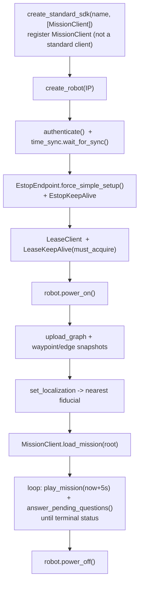
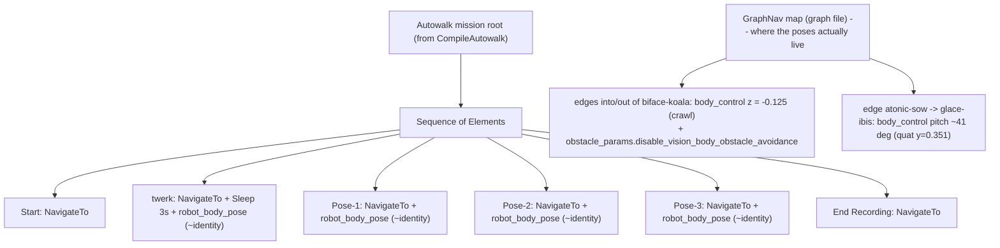
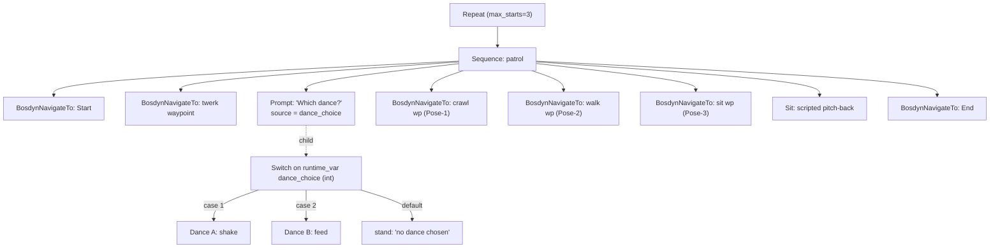
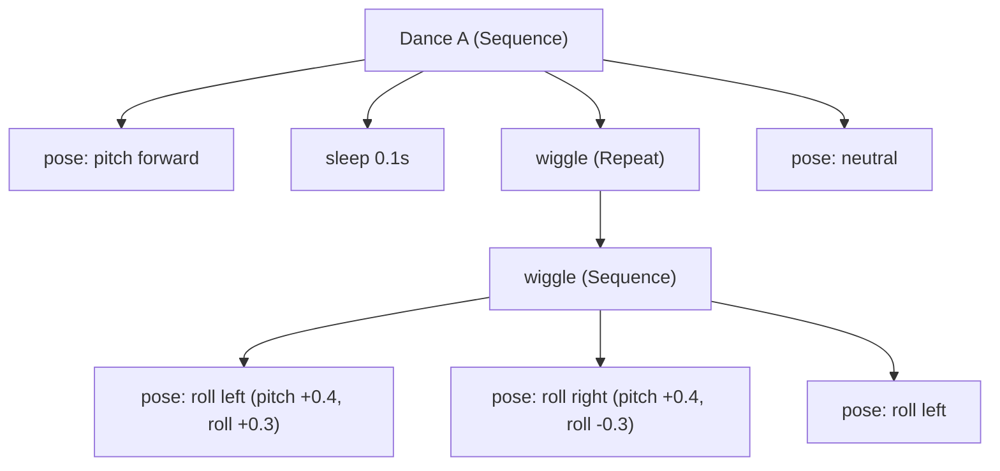

# Autowalk to custom mission: behaviour-tree build

How we turn a recorded Spot autowalk into a hand-built **Mission behaviour tree** that we control, add branching to, and inject custom actions into. Built and run against the `elab test 2` indoor walk. The runnable code is `spot-autowalk-collections/elab_behavior_tree.py`; this page explains the design, the trees, the body-pose bug we hit, and the fix.

The reusable SDK vocabulary (service / RPC / message, `Node` vs `Element`, `RobotCommandBuilder`, the mandatory startup flow, local setup) lives in [SDK: architecture and client flow](spot-sdk.md); the GraphNav map decode is in [autowalk deep-dive](spot-autowalk-deep-dive.md). This page assumes those.

## What we built

- Recorded `elab test 2` on the tablet: a short indoor route with a **twerk** waypoint, a **crawl under a table** (Pose-1 lower, Pose-2 raise), and a **pitch-back** (Pose-3), plus Start / End.
- Hand-built a Mission behaviour tree in Python that navigates the route, asks the operator **which dance to perform** (Prompt + Switch), performs a scripted dance, and strikes the pitch-back, all wrapped in a loop.
- Uploaded the GraphNav map, loaded the tree with the Mission service, and played it, answering the dance prompt from the console.

We hand-build the navigation with `BosdynNavigateTo` nodes rather than `CompileAutowalk`, because a compiled autowalk is one opaque block that we cannot splice branching into. Hand-building lets us interleave the Prompt/Switch and the scripted actions.

## Setup and run flow

Everything the program does, from connection to shutdown:



Notes that bit us:
- **`MissionClient` is not a standard SDK client** (it lives in `bosdyn-mission`). Register it in `create_standard_sdk(name, [MissionClient])` or you get `UnregisteredServiceTypeError`.
- The map must be **uploaded and localised** before `load_mission`, and a **fiducial must be visible** at start (`set_localization` with `FIDUCIAL_INIT_NEAREST`).
- `play_mission(pause_time)` is a keepalive: we re-call it in a loop with a near-future pause time until the mission reaches a terminal status.

## The original autowalk (for reference)

`CompileAutowalk` would turn the recorded `Walk` into a mission that is a **linear sequence of per-element subtrees** (navigate to the element's target, run its action). Conceptually:



The important part is the box on the right: **the recorded body poses are not in the Walk elements, they are in the map edges** (see the bug section).

## The custom mission behaviour tree

What `build_tree` assembles (loop wrapper around the patrol sequence):



The conditional is the piece worth understanding. **A `Prompt` writes the chosen option's `answer_code` to a blackboard variable named by its `source`; a `Switch` reads that variable via `pivot_value.runtime_var` and runs the matching `int_children` branch.** The `Switch` must be the `Prompt`'s **child** (not a sibling), because the answer variable is scoped to the prompt's subtree. The `Switch` also needs a real `default_child`, or the compiler rejects the empty default node.

Dance A expands to its own subtree:



Dance B (feed) and the Sit (pitch-back) are the same shape, just different `pose_node` angles.

## Code walkthrough

Node helpers (each returns a `nodes_pb2.Node` wrapping exactly one node kind):

- **`command_node(name, cmd)`** - wraps a `RobotCommand` in a `BosdynRobotCommand` node. Every scripted pose/sit goes through this.
- **`navigate_node(name, wp)`** - a `BosdynNavigateTo` node (`service_name='graph-nav-service'`). GraphNav navigation is a mission node, **not** a `RobotCommandBuilder` call.
- **`pose_node(name, yaw, roll, pitch, height)`** - a stand command with a body orientation. `footprint_R_body` takes a `bosdyn.geometry.EulerZXY` **directly** (the builder converts it; do not call `.to_quaternion()`).
- **`sleep_node(secs)`** - a `Sleep` node. `Sleep.seconds` is a **float** (not nanoseconds).
- **`sequence_node(name, [children])`** - a `Sequence`.

Dances and actions:
- **`build_dance_a`** (shake), **`build_dance_b`** (feed), **`build_sit`** (pitch-back) - each a small `Sequence` of `pose_node`s. `Repeat.max_starts` (int32) controls loop count.
- **`action_node(el)`** - reissue an element's recorded action: `robot_body_sit` -> `synchro_sit_command`; `robot_body_pose` -> read the rotation quaternion and convert to `EulerZXY` via `Quat.to_roll()/to_pitch()/to_yaw()`. (In practice our elements' poses were identity - see the bug.)
- **`edge_pose_node(graph, name, from_wp, to_wp)`** - the fix: read the recorded pose off a map **edge** and command it (see below).

Conditional and assembly:
- **`build_conditional_dance`** - Prompt + Switch, wired as above.
- **`dest_wp(el)`** - destination waypoint id from an element's target, handling both `navigate_to` (single) and `navigate_route` (list, take the last). Using the wrong accessor returns `''` and the mission fails to compile.
- **`build_tree(elems)`** - assembles the patrol sequence and wraps it in `Repeat` when `LOOP`.

Map + play:
- **`upload_graph_and_snapshots`** - uploads the `graph`, each waypoint/edge snapshot, then localises to the nearest fiducial.
- **`answer_pending_questions`** - reads `get_state().questions` and answers the dance Prompt from the console (or answer it on the tablet).

## The body-pose bug, and the root cause

**Symptom.** The recorded crawl-under-table reproduced fine just from navigation, but the recorded pitch-back did not, and reading the pose out of the element gave nothing. Our first `build_dance_b` / `build_sit` tried `elems['twerk'].action_wrapper.robot_body_pose.body_height` / `.footprint_R_body` - those attributes do not exist, and the pose that does exist (`target_tform_body`) was **identity** in every element.

**Investigation.** Dumping the elements showed every `robot_body_pose.target_tform_body` is essentially identity (rotation `w ~ 1`, others `~1e-5`; position `~1e-6`). So no element stores a real pose. But on replay the robot still crawled under the table - which it had refused to do during recording until we manually lowered it. If it were only obstacle avoidance, replay would refuse the table too. So the lowered body **must** be stored somewhere.

**Root cause.** The recorded body poses live in the **GraphNav map edges**, not the Walk elements. Decoding the `graph` file, each edge carries `Edge.Annotations.mobility_params.body_control.base_offset_rt_footprint`, and:
- Three edges around `biface-koala` (Pose-1) set the body offset **z = -0.125** (12.5 cm lower) - the crawl - and their override mask includes **`obstacle_params.disable_vision_body_obstacle_avoidance`**, which is why the robot goes under the table on replay instead of refusing it.
- One edge (`atonic-sow -> glace-ibis`) sets a body **rotation** of quaternion `y = 0.351, w = 0.936`, a **~41 degree pitch**.
- Every other edge is identity.

So the tablet stores recorded body posture as **per-edge mobility overrides on the map**, applied while the robot traverses that edge. That is why `BosdynNavigateTo` reproduced the crawl (our route crossed the lowered edges) but not the pitch (the pitched edge was not on our route): an edge's body pose only fires when the robot actually walks that edge. The full autowalk reproduces everything because it follows the exact recorded edge sequence; a bare `NavigateTo` reproduces only the poses on whatever route the planner chooses.

## The fix: `edge_pose_node`

Because the pose is edge data, we can read it out and command it directly, without running the route:

```python
def edge_pose_node(graph, name, from_wp=None, to_wp=None):
    for e in graph.edges:
        if from_wp and e.id.from_waypoint != from_wp:
            continue
        if to_wp and e.id.to_waypoint != to_wp:
            continue
        pts = e.annotations.mobility_params.body_control.base_offset_rt_footprint.points
        if not pts:
            continue
        pose = pts[0].pose                       # SE3Pose: position + rotation
        rot = pose.rotation
        q = math_helpers.Quat(w=rot.w, x=rot.x, y=rot.y, z=rot.z)
        R = bosdyn.geometry.EulerZXY(yaw=q.to_yaw(), roll=q.to_roll(), pitch=q.to_pitch())
        return command_node(name, RobotCommandBuilder.synchro_stand_command(
            body_height=pose.position.z, footprint_R_body=R))
    return None
```

Match the pitched edge by its waypoints, read `body_control` (position `z` + rotation quaternion), convert the quaternion to `EulerZXY` with `Quat.to_roll()/to_pitch()/to_yaw()` (the same conversion `action_node` uses), and hand it to `synchro_stand_command`. The robot strikes the recorded pose as a stationary stand, no route needed. The two ways to reproduce a recorded edge pose:
1. **Run the route** - `BosdynNavigateRoute` along the recorded edges (or `CompileAutowalk`); the override fires during traversal.
2. **Extract and command** - `edge_pose_node` above; strikes the pose on demand at any waypoint.

For a demo we take option 2, or just script the pose value directly (the pitch is `~0.717 rad`).

## Appendix A: what is stored in an Element

An autowalk `Walk` is a flat list of `Element`s (`bosdyn.api.autowalk`). Here is one **real element** exactly as it prints (`print(el)`) — the `twerk` element from our walk — so each field maps to what you actually see:

```text
name: "twerk"
target {
  navigate_to {                                    # <-- oneof target: this element uses navigate_to...
    destination_waypoint_id: "parted-mako-MS8EMEJdZwg.cbcIM1OIIw=="   # ...but recorded route elements use navigate_route instead
    travel_params {
      max_distance: 0.2
      feature_quality_tolerance: TOLERANCE_IGNORE_POOR_FEATURE_QUALITY
      blocked_path_wait_time { seconds: 5 }
      ground_clutter_mode: GROUND_CLUTTER_FROM_FOOTFALLS
      planner_mode: PLANNER_MODE_SHORT_RANGE
    }
    destination_waypoint_tform_body_goal { }       # empty -> stop on the waypoint, no offset
  }
}
target_failure_behavior {                          # what to do if navigation fails
  retry_count: 2
  prompt_duration { seconds: 60 }
  proceed_if_able { }
}
action {
  sleep {                                          # <-- the element's action is a Sleep...
    duration { seconds: 3 nanos: 3907442 }
  }
}
action_wrapper {
  robot_body_pose {                                # <-- ...held under this body pose while the action runs
    target_tform_body {
      position { x: 3.722588717280928e-07 y: 2.4650630818356944e-05 z: 1.1459826110282734e-07 }
      rotation { x: -2.266814225393432e-05 y: -6.6440642934040284e-06
                 z: -1.3916996399965242e-05 w: 1.0000000072978028 }   # <-- IDENTITY (w~1): no real pose here
    }
  }
}
action_failure_behavior {
  retry_count: 2
  prompt_duration { seconds: 60 }
  proceed_if_able { }
}
battery_monitor {                                  # pause/resume battery thresholds
  battery_start_threshold: 60
  battery_stop_threshold: 15
}
action_duration { }
id: "2dd12d9a-4e40-4cdd-9e00-f540fb56af96"
```

Field by field:

| Field | Meaning |
|---|---|
| `name`, `id` | element label and unique id |
| `target` | oneof `navigate_to { destination_waypoint_id, travel_params, ... }` **or** `navigate_route { route { waypoint_id[], edge_id[] } }` |
| `target_failure_behavior` | what to do if navigation fails (retry_count, prompt_duration, proceed_if_able) |
| `action` | oneof `sleep` / `data_acquisition` / `remote_grpc` / `node` / `execute_choreography` (our elements: `sleep`) |
| `action_wrapper` | optional sub-messages held during the action: `robot_body_sit`, `robot_body_pose { target_tform_body }`, `spot_cam_*`, `arm_sensor_pointing`, `gripper_*` |
| `action_failure_behavior` | what to do if the action fails |
| `battery_monitor` | start/stop battery thresholds (60 / 15 here) |
| `action_duration` | how long to hold the action |

**Key point:** in our walk, `action_wrapper.robot_body_pose.target_tform_body` is **identity for every element**. The element carries the navigation target and a (neutral) placeholder pose; the real recorded posture is on the map edges.

## Appendix B: what is stored in an Edge

The GraphNav `graph` file is a `Graph { repeated Waypoint waypoints; repeated Edge edges; Anchoring anchoring }`. Here is a **real edge** — the crawl edge `tabby-bat -> biface-koala (Pose-1)` — in proto-text form (reconstructed from the graph decode), showing where the recorded body posture actually lives:

```text
id {
  from_waypoint: "tabby-bat-...=="
  to_waypoint:   "biface-koala-7l1N9DpJ5n8JGKWtwouqLQ=="
}
snapshot_id: "...edge_snapshot..."                 # recorded foot-fall / terrain data in edge_snapshots/
from_tform_to { ... }                              # SE3Pose: relative transform between the two waypoints
annotations {
  mobility_params {                                # <-- the recorded traversal params (bosdyn.api.spot.MobilityParams)
    body_control {
      base_offset_rt_footprint {
        points {
          pose {
            position { x: 0 y: 0 z: -0.125 }        # <-- BODY LOWERED 12.5 cm == the crawl
            rotation { w: 1 x: 0 y: 0 z: 0 }        # identity: no tilt on THIS edge
          }
          time_since_reference { }
        }
      }
    }
    obstacle_params {
      disable_vision_body_obstacle_avoidance: true  # <-- lets the body pass UNDER the table
    }
  }
  # override field mask on this edge lists exactly what it overrides:
  #   body_control, obstacle_params.disable_vision_body_obstacle_avoidance
}
```

The **pitch-back** lives on a different edge, same structure, different pose — `atonic-sow -> glace-ibis`:

```text
    body_control {
      base_offset_rt_footprint {
        points { pose {
          position { x: 0 y: 0 z: 0.0004 }          # ~normal height
          rotation { w: 0.936 x: 0 y: 0.351 z: 0 }  # <-- ~41 deg body PITCH (this is the "sit"/pitch-back)
        } }
      }
    }
```

Every other edge's `body_control` is identity — no recorded posture. Field by field, each `Edge` (`bosdyn.api.graph_nav.map`):

| Field | Meaning |
|---|---|
| `id` | `{ from_waypoint, to_waypoint }` |
| `snapshot_id` | filename in `edge_snapshots/` (recorded foot-fall / terrain data) |
| `from_tform_to` | `SE3Pose` relative transform between the two waypoints |
| `annotations` | `Edge.Annotations` - the recorded traversal parameters |

Inside `Edge.Annotations`, the field that holds the recorded body posture is **`mobility_params`** (`bosdyn.api.spot.MobilityParams`):

| `mobility_params` sub-field | Meaning |
|---|---|
| `vel_limit` | recorded velocity limits for the edge |
| **`body_control.base_offset_rt_footprint`** | trajectory of `SE3Pose` body offsets - **position z = body height, rotation quaternion = body orientation**. This is the crawl (`z=-0.125`) and the pitch (`quat y=0.351`) |
| `obstacle_params` | includes **`disable_vision_body_obstacle_avoidance`** (lets the robot go under the table), foot obstacle flags, padding |
| `terrain_params`, `stairs_mode`, `swing_height`, `locomotion_hint`, ... | other recorded traversal params |
| (override field mask) | lists which of the above this edge overrides (e.g. `body_control`, `obstacle_params.disable_vision_body_obstacle_avoidance`) |

**Key point:** the recorded body poses are per-edge overrides applied during traversal. Reproduce them by walking the edge (route / autowalk) or by extracting them with `edge_pose_node` and commanding them.

## Sources

| Title | Publisher | Date | Links |
|---|---|---|---|
| `elab_behavior_tree.py` (the build) | spot-rehab (operator) | 2026-07-24 | `spot-autowalk-collections/elab_behavior_tree.py` |
| Mission Service concept (behavior trees, Prompt/Switch, nodes) | Boston Dynamics Spot SDK docs | 2026 | [missions_service](https://dev.bostondynamics.com/docs/concepts/autonomy/missions_service) |
| Autowalk Service concept | Boston Dynamics Spot SDK docs | 2026 | [autowalk_service](https://dev.bostondynamics.com/docs/concepts/autonomy/autowalk_service) |
| Decoded `elab test 2` walk + graph (elements identity, edge body_control) | spot-rehab (first-hand decode) | 2026-07-24 | `spot-autowalk-deep-dive.md` |
