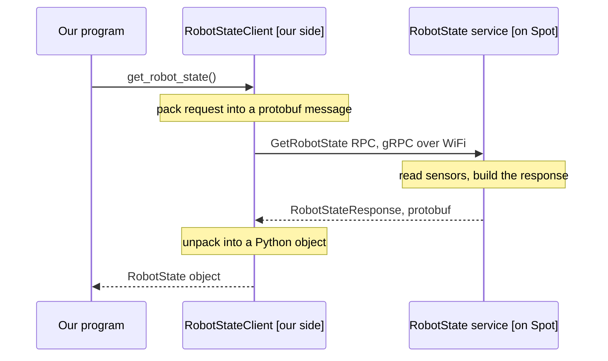

# Spot SDK: architecture and client flow

Spot is effectively a black box. There is no SSH into it and we do not know the onboard compute specs. Everything we do from our own computer goes over the network to the robot, so the whole SDK is understood through one idea: the robot runs a set of gRPC services, and our program is a gRPC client of those services. This page covers the software stack, the whole vocabulary in code (from a single call up to a mission behavior tree), the mandatory startup procedure every controlling program has to follow, and one full worked example.

For how this compares to the ROS 2 wrapper and Autowalk, see [SDK vs Autowalk vs spot_ros2](sdk-vs-autowalk-vs-ros2.md).

## Software stack and architecture

The SDK is language agnostic at the protocol level. Everything is gRPC services defined by Protocol Buffer messages under `bosdyn/api`. The Python library is the reference client, but any language that speaks the protos can drive the robot.

An application talks to a directory of services the robot exposes and instantiates one client per capability.

```
Your app (Python)
  -> create_standard_sdk()  -> SDK object
  -> create_robot(IP)       -> Robot object
       -> service directory (gRPC)
            -> RobotCommandClient   (mobility, manipulation)
            -> RobotStateClient     (battery, joint and motor status)
            -> ImageClient          (5 fisheye + 5 depth cameras)
            -> LeaseClient, EstopClient
            -> GraphNavClient, DockingClient, MissionClient, ...
```

The `Robot` object abstracts the client-server gRPC layer. We query its directory and get typed clients, and each call can be blocking or async.

**Repository layout** (github.com/boston-dynamics/spot-sdk):

| Folder | Contents |
|---|---|
| `python/` | client library, examples, QuickStart |
| `protos/` | the `bosdyn/api` gRPC and protobuf definitions (the real contract) |
| `docs/` | concept guides, Python docs, payload developer docs |
| `choreography_protos/`, `prebuilt/`, `tools/` | specialised modules |

Our `spot_ros2` wrapper tracks SDK **5.0.1**, and the robot ran firmware **V5.1.6**, so keep the client and robot versions aligned.

## The stack, end to end (key terms in code)

Everything the robot exposes is gRPC services made of protobuf messages, and everything we build to control it is those same messages. Read the whole vocabulary first, then the command / node / behavior-tree examples that use it, then the data flow of a single call.

### The vocabulary

| Term | What it is | Spot example |
|---|---|---|
| **gRPC** | Google Remote Procedure Call, a cross-platform client-server call framework. The robot is the server, our app is the client. | robot answers on WiFi at `192.168.80.3` |
| **Protobuf (`.proto`)** | The interface definition language. A `.proto` file declares the services and message types; it fixes the interface (inputs and calls), not the implementation. | `bosdyn/api/*.proto` |
| **Service** | A named bundle of RPCs the robot offers. | `RobotCommandService`, `RobotState`, `Image` |
| **RPC / method** | A *verb* — one callable action that runs on the robot, invoked over the network. Declared `rpc Name(RequestMessage) returns (ResponseMessage)`. In Python it is a client method. | `RobotCommand`, `GetRobotState`, `LoadMission` |
| **Message** | A *noun* — passive typed data, the input or output of an RPC, built from fields. It does nothing; it just holds data. | `RobotCommandRequest`, `BatteryState`, `Node`, `Walk` |
| **Client** | Our side's object for talking to one service (the phone for one department); it hides the networking. Obtained from the `Robot` object. | `RobotCommandClient`, `RobotStateClient` |
| **Object** | A built message instance we pass around. | a `RobotCommand` payload from `RobotCommandBuilder` |
| **`oneof`** | A protobuf "exactly one of these" union: several fields where at most one may be set, and setting one clears the rest. It is why commands nest. | `RobotCommand` = `full_body_command` \| `synchronized_command` |
| **`.Request` / `.Feedback`** | Nested messages *inside* a command message: the params to *issue* it, and the status it *reports back*. | `StandCommand.Request`, `StandCommand.Feedback` |
| **Generated module (`*_pb2`)** | The Python module `protoc` produces from one `.proto` file. | `robot_command_pb2`, `nodes_pb2` |
| **Node** | The atom of a *mission* behavior tree — a polymorphic `Node` wrapper, each one a single kind (sequence, selector, a command, a nav). | `nodes_pb2.Node` |
| **Element** | The atom of an *autowalk* — one "go here, do this" step: a target waypoint + an action + failure/battery behaviours. A `Walk` is a list of Elements; compiling turns each into a `Node` subtree. | `walks_pb2.Walk.elements` |

**Naming convention.** Types are `CamelCase` (`BosdynRobotCommand`), fields are `snake_case` (`bosdyn_robot_command`), modules are `snake_case` + `_pb2`. So `bosdyn_robot_command` is the field that *holds* a `BosdynRobotCommand` message — the same word in two cases, which is why the code reads as repetitive.

### RPC vs message (and the overloaded name `RobotCommand`)

An **RPC is a verb** — an action that runs on the robot: `RobotCommand`, `LoadMission`, `PlayMission`, `ListWorldObjects`. A **message is a noun** — passive data that does nothing on its own. The relationship is that every RPC takes exactly one request message and returns one response message, exactly like a Python function:

```python
def robot_command(request: RobotCommandRequest) -> RobotCommandResponse:
    ...
```

The function itself is the RPC; the parameter and return value are messages. Nothing executes while we build messages — execution happens only when an RPC carries them. The canonical protobuf shape is a Greeter service with one RPC:

```proto
service Greeter {
  rpc SayHello (HelloRequest) returns (HelloReply);   // RPC = a method the client can call
}
message HelloRequest { string name = 1; }             // message = the input
message HelloReply   { string message = 1; }          // message = the output
```

Boston Dynamics splits Spot's version across two files: a `*_service.proto` holding only the service and its RPCs, and a data `.proto` holding only the message types.

```proto
// robot_command_service.proto  (the SERVICE, RPCs only)
service RobotCommandService {
    rpc RobotCommand(RobotCommandRequest) returns (RobotCommandResponse);
}
// robot_command.proto  (the DATA, message types only)
message RobotCommandRequest {
    RequestHeader header = 1;
    Lease         lease  = 2;
    RobotCommand  command = 3;          // <-- the command payload is nested here
    string        clock_identifier = 4;
}
message RobotCommand {                  // the payload: the actual command
    oneof command {
        FullBodyCommand.Request     full_body_command    = 1;
        SynchronizedCommand.Request synchronized_command = 3;
    }
}
message RobotCommandResponse {
    ResponseHeader header = 1;
    // ...
    uint32 robot_command_id = 5;        // what we poll for feedback
}
```

This is where the name `RobotCommand` trips people up — it labels **three different things**:

| Name | What it is | Defined in |
|---|---|---|
| `RobotCommand` | the **RPC** (the action) | `robot_command_service.proto` |
| `RobotCommandRequest` / `RobotCommandResponse` | the RPC's **envelope** messages (what the service literally takes and returns) | `robot_command.proto` |
| `RobotCommand` | the **payload** message (the command content we build) | `robot_command.proto` |

The request is *not* the payload — it **wraps** it. `RobotCommandRequest` holds `header`, `lease`, `clock_identifier`, and a `RobotCommand command` field. That inner `RobotCommand` is the thing we assemble (the full-body/synchronized oneof) and what `RobotCommandBuilder` returns; the RPC is named after the payload it carries.

We never see `RobotCommandRequest` in our own code because the client hides it. `command_client.robot_command(cmd)` takes our `RobotCommand` payload, wraps it in a `RobotCommandRequest` (auto-filling `header`, `lease`, `clock_identifier`), calls the `RobotCommand` RPC, receives a `RobotCommandResponse`, and hands back the `robot_command_id`. The payload is a standalone message on purpose — the same `RobotCommand` also slots into the mission node `BosdynRobotCommand.command`, so building it serves both the live RPC path and a behavior tree.

> Two different messages both end in "Request": the RPC envelope `RobotCommandRequest` (wraps the payload plus lease/header) versus a command's own parameters `StandCommand.Request` (the stand's arguments, nested inside the payload). Different messages, same suffix.

### A command is deeply nested (and why)

A `RobotCommand` *payload* is built inside-out because the command API is generic. The full manual construction of a stand is four `oneof` layers:

```python
from bosdyn.api import basic_command_pb2, mobility_command_pb2
from bosdyn.api import synchronized_command_pb2, robot_command_pb2

request = basic_command_pb2.StandCommand.Request()                       # the stand parameters
mobility = mobility_command_pb2.MobilityCommand.Request(                 # pick "stand" among mobility commands
    stand_request=request)
synchronized = synchronized_command_pb2.SynchronizedCommand.Request(     # coordinate arm+gripper+mobility
    mobility_command=mobility)
robot_command = robot_command_pb2.RobotCommand(                          # the payload: full-body vs synchronized
    synchronized_command=synchronized)
```

Read outward: a stand is a *mobility* command, which is a *synchronized* command (mobility, arm and gripper in lockstep), which is a *robot* command. Each layer is a oneof selecting one alternative. We almost never write this by hand — **`RobotCommandBuilder` collapses all four layers into one call:**

```python
from bosdyn.client.robot_command import RobotCommandBuilder
robot_command = RobotCommandBuilder.synchro_stand_command()             # same RobotCommand payload, one line
```

The builder has `synchro_stand_command` (with body-pose and height args), `synchro_sit_command`, `synchro_se2_trajectory_command` (an in-place yaw or a pose move), and more. The verbose version is only worth seeing once, to understand what the builder assembles underneath.

### Wrapping a command in a mission node

The mission service runs **behavior trees**. Their atom is `nodes_pb2.Node`, a generic polymorphic wrapper: every node is a `Node` whose `oneof type` selects the kind (`bosdyn_robot_command`, `bosdyn_navigate_to`, `sequence`, `selector`, ...). (This is the mission-tree atom; the autowalk atom is instead an `Element` — navigate to a target, perform an action, with failure and battery behaviors.) To put a command in the tree, wrap the `RobotCommand` payload in a `BosdynRobotCommand` node, then in a `Node`:

```python
from bosdyn.api.mission import nodes_pb2

stand = nodes_pb2.BosdynRobotCommand(
    service_name='robot-command',       # the RobotCommandService
    host='localhost',                   # the robot itself (the mission runs on-robot)
    command=robot_command)              # the RobotCommand payload from above

stand_node = nodes_pb2.Node(name='Just stand')
stand_node.bosdyn_robot_command.CopyFrom(stand)     # bosdyn_robot_command is field 19 in Node's oneof
```

`CopyFrom` is needed because `bosdyn_robot_command` is a message field inside a oneof: protobuf does not allow assigning a message straight to it (`node.bosdyn_robot_command = stand` raises). `CopyFrom` copies the fields in and activates that branch. Passing it as a constructor keyword (`nodes_pb2.Node(name='Just stand', bosdyn_robot_command=stand)`) is the equivalent shorthand.

### Assembling nodes into a tree

Structural nodes hold children, so a whole routine is just nesting `Node`s. Following the mission-service example (stand, then sit):

```python
def command_node(name, robot_command):
    node = nodes_pb2.Node(name=name)
    node.bosdyn_robot_command.CopyFrom(nodes_pb2.BosdynRobotCommand(
        service_name='robot-command', host='localhost', command=robot_command))
    return node

stand_node = command_node('Stand', RobotCommandBuilder.synchro_stand_command())
sit_node   = command_node('Sit',   RobotCommandBuilder.synchro_sit_command())

seq = nodes_pb2.Sequence()                          # runs children in order until one fails
seq.children.extend([stand_node, sit_node])         # Sequence.children is repeated Node

root = nodes_pb2.Node(name='stand then sit')
root.sequence.CopyFrom(seq)                          # root is a Node wrapping the Sequence
```

`root` is now a complete behavior tree. We send it to the robot with the Mission service, not the command service:

```python
from bosdyn.mission.client import MissionClient
mission_client = robot.ensure_client(MissionClient.default_service_name)
mission_client.load_mission(root, leases=[...])      # LoadMission RPC
mission_client.play_mission(pause_time_secs, leases=[...])   # PlayMission RPC
```

The same pattern scales: swap `command_node` for `BosdynNavigateTo` nodes to move between waypoints, wrap a `Sequence` in a `Selector` for branching, or in a `Repeat` to loop. Our patrol mission is built exactly this way; the full design (loop, battery safe-stop, fiducial-conditional dance) is in the wiki page *Autowalk and Mission - Patrol Sequence Development*.

### What a client is, and the data flow of one call

With the vocabulary in place, here is what actually happens on the wire for a single call. The robot is the server. It runs a set of separate services, each doing one job: RobotState (health, battery, joint angles), Image (cameras), RobotCommand (movement), Docking, and so on. Think of them as departments inside the robot, each with its own phone line.

A **client** is our side's phone for one of those departments — an object in our own program that knows how to talk to exactly one service. We get each one from the `Robot` object with `robot.ensure_client(...)`, then call a method, which is really the matching RPC:

```python
state_client = robot.ensure_client(RobotStateClient.default_service_name)
state = state_client.get_robot_state()          # calls the GetRobotState RPC
print(state.battery_states[0].charge_percentage)
```

The client does all the network plumbing: it packs our request into a protobuf message, sends it over WiFi as a gRPC call to that service, waits for the reply, and unpacks it back into a Python object. From our side it looks like a normal local method call.



This is why there is one client per service rather than one big Spot object: we do not call the robot as a whole, we call the specific service we want something from, and the client is the object that knows how to reach that one service. The mental model is: find the service in the proto list to see what Spot can do, then call the matching method on that service's client. The SDK's protobuf reference page is the low-level index of everything the robot exposes.

## Local setup (install and connect)

**No Linux required** — the SDK is pure Python and runs on Windows, macOS and Linux. (Only the ROS 2 tooling needs Linux/Docker.)

1. **Python 3** — install 3.10 (the SDK supports a 3.8+ range).
2. **Virtual environment:** `python -m venv spot-venv` then activate it (`spot-venv\Scripts\activate` on Windows).
3. **Install the client + mission libraries, version-matched to the robot** (~V5.1.x — confirm in the tablet *About* / admin console; a major-version mismatch causes proto incompatibilities):
   ```
   pip install bosdyn-client==5.1.0 bosdyn-mission==5.1.0 bosdyn-api==5.1.0
   ```
4. **Runnable examples** (not on pip) live in the repo — clone it if you want `hello_spot`, `edit_autowalk`, etc.: `git clone https://github.com/boston-dynamics/spot-sdk.git`.

To connect and control:

- **Network** — put the laptop on the same network as Spot: its WiFi AP (robot IP `192.168.80.3` by default), the rear ethernet port, or Spot's LAN IP. That address is `ROBOT_IP`.
- **Credentials** — `set BOSDYN_CLIENT_USERNAME=<user>` / `set BOSDYN_CLIENT_PASSWORD=<pass>` so scripts pick them up without prompting.
- **E-Stop** — motors will not power without an active E-Stop endpoint: keep the **tablet** connected as the E-Stop, or run the SDK's `estop_gui` example as a second endpoint.
- **Localization** (for GraphNav / missions) — a **fiducial must be visible from the start waypoint** when the run begins.

## Mandatory startup procedure

Order matters. Each step gates the next, and nothing moves until all of them are done.

| Step | Why it is mandatory |
|---|---|
| **Create SDK and Robot** | build the SDK object, point it at the robot IP |
| **Authenticate** | username, password and robot IP unlock most services |
| **Time-sync** | commands carry validity windows keyed to the robot clock, so without sync they are rejected |
| **E-Stop** | gates motor power. Status has to move from cut to none before power-on |
| **Lease** | exclusive-control token. Taken with `acquire`, or stolen from the current holder with `take` (that holder drops to observer) |
| **Power on** | motors are off until explicitly powered |

The lease is how the system knows which computer has control authority. Only one computer controls Spot at a time. By default other computers are just observers (they can stream camera images without controlling). If another computer really wants control it can `take` the lease, and the previous holder becomes an observer.

> [!WARNING]
> The lease and E-Stop keepalives have to stay in scope for the whole session. `LeaseKeepAlive` and `EstopKeepAlive` run background threads that check in periodically. If either falls out of scope the robot times out, the lease is revoked and motor power is cut. This is the single most common cause of a program appearing to randomly lose control of Spot.

Commands are built with `RobotCommandBuilder` helpers (for example `synchro_stand_command()`, trajectory and velocity commands). Each helper wraps several RobotCommand RPCs, validates preconditions, and returns a command id we poll for feedback.

## Worked example: one full code flow (hello_spot)

`hello_spot` is the smallest example that exercises the entire flow, from connection to motion to shutdown. Read top to bottom it is the whole API in miniature.

```python
import bosdyn.client
from bosdyn.client.robot_command import RobotCommandClient, RobotCommandBuilder, blocking_stand
from bosdyn.client.image import ImageClient

# 1. Connect: build the SDK, point it at the robot IP, authenticate, sync clocks
sdk   = bosdyn.client.create_standard_sdk('hello-spot')
robot = sdk.create_robot('192.168.80.3')
robot.authenticate('user', 'password')
robot.time_sync.wait_for_sync()

# 2. E-Stop: register an endpoint and keep it alive (moves status to ESTOP_LEVEL_NONE)
estop_client = robot.ensure_client('estop')
estop_endpoint = bosdyn.client.estop.EstopEndpoint(estop_client, 'hello-estop', 9.0)
estop_endpoint.force_simple_setup()
estop_keepalive = bosdyn.client.estop.EstopKeepAlive(estop_endpoint)

# 3. Lease: acquire exclusive control, keep it alive for the session
lease_client = robot.ensure_client(bosdyn.client.lease.LeaseClient.default_service_name)
lease = lease_client.acquire()
lease_keepalive = bosdyn.client.lease.LeaseKeepAlive(lease_client)

# 4. Power on the motors (needs E-Stop cleared and the lease held)
robot.power_on(timeout_sec=20)

# 5. Command motion: build a command object, then send it through the command client
command_client = robot.ensure_client(RobotCommandClient.default_service_name)
blocking_stand(command_client, timeout_sec=10)                       # stand
cmd = RobotCommandBuilder.synchro_stand_command(body_height=0.1)     # build a pose command object
command_client.robot_command(cmd)                                    # -> RobotCommand RPC, returns a command id

# 6. Read a sensor: capture from a camera through its own client
image_client = robot.ensure_client(ImageClient.default_service_name)
image = image_client.get_image_from_sources(['frontleft_fisheye_image'])[0]

# 7. Shut down cleanly: sit, then cut motor power. Keepalives release as they leave scope.
command_client.robot_command(RobotCommandBuilder.synchro_sit_command())
robot.power_off(cut_immediately=False)
```

Every numbered block maps back to a key term above. `ensure_client(...)` hands us the client for a service, `RobotCommandBuilder.*` returns a command object (a built message), and `command_client.robot_command(cmd)` is the RPC. The gripper-open case is the same shape with a different builder: build a gripper command with the open fraction set to `1.0` and send it through the command client. Anything more than a single action (walk while moving the arm, for instance) is wrapped into one synchronized command so it dispatches together.

## Example catalog

The SDK ships runnable examples under `python/examples/` that map directly to capabilities, so the folder is the best index of what we can do:

- **Basic control and state:** `hello_spot`, `wasd`, `estop`, `get_robot_state`, `stance`, `xbox_controller`, `joint_control` (Joint Control API, license gated)
- **Perception:** `get_image`, `get_depth_plus_visual_image`, `stitch_front_images`, `ray_cast`, `get_world_objects`, `fiducial_follow`
- **Autonomy and navigation:** `graph_nav_command_line`, `graph_nav_view_map`, `auto_return`, `area_callback`, `user_nogo_regions`, `gps_service`
- **Missions and workflows:** `mission_recorder`, `replay_mission`, `record_autowalk`, `remote_mission_service`
- **Arm and manipulation:** `arm_grasp`, `arm_door`, `arm_trajectory`, `inverse_kinematics` (arm hardware required)
- **Payload and compute:** `self_registration`, `network_compute_bridge`, `spot_tensorflow_detector`, `core_io_gpio`
- **Docking and data:** `docking`, `data_acquisition_service`, `bddf_download`

## Licensing

The SDK docs flag exactly two controlled-access APIs that need a special-permissions license from Boston Dynamics: the **Joint Control API** and the **Choreography service**. Everything else, including the autonomy stack (GraphNav, Autowalk, Missions), carries no license or permission statement and is standard. A robot's actually-enabled features can be read at runtime through the `LicenseClient`. Our robot carries the **Spot Enterprise** license (self-charging dock, GraphNav autonomy, Orbit remote ops), which does not grant Joint Control or Choreography. See [SDK vs Autowalk vs spot_ros2](sdk-vs-autowalk-vs-ros2.md) for the full capability breakdown.

## References

- Spot Python SDK docs: https://dev.bostondynamics.com/docs/python/readme
- spot-sdk repo: https://github.com/boston-dynamics/spot-sdk
- Spot Robot Development Tutorial (gRPC, proto and lease walkthrough): https://www.youtube.com/watch?v=KDvh__1Y0fI
