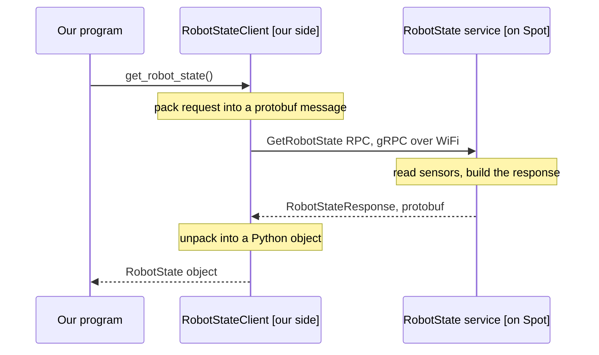

# Spot SDK: architecture and client flow

Spot is effectively a black box. There is no SSH into it and we do not know the onboard compute specs. Everything we do from our own computer goes over the network to the robot, so the whole SDK is understood through one idea: the robot runs a set of gRPC services, and our program is a gRPC client of those services. This page covers the software stack, the key terms with code, the mandatory startup procedure every controlling program has to follow, and one full worked example.

For how this compares to the ROS 2 wrapper and Autowalk, see [SDK vs Autowalk vs spot_ros2](sdk-vs-autowalk-vs-ros2.md).

## Software stack and architecture

The SDK is language agnostic at the protocol level. Everything is gRPC services defined by Protocol Buffer messages under `bosdyn/api`. The Python library is the reference client, but any language that speaks the protos can drive the robot.

An application talks to a directory of services the robot exposes and instantiates one client per capability.

```
Your app (Python)
  -> create_standard_sdk()  -> SDK object
  -> create_robot(IP)       -> Robot object
       -> service directory (gRPC)
            -> RobotCommandClient   (mobility, manipulation)
            -> RobotStateClient     (battery, joint and motor status)
            -> ImageClient          (5 fisheye + 5 depth cameras)
            -> LeaseClient, EstopClient
            -> GraphNavClient, DockingClient, MissionClient, ...
```

The `Robot` object abstracts the client-server gRPC layer. We query its directory and get typed clients, and each call can be blocking or async.

**Repository layout** (github.com/boston-dynamics/spot-sdk):

| Folder | Contents |
|---|---|
| `python/` | client library, examples, QuickStart |
| `protos/` | the `bosdyn/api` gRPC and protobuf definitions (the real contract) |
| `docs/` | concept guides, Python docs, payload developer docs |
| `choreography_protos/`, `prebuilt/`, `tools/` | specialised modules |

Our `spot_ros2` wrapper tracks SDK **5.0.1**, and the robot ran firmware **V5.1.6**, so keep the client and robot versions aligned.

## Key terms (with code)

The whole API is a small set of terms. The table maps each one, and the code below shows the same idea in a plain example and then in Spot.

| Term | What it is | Spot example |
|---|---|---|
| **gRPC** | Google Remote Procedure Call. A cross-platform framework for server-to-client calls. The robot is the server, our app is the client. | robot answers on WiFi at `192.168.80.3` |
| **Protobuf (`.proto`)** | The interface definition language. A `.proto` file declares the services and message types. It fixes the interface (inputs and calls), not the implementation. | `bosdyn/api/*.proto` |
| **Service** | A named group of RPCs the robot offers. | `RobotState`, `RobotCommand`, `Image` |
| **RPC / method** | One callable operation on a service. In Python it is a client method, underneath it is a remote call. | `GetRobotState`, `RobotCommand` |
| **Message** | The typed input or output of an RPC, built from fields. | `RobotStateRequest`, `BatteryState` |
| **Client** | Our side's object for talking to one service (the phone for one department). It hides the networking. Obtained from the `Robot` object. | `RobotStateClient` |
| **Object** | A built message instance we pass around. | a `RobotCommand` from `RobotCommandBuilder` |

The canonical protobuf example is a Greeter service with one RPC:

```proto
service Greeter {
  rpc SayHello (HelloRequest) returns (HelloReply);   // RPC = a method the client can call
}
message HelloRequest { string name = 1; }             // message = the input
message HelloReply   { string message = 1; }          // message = the output
```

Spot follows the same shape, and Boston Dynamics splits it across two files: a `*_service.proto` holding only the service and its RPCs, and a data `.proto` holding only the message types.

```proto
// robot_state_service.proto  (the SERVICE, RPCs only)
service RobotState {
  rpc GetRobotState (RobotStateRequest) returns (RobotStateResponse);
}
// robot_state.proto  (the DATA, message types only)
message BatteryState { /* charge_percentage, voltage, temperatures, ... */ }
```

At runtime we never touch the protos directly. We use the generated client class, and each method call is really the matching RPC:

```python
state_client = robot.ensure_client(RobotStateClient.default_service_name)
state = state_client.get_robot_state()          # calls the GetRobotState RPC
print(state.battery_states[0].charge_percentage)
```

### What a client is, and the data flow of one call

The robot is the server. It runs a set of separate services, each doing one job: RobotState (health, battery, joint angles), Image (cameras), RobotCommand (movement), Docking, and so on. Think of them as departments inside the robot, each with its own phone line.

A **client** is our side's phone for one of those departments. It is an object in our own program that knows how to talk to exactly one service. `RobotStateClient` calls the RobotState department, `ImageClient` calls the camera department, `RobotCommandClient` calls the movement department. We get each one from the `Robot` object with `robot.ensure_client(...)`.

When we call a method on a client, the client does all the network plumbing for us. It packs our request into a protobuf message, sends it over WiFi as a gRPC call to that service on the robot, waits for the reply, and unpacks it back into a Python object. From our side it looks like a normal local method call.



This is why there is one client per service rather than one big Spot object: we do not call the robot as a whole, we call the specific service we want something from, and the client is the object that knows how to reach that one service.

So the mental model is: find the service in the proto list to see what Spot can do, then call the matching method on that service's client. The SDK's protobuf reference page is the low-level index of everything the robot exposes.

## Mandatory startup procedure

Order matters. Each step gates the next, and nothing moves until all of them are done.

| Step | Why it is mandatory |
|---|---|
| **Create SDK and Robot** | build the SDK object, point it at the robot IP |
| **Authenticate** | username, password and robot IP unlock most services |
| **Time-sync** | commands carry validity windows keyed to the robot clock, so without sync they are rejected |
| **E-Stop** | gates motor power. Status has to move from cut to none before power-on |
| **Lease** | exclusive-control token. Taken with `acquire`, or stolen from the current holder with `take` (that holder drops to observer) |
| **Power on** | motors are off until explicitly powered |

The lease is how the system knows which computer has control authority. Only one computer controls Spot at a time. By default other computers are just observers (they can stream camera images without controlling). If another computer really wants control it can `take` the lease, and the previous holder becomes an observer.

> [!WARNING]
> The lease and E-Stop keepalives have to stay in scope for the whole session. `LeaseKeepAlive` and `EstopKeepAlive` run background threads that check in periodically. If either falls out of scope the robot times out, the lease is revoked and motor power is cut. This is the single most common cause of a program appearing to randomly lose control of Spot.

Commands are built with `RobotCommandBuilder` helpers (for example `synchro_stand_command()`, trajectory and velocity commands). Each helper wraps several RobotCommand RPCs, validates preconditions, and returns a command id we poll for feedback.

## Worked example: one full code flow (hello_spot)

`hello_spot` is the smallest example that exercises the entire flow, from connection to motion to shutdown. Read top to bottom it is the whole API in miniature.

```python
import bosdyn.client
from bosdyn.client.robot_command import RobotCommandClient, RobotCommandBuilder, blocking_stand
from bosdyn.client.image import ImageClient

# 1. Connect: build the SDK, point it at the robot IP, authenticate, sync clocks
sdk   = bosdyn.client.create_standard_sdk('hello-spot')
robot = sdk.create_robot('192.168.80.3')
robot.authenticate('user', 'password')
robot.time_sync.wait_for_sync()

# 2. E-Stop: register an endpoint and keep it alive (moves status to ESTOP_LEVEL_NONE)
estop_client = robot.ensure_client('estop')
estop_endpoint = bosdyn.client.estop.EstopEndpoint(estop_client, 'hello-estop', 9.0)
estop_endpoint.force_simple_setup()
estop_keepalive = bosdyn.client.estop.EstopKeepAlive(estop_endpoint)

# 3. Lease: acquire exclusive control, keep it alive for the session
lease_client = robot.ensure_client(bosdyn.client.lease.LeaseClient.default_service_name)
lease = lease_client.acquire()
lease_keepalive = bosdyn.client.lease.LeaseKeepAlive(lease_client)

# 4. Power on the motors (needs E-Stop cleared and the lease held)
robot.power_on(timeout_sec=20)

# 5. Command motion: build a command object, then send it through the command client
command_client = robot.ensure_client(RobotCommandClient.default_service_name)
blocking_stand(command_client, timeout_sec=10)                       # stand
cmd = RobotCommandBuilder.synchro_stand_command(body_height=0.1)     # build a pose command object
command_client.robot_command(cmd)                                    # -> RobotCommand RPC, returns a command id

# 6. Read a sensor: capture from a camera through its own client
image_client = robot.ensure_client(ImageClient.default_service_name)
image = image_client.get_image_from_sources(['frontleft_fisheye_image'])[0]

# 7. Shut down cleanly: sit, then cut motor power. Keepalives release as they leave scope.
command_client.robot_command(RobotCommandBuilder.synchro_sit_command())
robot.power_off(cut_immediately=False)
```

Every numbered block maps back to a key term above. `ensure_client(...)` hands us the client for a service, `RobotCommandBuilder.*` returns a command object (a built message), and `command_client.robot_command(cmd)` is the RPC. The gripper-open case is the same shape with a different builder: build a gripper command with the open fraction set to `1.0` and send it through the command client. Anything more than a single action (walk while moving the arm, for instance) is wrapped into one synchronized command so it dispatches together.

## Example catalog

The SDK ships runnable examples under `python/examples/` that map directly to capabilities, so the folder is the best index of what we can do:

- **Basic control and state:** `hello_spot`, `wasd`, `estop`, `get_robot_state`, `stance`, `xbox_controller`, `joint_control` (Joint Control API, license gated)
- **Perception:** `get_image`, `get_depth_plus_visual_image`, `stitch_front_images`, `ray_cast`, `get_world_objects`, `fiducial_follow`
- **Autonomy and navigation:** `graph_nav_command_line`, `graph_nav_view_map`, `auto_return`, `area_callback`, `user_nogo_regions`, `gps_service`
- **Missions and workflows:** `mission_recorder`, `replay_mission`, `record_autowalk`, `remote_mission_service`
- **Arm and manipulation:** `arm_grasp`, `arm_door`, `arm_trajectory`, `inverse_kinematics` (arm hardware required)
- **Payload and compute:** `self_registration`, `network_compute_bridge`, `spot_tensorflow_detector`, `core_io_gpio`
- **Docking and data:** `docking`, `data_acquisition_service`, `bddf_download`

## Licensing

The SDK docs flag exactly two controlled-access APIs that need a special-permissions license from Boston Dynamics: the **Joint Control API** and the **Choreography service**. Everything else, including the autonomy stack (GraphNav, Autowalk, Missions), carries no license or permission statement and is standard. A robot's actually-enabled features can be read at runtime through the `LicenseClient`. Our robot carries the **Spot Enterprise** license (self-charging dock, GraphNav autonomy, Orbit remote ops), which does not grant Joint Control or Choreography. See [SDK vs Autowalk vs spot_ros2](sdk-vs-autowalk-vs-ros2.md) for the full capability breakdown.

## References

- Spot Python SDK docs: https://dev.bostondynamics.com/docs/python/readme
- spot-sdk repo: https://github.com/boston-dynamics/spot-sdk
- Spot Robot Development Tutorial (gRPC, proto and lease walkthrough): https://www.youtube.com/watch?v=KDvh__1Y0fI
