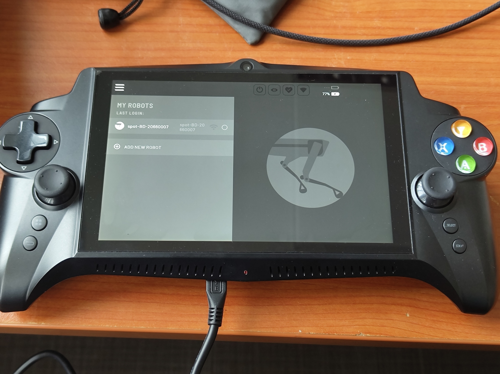

****
**Date:** 13-05-2026

**Duration:** 3hr

**People:** Yizhang

**Subsystem:** 🔋 Power & Battery

**Outcome:** ✅ Complete

**Objective:**
>Attempt to charge the battery and test the controller.

**Resources:**
> - [Comprehensive Teardown Report of the Quadruped Robot Spot : r/IndiaTech](https://www.reddit.com/r/IndiaTech/comments/1nwsba2/comprehensive_teardown_report_of_the_quadruped/)
> - [LHS Materials](https://www.lhsmaterials.com/thermal-regulation)

****
## TL;DR
Both Spot batteries fail to charge — the charger flashes red briefly then goes dark instead of blinking green. The controller, in contrast, powers on and connects fine but drains fast. Identified the battery internals (56× 18650 in 2 packs, CAN-based BMS) from a teardown report.

## Work done
#### Charge attempt with legacy charger
- Charger powers on normally — green AC indicator lights up as expected.
- Connected each battery in turn; the charge indicator briefly blinks red then vanishes. (Per the manual it should blink green steadily during normal charging.)

#### Controller power-on test
- Controller boots via a long-press of the top power button, starting at ~28% charge.
- Connects to wifi; joysticks and buttons are responsive.
- Spot app launches properly, with the past-mission cache still visible.
- Charges over micro-USB (slowly).

#### Source hardware documentation
- Found a full teardown report (in Chinese) on Reddit (linked above).

## Findings & data
- Both batteries fail to charge — indicator blinks red then goes dark (expected: steady green blink).
- Controller battery drains fast — >10% lost over ~10 min of idle.
- Battery internals (teardown p.167): 56× 18650 Li-ion cells split into 2 packs of 28.
- Cells are surrounded by [LHS thermal-regulation material](https://www.lhsmaterials.com/thermal-regulation) for thermal homogeneity and heat absorption (cell protection).
- The BMS communicates with the robot over a CAN bus.

## Decisions
- **Decision:** Open the battery pack (with Royston's help) and attempt to trickle-charge / jump-start the cells.
  **Why:** The packs won't charge via the normal charger and can't be opened without help due to perimeter sealant.
  **Alternatives considered:** —

## Roadblocks
- Batteries do not charge.
- Unable to open the battery packs due to sealant around the perimeter.

## Next steps
- [x] Find Royston to disassemble the battery pack.
- [x] Attempt to jump-start / trickle-charge the cells.

## Media

