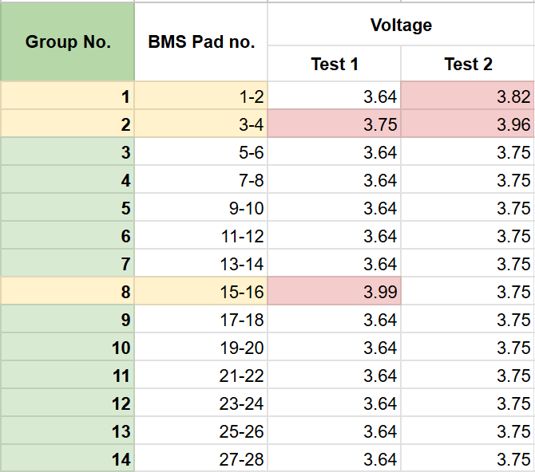
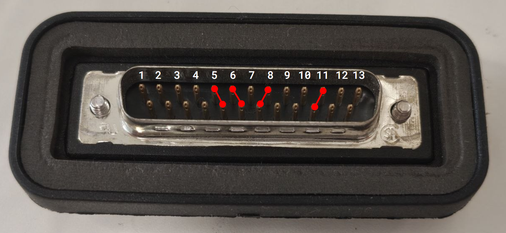
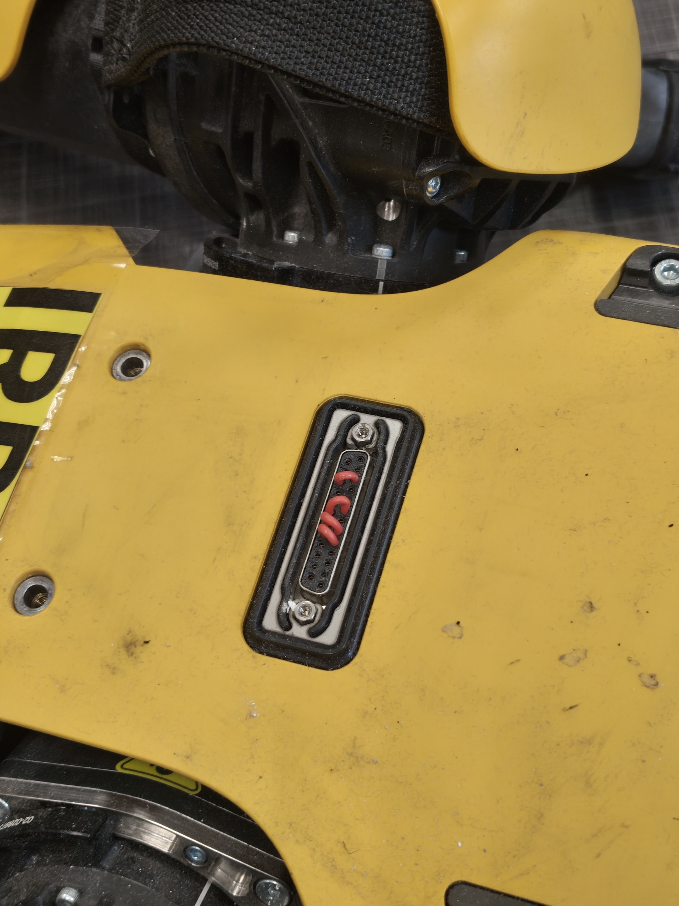
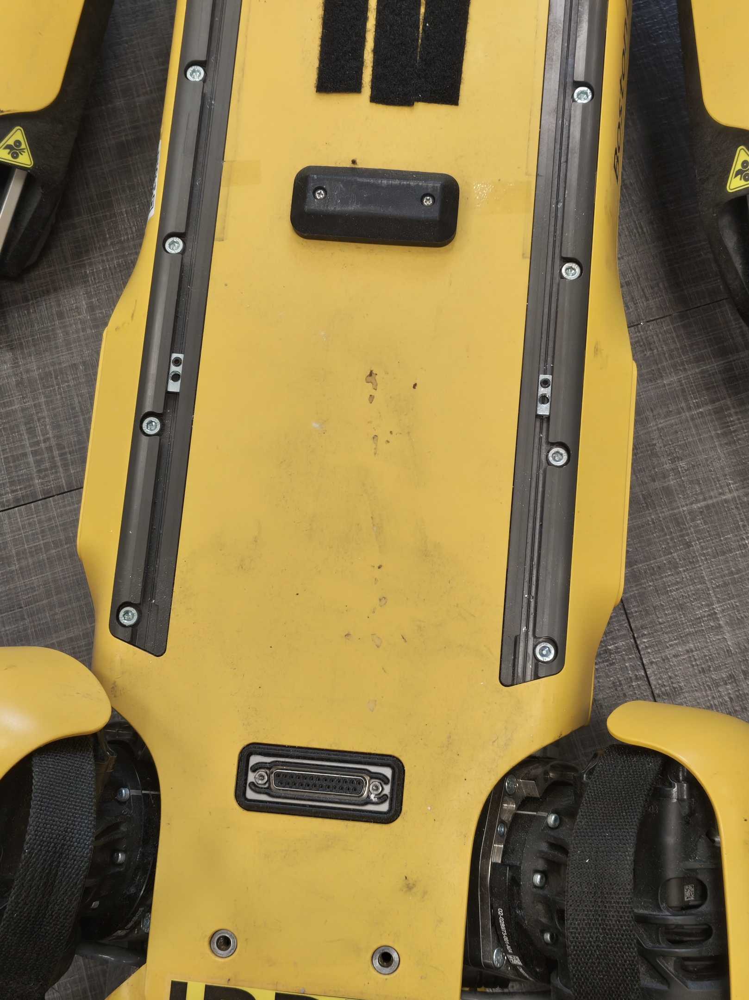
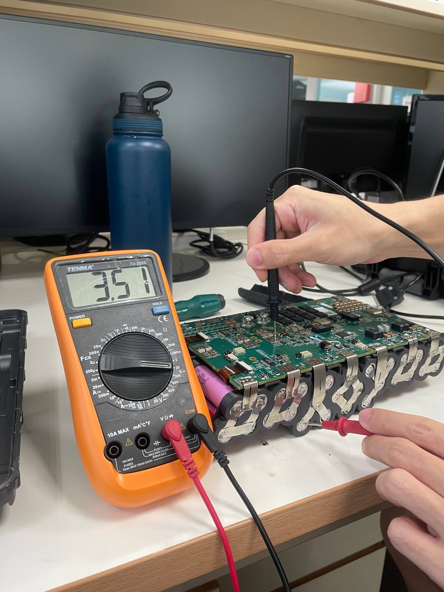
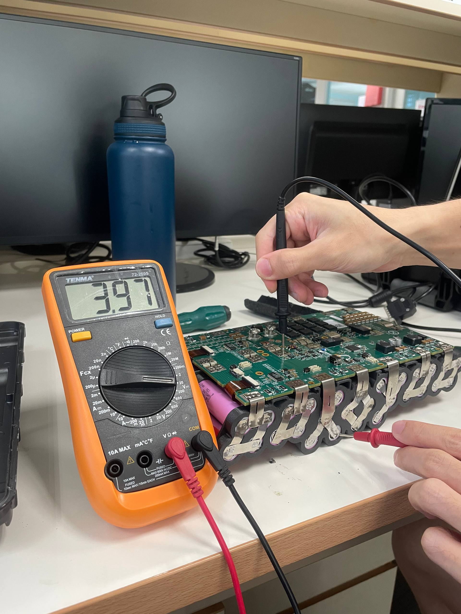
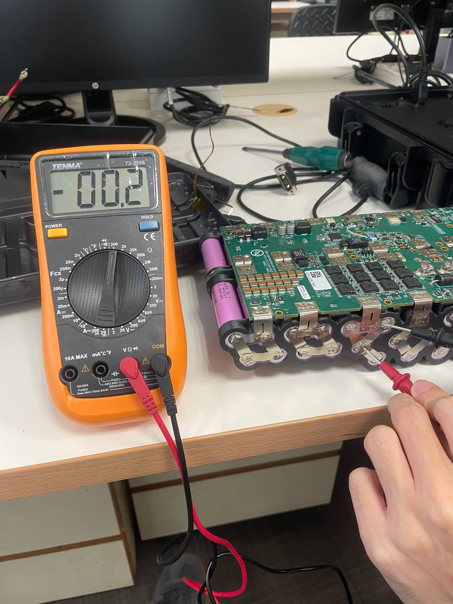
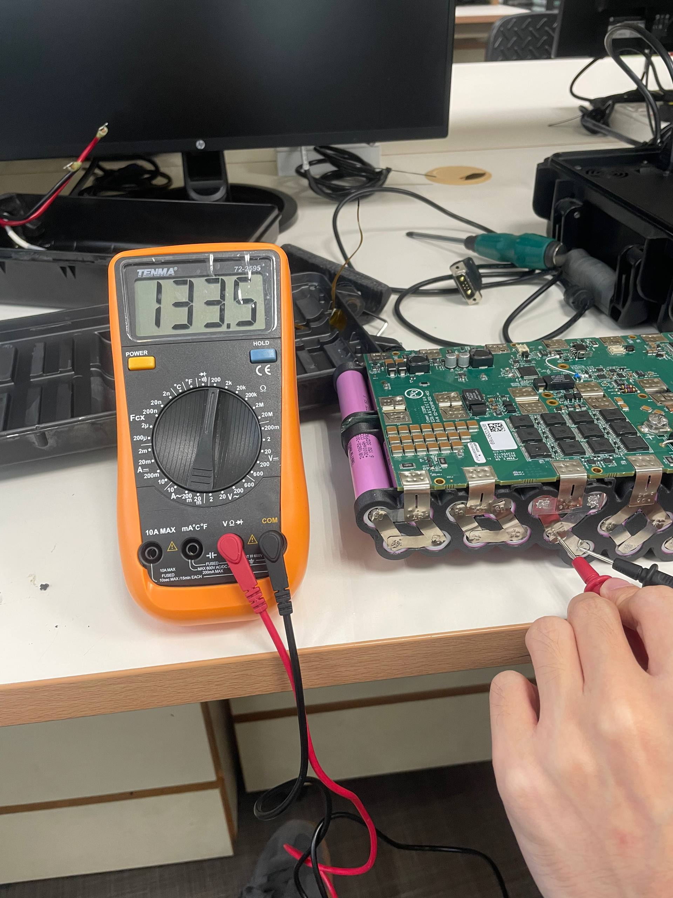
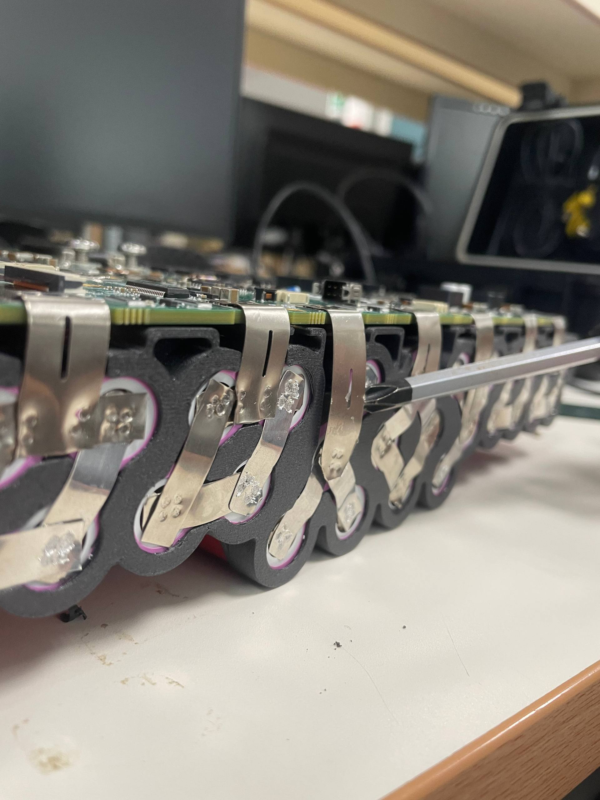

# Software update and test
**Date:** 2026-06-05

**Duration:** 5hr

**People:** Ming, Yizhang

**Subsystem:** 🔋 Power & Battery, 🦿 Actuators & Legs, 🧠 Compute & Mainboard

**Outcome:** ✅ Complete

**Objective:**
>Diagnose battery charge problem, update Spot firmware and attempt to power up Spot.

**Resources:**
- [Boston Dynamics Spot update guide](https://support.bostondynamics.com/s/article/Spot-Software-Updates-70795)
- [Spot self right](https://support.bostondynamics.com/s/article/Self-Right-49951)

****
## TL;DR

Battery imbalance diagnosed to be due to failed spot welds, Spot robot & controller successfully updated to latest firmware/software. Robot unable to self-right.

## Work done
#### Battery diagnostic
- The battery was connected to the charger and charged until the charger reports a full charge again.
- This time, pressing SoC shows 3/5 bars of charge.
- The individual cell groups are probed to get the respective voltage levels, then recorded in a table.
- The cell groups with abnormal charge levels were investigated, and in all cases we found the culprit to be a bad spot weld joint.
- A inconsistant weld also increases the resistance of the trace substentially.

#### Spot controller software update
- The controller originally was running software version 3.3.2 and was unable to connect to the robot due to outdated liscencing/cirtificates as suggested by the Spot manual.
- The Spot app `apk` was downloaded and installed from the boston dynamics website.

#### Spot firmware update
- Spot was running firmware version [xx] which was released in 2023.
- An attempt was made to flash it with the most current firmware (V5.1.6) immediately. The V5.1.6 `.bde` firmware update file was downloaded and uploaded to Spot via the admin console, which indicates thats the update was installed and automatically rebooted Spot.
- However, after power cycling Spot, the firmware version displayed was still the outdated V3.x.x.
- The manual recommends users to not skip major updates. Hence, another attempt was made to flash it with the legacy V4.1.1 first before the most recent V5.1.6.
- Spot was successfully updates to V5.1.6 after a reboot.

#### Connect Spot to controller
- After updating both Spot and the console app, the app was able to establish connection with the robot and started displaying the video feed from the 4 cameras.

#### Unsuccessful attempt to power on motors
- The motors can be powered on from the console app. However, the app flagged one of the uncovered interface connectors on Spot as a stopping function, i.e. the motors are blocked from powering on.
- Upon inspection, Spot has 2x DB25 interface connectors on the top for mounting external accessories. Only the connector near the head is covered.
- It seems Spot has some way of detecting if the interface connectors are covered. After inspection, there are no special/active components present in the cover - only the mating male DB25 connector.

#### Port cover detection bypass
- We are unable to find the missing port connector.
- However, after probing around the pins on the port cover, we noticed some of the pins are shorted together (continuous).
- Probing every combination of pins reveals that 4 sets of pins are connected together. This is probably what Spot uses to check if the port cover has been set properly.
- Short pieces of wire were tinned and used as short jumpers to manually short the same pins on the uncovered interface connector on Spot in an attempt to bypass the cover detection fault.
- It worked!

#### Motor power on and self right attempt
- The port cover faults were cleared after jumping the interface connectors.
- After power on motors, the controller prompted for Spot to self-right: an automatic process to first make Spot seat, then stand up.
- Despite the joint motors moving, Spot was stuck trying to get into the sit position. The left hind leg was significantly higher than the right although they should be level according to demo videos.

#### Flipped over self right attempt
- To further observe motor operations, Spot was flipped to lie on its back before attempting self right. The automatic flip-over action on Spot moves the legs through a much larger range of motion, allowing us to better observe the motor movements.
- Spot successfully flipped over, but the left hind leg was once again stuck in a awkward position. However, all 3 joint actuators on the left hind leg seems to be functional.

## Findings & data
#### Individual battery cell group voltage test
  
After the battery stopped charging, the voltage across each individual cell groups are measured and recorded.

From the voltage data, cell groups 1, 2 and 8 have abnormally high charge while the other groups are perfectly balanced.

Upon inspection, the highlighted cell groups all have a poor spot welded joint present on the positive side. The spot weld popped off on groups 2 and 8, resulting in only 2 batteries being connected in parallel, hence the higher relative voltage. Group 1 had a defective spot weld point that loosely connected the nickel strips, resulting in a very high measured resistance.

#### Port cover detection method

After probing around the DB25 interface connector cover piece to test for continuity, we found that 4 sets of pins are shorted together in the cover. This turns out to be how Spot detects if a interface port cover is in place, as shorting these pins manually on Spot lifted the no-action warning.

## Decisions
>**Decision:** Also repair second battery module, with improved bracket design and offload welding to battery company.

**Why:** Current bracket design introduces small bends and stress points in the nickel strip routing, causing spot weld points to fail.

**Alternatives considered:** Stick to only the current battery and move on. This was rejected as the unreliable spot welds pose a serious safety risk.

## Roadblocks
- Unable to fully diagnose Spot motor problem.

## Next steps
- [x] Buy 52x lithium cells for 2nd battery pack (have 4 leftover from previous repair).
- [x] Optimize battery spacer design.
- [x] 3D print new battery spacers.
- [x] Contact Unicell Pte. Ltd. for quote to aid in spot welding 2nd pack.
- [x] Purchase male DB25 connector & solder connections as DIY port cover.

## Media

  <video width="360" height="480" controls>
    <source src="assets/flipped-self-right.mp4" type="video/mp4">
    Your browser does not support the video tag.
  </video>

