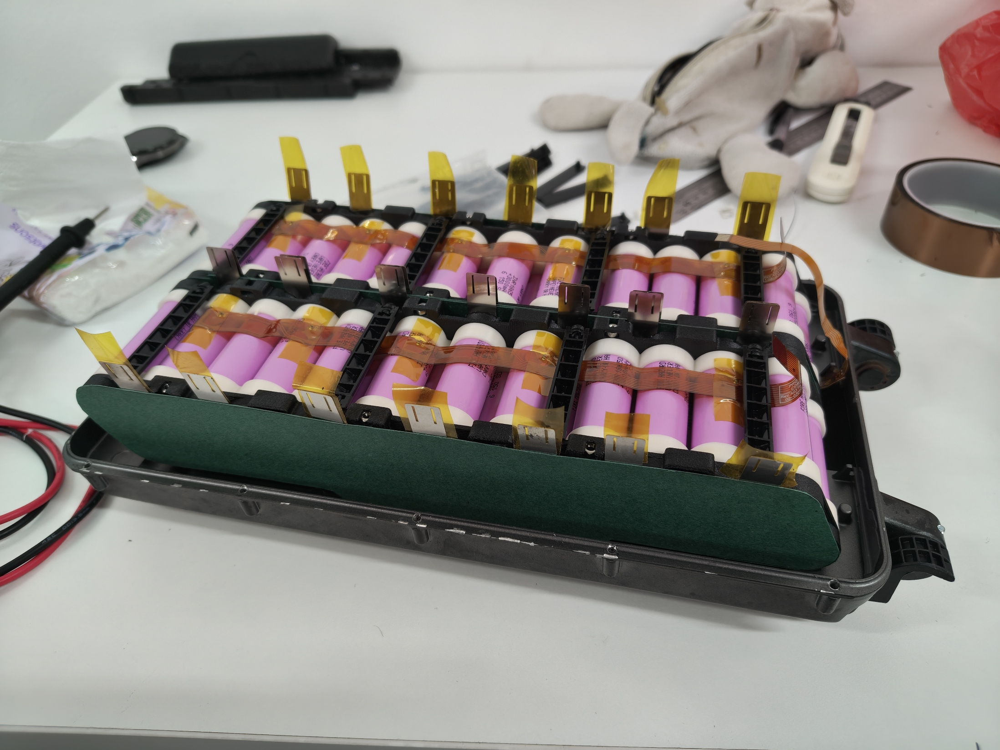

# Battery pack #2 assembly at Sodion

**Date:** 17-06-2026

**Duration:** 5hr

**People:** Yizhang

**Subsystem:** 🔋 Power & Battery 

**Outcome:** ✅ Complete

**Objective:**
>Assemble battery pack #2

**Resources:**
NIL

****
## TL;DR

Battery pack #2 fully assembled.

## Work done
#### Spot welding pack #2 at Sodion
- Visited Sodion again to use their spot welder.
- The revised design is much easier to assemble and has much improved rigidity compared to the first pack.
- The laser cut nickel strips were much easier to weld on as it eliminates the need for strip stacking.
- The little slot cutout at the weld sites also drastically improved weld performance; little to no sparking was observed and the welds stayed solid when we pulled on the tabs.
- Only took 1 person one afternoon to complete the whole pack, compared to pack #1 which took 2 person 3 days.

## Findings & data
#### BMS welding sequence
Pack #1 had the battery GND tabs welded to the BMS first, followed by all the positives in no exact order. Care was taken to weld the positive tabs in sequence according to the pad labels, from $P1$ to $P28$. 

When pack #1 was welded, some red indicator LEDs on the BMS randomly lit up when certain pads are connected. However when pack #2 was welded according to the pad labels, the sequence of indicator LEDs still seemed random.

#### Cell voltage
- Average cell voltage: 3.446V ($\pm 0.002V$ across all 56 cells)

## Decisions
NIL

## Roadblocks
NIL

## Next steps
- [x] Battery #2 charge test

## Media

