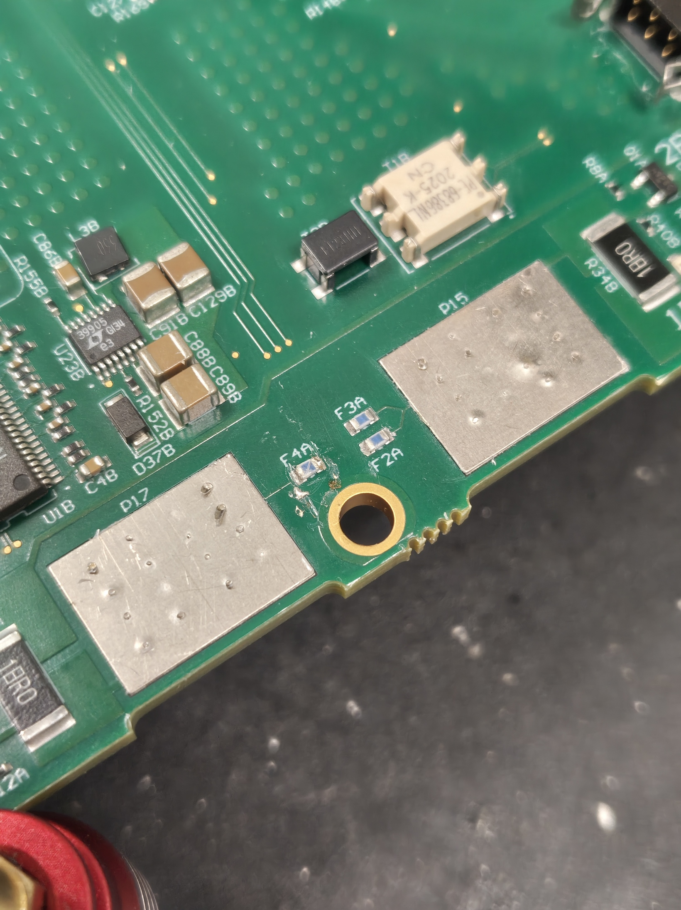
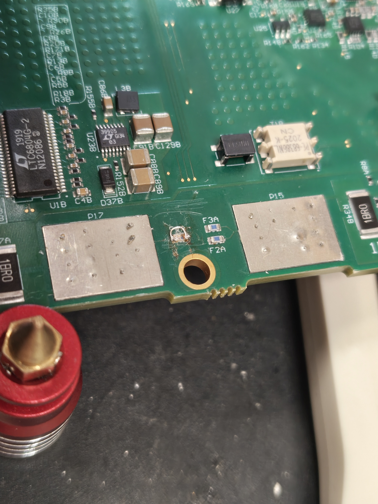
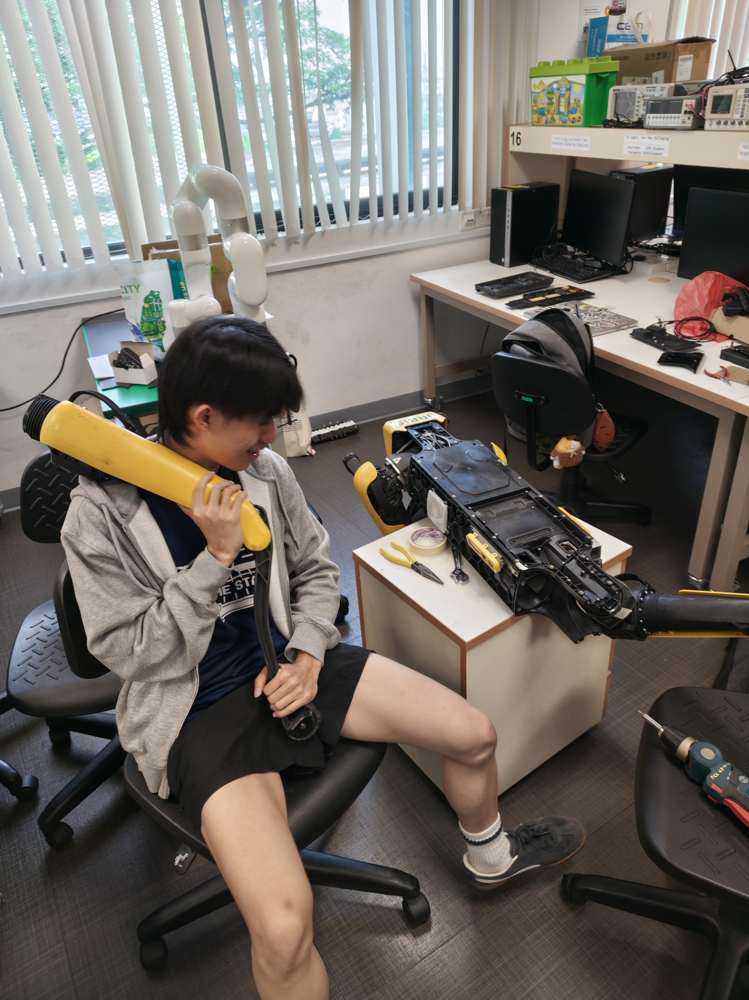
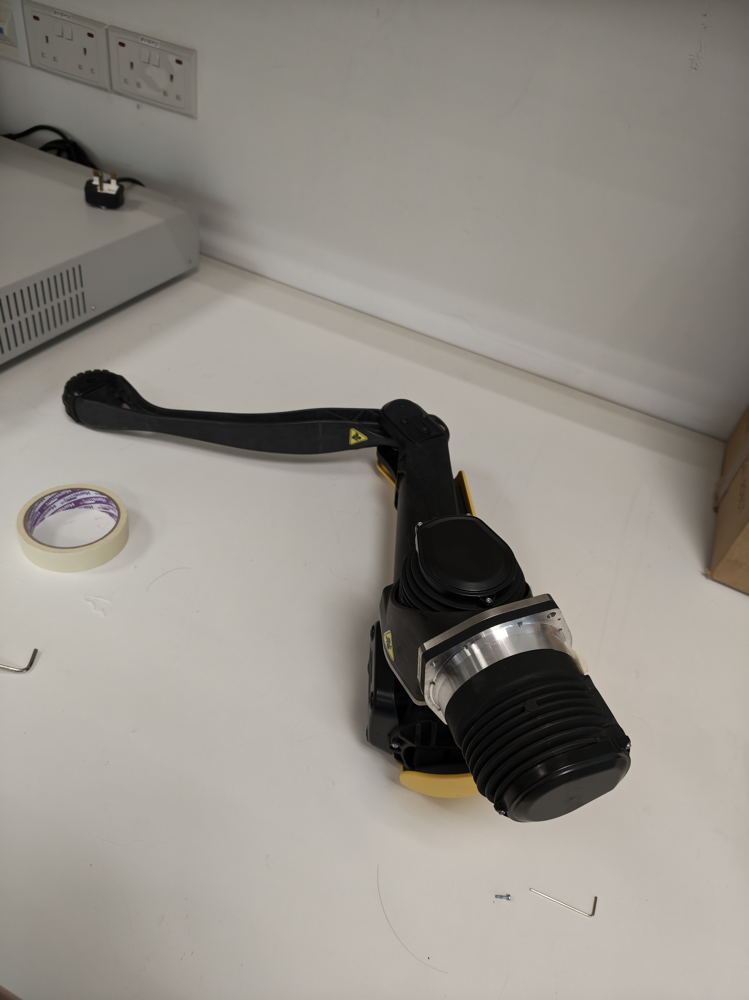

# Battery pack #2 and SPOT Teardown
**Date:** 2026-06-15

**Duration:** 6hr

**People:** Ming, Yizhang

**Subsystem:** 🦿 Actuators & Legs, 🧠 Compute & Mainboard, 🔋 Power & Battery

**Outcome:** ✅ Complete

**Objective:**
>SPOT teardown.

**Resources:** 
- —

****
## TL;DR

Started disassembly and teardown of SPOT to take out left hind leg for diagnosis and testing. Battery pack #2 was also disassembled for repair.

## Work done
#### Took SPOT apart
- Disassembled and tore down SPOT to take out the left hind leg motor.
- Successfully took out the left hind leg, as well as the left_hind_x motor controller board with the hall encoder.

#### Battery pack #2 disassembly
- The 2nd battery pack was disassembled similar to the first.
- A voltage test across the cell groups reveals severly discharged cells, with a max recorded voltage of only 0.05V.
- During disassembly, we spotted a cracked fuse next to pad P17. Some sort of SMD fuse (blue, 0603 footprint) is attached beside every pad.
- An attempt was made to de-solder the fuse, but unsuccessful as the board was coated in something that made the solder hard to melt even after prolonged heating with a reflow station hot air gun.
- Instead, a thin piece of wire was used to just jump the fuse.

## Findings & data
#### Left Hind leg, Controller board and Encoder analysis
- Encoder was identified to be iC-MHM 14-bit absolute angle hall encoder.
- Initial inspection of the hind leg wires and controller board showed no physical defects
- When we tried to use the test points on the board to check for any wiring defects, it was very difficult to do so as there was a layer of coating (likely epoxy) on the entire board, preventing us from making contact with the points unless we forcefully scraped it away
- Decided to wrap it up and do the controller board switching the next session

## Decisions
>**Decision:** Continue with SPOT teardown and open up the left hind leg for checks and testing.

**Why:** After further discussion, we concluded that this is not enough to confirm the encoder is the problem. Whilst mechanically the motor may still be functioning, magnetically it may be fault (demagnetised or broken magnets in rotor), that result in the frozen position value. Hence, there are still 2 fault points: the motor and the encoder, but the problem has been confirmed to be isolated to the left_hind_x motor.

The test to isolate the fault to the motor/encoder will proceed in this manner:
1. teardown and disassemble SPOT to take out the left hind leg.
2. Check for any faulty wiring whilst doing so.
3. when left hind leg is removed, open up the left_hind_x motor to check the controller board with the encoder for any physical defects or faults
4. If everything passes, swap this controller board with that of the other working hind leg
5. Run the diagnostics and admin console visualiser again to see if the fault swaps to the other leg. If so, its an encoder fault. If it does not, it is a motor/rotor fault.

**Alternatives considered:** Utilising joint-level API on the SPOT SDK, but this requires a specific special-permissions license that we do not have.

## Roadblocks
- —

## Next steps
- [x] Swap controller boards with working hind leg and check diagnostics and admin console visualiser

## Media

