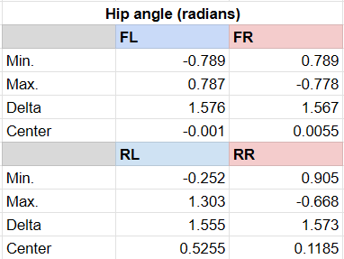
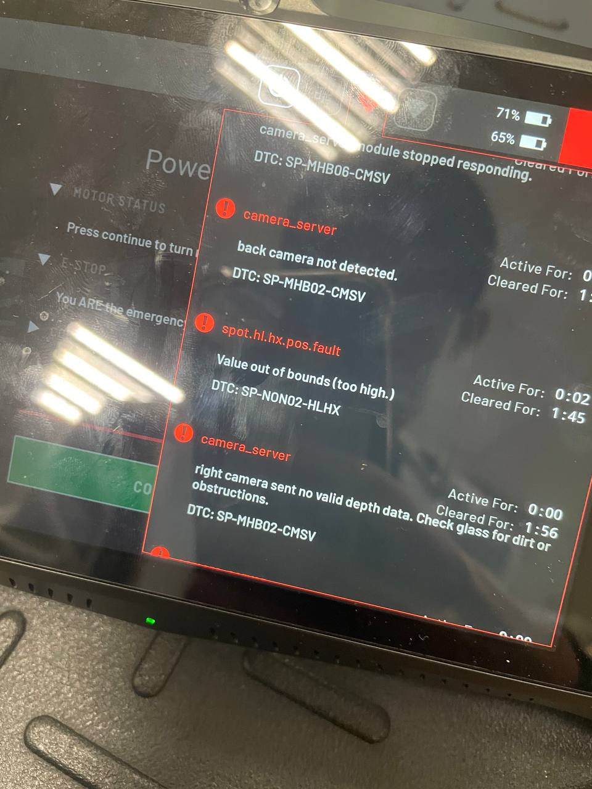

# Output encoder PCB swap

**Date:** 30-06-2026

**Duration:** 6hr

**People:** Ming, Yizhang

**Subsystem:** 🦿 Actuators & Legs

**Outcome:** ✅ Complete

**Objective:**
>Swap the output encoder modules for the hind hips and test to isolate root issue.

**Resources:**
>- [IC MU datasheet](https://ave-nl.com/wp-content/uploads/2021/12/MU_datasheet_F2en_AVE.pdf) 
>- [LTC2863 transceiver](https://www.analog.com/media/en/technical-documentation/data-sheets/2862345fc.pdf)

****
## TL;DR

First swapped hind hip's entire rotor assemblies, then only the output encoder PCB. The former relocated the frozen angle issue to the right hip, while the latter somehow resolved the issue and instead gave active, off-limit readings. Robot is unable to power up due to the angle out of range faults.

## Work done
#### Swap hind leg rotor assemblies
- The entire rotor assembly (main connector + encoder + force beedback module) was plucked out and swapped around.
- After reassembling Spot, powering it on reveals a loadcell error for the right hip.
- The live model viewer in the console reflects no angle updates for the right leg when manually jogged. The left hip works well.
- Robot is unable to power up due to loadcell error being categorized as a hard fault.

#### Swap hind hip output encoder + connector only
- Spot was amputated again. This time, only the main connector PCB including the encoder is removed and swapped.
- The rotors + loadcell assembly is placed back in their original stators. Apparently the load cells are calibrated per joint and swapping them likely resulted in the error above.
- The motor driver boards are also swapped back (they were swapped a long long time ago).
- After reassembly and powering up Spot, the loadcell error disappeared.
- Jogging the legs manually also reveals that the frozen angle issue is gone! Both hind hips reflect real time position changes in the console.
- However, the left hind hip seems to suffer from some offset issue. The controller also logs a angle off limits fault.
- The robot is unable to power on the motors due to the angle fault.
- The right hip, however, seems to reflect angles accurately.

#### Angle limits test
- Spot's 4 legs were manually jogged across the full range of motion and the 4 hip angle readings were recorded at the limits.
- The data shows that the sign of the hip joints are matched per-side: the angle limit when the legs are tucked beneath the robot is negative for the left-side hips and positive for the right.
- The data also shows a relatively centered range about the horizontal position.
- Comparing the left and right hips, the right hip had a consistant angle offset from the left. This infers a encoder calibration offset error.

## Findings & data
#### Hip joint full ROM angles
The hip joint of each leg was manually jogged across the full range of motion and the angles at the physical limits recorded.

From the data, we can see that the angle range (delta) is quite consistant across the joints including the one with offset error. From the front hip joint angles, we notice the angle values are about centered around 0 rads. Using 0 rad as the optimal center angle, we can calculate the offset of the hind hip joints:

| RL            | RR             |
|---------------|----------------|
| 0.5255 (≈30°) | 0.1185 (≈6.8°) |

#### Offset encoder PCB components

## Decisions
>**Decision:** Swap back the encoders and test again.

**Why:** Nobody knows why swapping the encoder solved the frozen angle problem. Perhaps it was due to rotor alignment or some mechanical assembly issue? Swapping back will confirm if it is a magnet + encoder hardware pairing issue.

**Alternatives considered:** NIL

>**Decision:** If swap fails, rotate housing attached to rotor by 1 screw.

**Why:** Manually correct the offset, but minimum resolution is 45 degrees as only 8 screws are used to secure rotor housing.

**Alternatives considered:** Try to find some calibration procedures. However motors are unable to power on due to out of range fault, hence no calibration procedures can be performed.

## Roadblocks
NIL

## Next steps
- [ ] Swap back the encoders and test again
- [ ] If swap fails, rotate housing attached to rotor by 1 screw

## Media

encoder feedback test:

  <video width="360" height="480" controls>
    <source src="../assets/encoder-responsive.MOV" type="video/mp4">
    Your browser does not support the video tag.
  </video>

