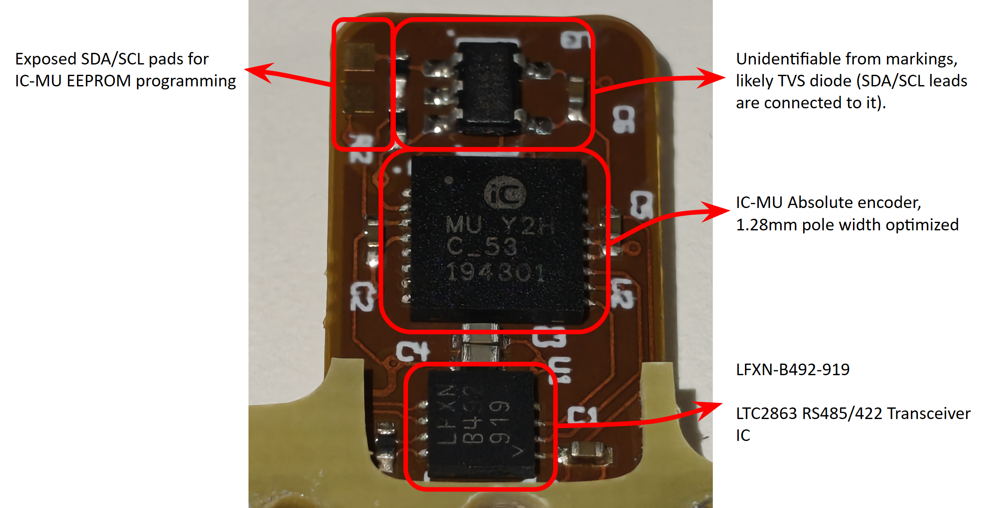
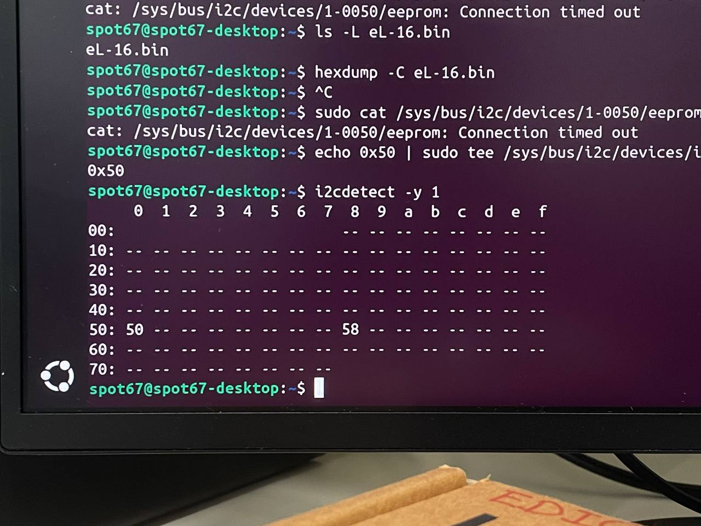
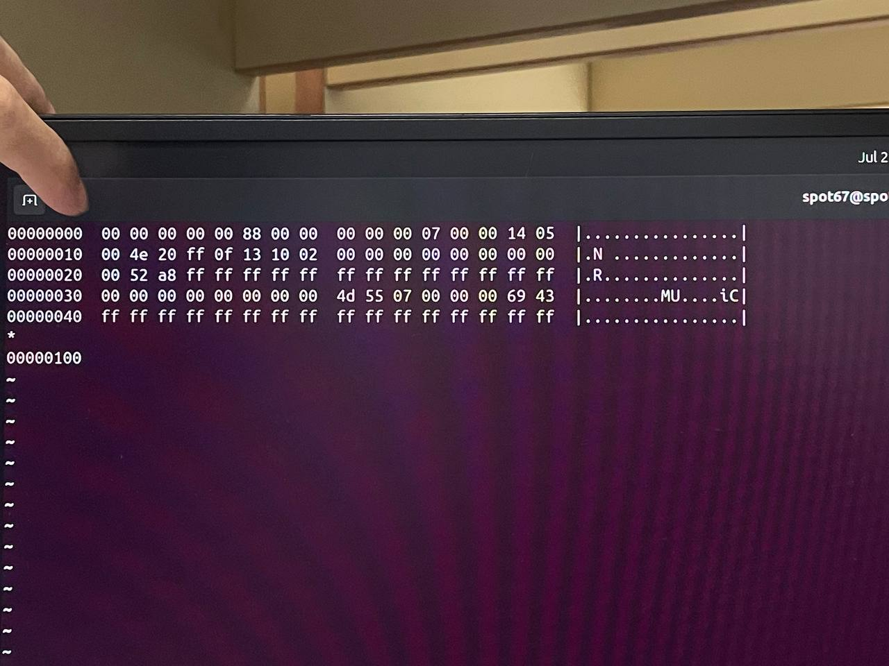
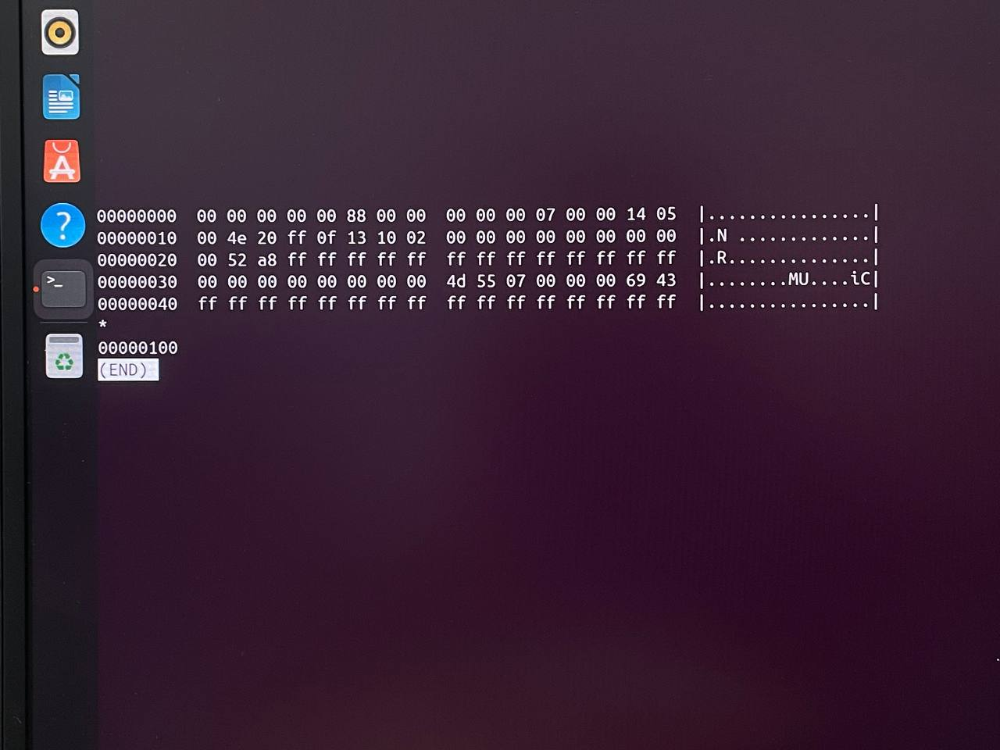
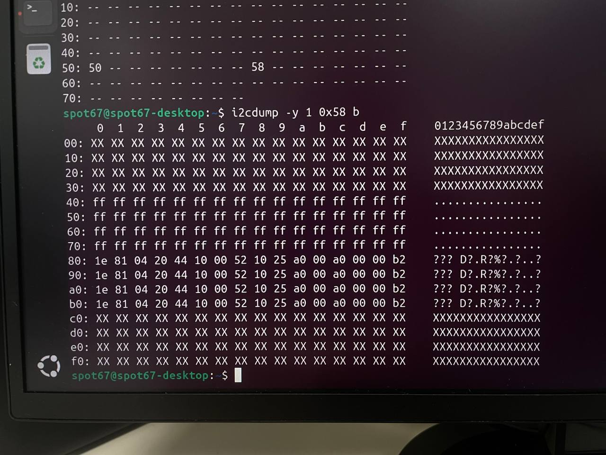
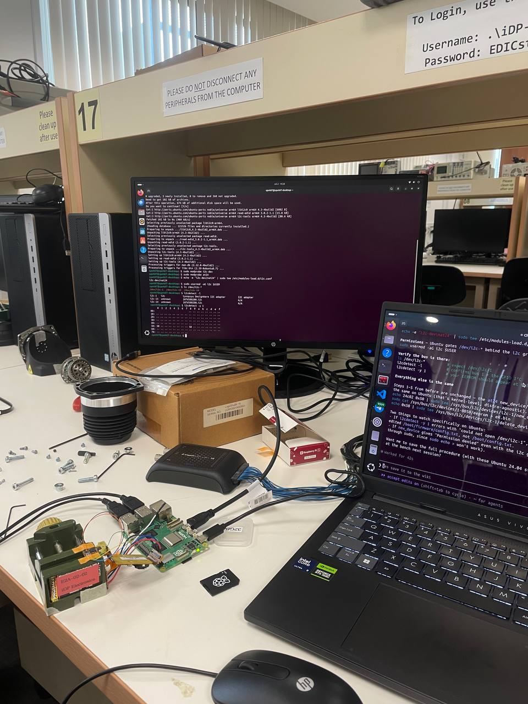
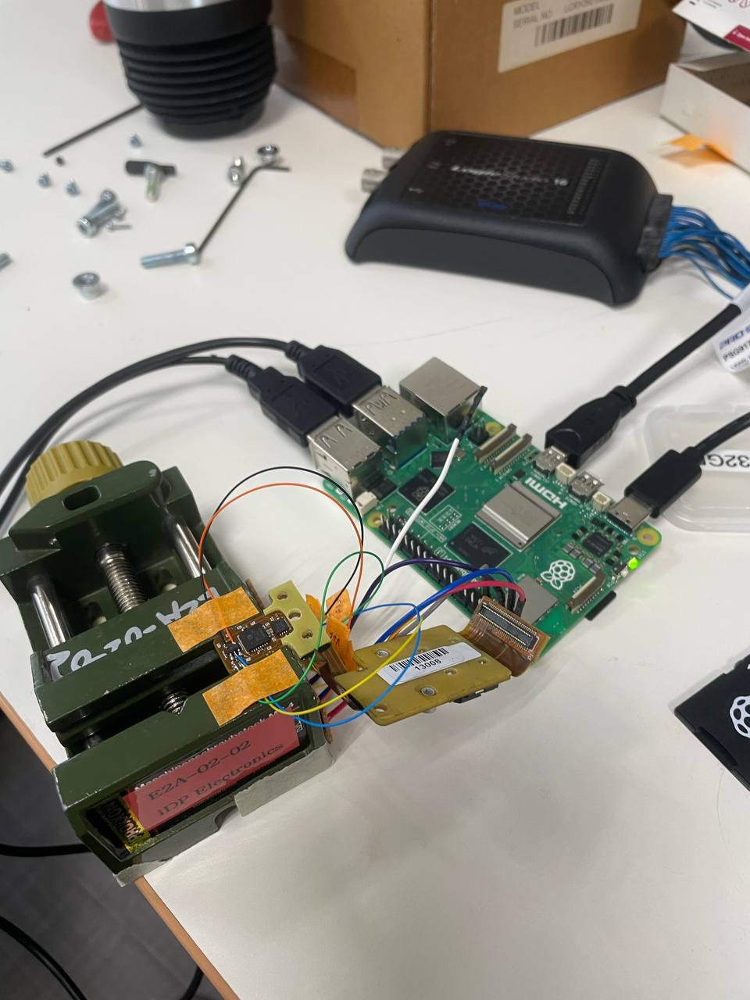
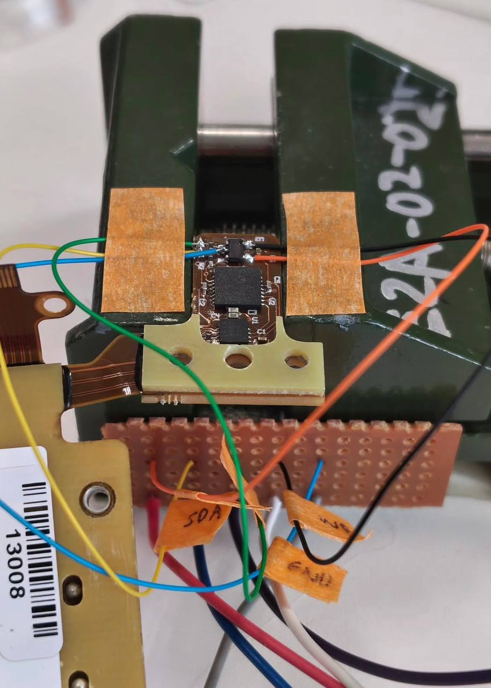

# Encoder EEPROM probe

**Date:** <font style="color:tomato; font-family:Consolas;">02-07-2026</font>

**Duration:** 8h

**People:** Ming, Yizhang

**Subsystem:** 🦿 Actuators & Legs

**Outcome:** ✅ Complete

**Objective:**
>Read and compare the iC-MU secondary encoder's configuration EEPROM on the suspect (eL) vs the known-good (eR) PCB via a Raspberry Pi I2C bench rig, to determine whether the fault found on 2026-07-02 (SpotCheck Encoder Health <20% on eL) is a corrupted/miscalibrated configuration — recoverable by reflashing or re-running the iC-MU's AN3 auto-calibration — or a genuine physical hardware defect requiring replacement.

**Resources:**
>- [IC MU datasheet](https://ave-nl.com/wp-content/uploads/2021/12/MU_datasheet_F2en_AVE.pdf) 
>- [LTC2863 transceiver](https://www.analog.com/media/en/technical-documentation/data-sheets/2862345fc.pdf)
>- [24C02 EEPROM](https://ww1.microchip.com/downloads/en/DeviceDoc/21202j.pdf)

****
## TL;DR

Bench-read the encoder's onboard config EEPROM directly through test points into a Raspberry Pi (Ubuntu 24.04) over I2C, deliberately powering the shared VCC rail at 3.3V — below the iC-MU's 4.5V minimum supply — so the iC-MU chip itself stays dormant and off the bus, leaving only the passive EEPROM to respond (no bus-contention risk). Identified the chip as a 24C02 (256 bytes). Dumped and verified both the suspect (eL) and known-good (eR) EEPROMs: both pass the iC-MU's own CRC16 check and are byte-for-byte identical across the entire configuration region, including an all-zero gain/offset/phase calibration-trim block. Since the healthy eR ships with the exact same all-zero trims, that block is evidently Boston Dynamics' normal factory configuration (the iC-MU's runtime auto-gain-control loop handles signal conditioning live; no per-unit trim is stored) — not a sign of lost calibration on eL. With configuration proven identical between the healthy and faulty units, the difference must be physical, not firmware: this closes off reflashing and recalibration as repair paths and leaves hardware replacement of eL as the only fix.

## Work done
#### Locating the config EEPROM
- Located the config EEPROM on the secondary encoder PCB, mounted immediately next to the iC-MU Hall sensor IC and exposed via test points. The iC-MU loads its operating configuration from this external I2C EEPROM at every power-up.

#### Bench rig setup
- Enabled I2C on the Pi (Ubuntu 24.04): added `dtparam=i2c_arm=on` and `dtparam=i2c_arm_baudrate=50000` to `/boot/firmware/config.txt`, then rebooted.
- Loaded the kernel modules and set up permissions: `sudo modprobe i2c-dev`, `sudo modprobe at24`, `sudo usermod -aG i2c $USER` (re-login for group membership to take effect).
- Wired SDA/SCL from the encoder PCB's test points to Raspberry Pi GPIO2/3 (I2C bus 1), tied write-protect high (read-only throughout — no writes were ever made to either chip), and powered the shared VCC rail at 3.3V rather than the chip's nominal 5V.
- This was deliberate: the iC-MU's minimum supply voltage is 4.5V and it doesn't begin operating below ~4V, so at 3.3V the iC-MU stays dormant and off the bus entirely, eliminating any risk of a second master contending for the bus and leaving only the EEPROM to answer.

#### Device discovery and identification
- Scanned the bus: `i2cdetect -y 1` → found a device at 0x50 (the EEPROM) and a second device at 0x58.
- First attempted to bind the EEPROM as a 24C16 (the larger, more common part): `echo 24c16 0x50 | sudo tee /sys/bus/i2c/devices/i2c-1/new_device`, then tried to read it: `sudo cat /sys/bus/i2c/devices/i2c-1/1-0050/eeprom` → this hung and returned "Connection timed out" — a 24C16 uses 11-bit sub-addressing across all of 0x50–0x57, so binding it as a 24C16 while the physical chip only ACKs at 0x50 causes exactly this kind of read failure.
- Unbound the failed device: `echo 0x50 | sudo tee /sys/bus/i2c/devices/i2c-1/delete_device`, then re-bound it correctly as a 24C02: `echo 24c02 0x50 | sudo tee /sys/bus/i2c/devices/i2c-1/new_device`. This time the read succeeded immediately, confirming the part is a 24C02 (256 bytes) rather than a 24C16 — consistent with the lone 0x50 ACK and the dump's non-wrapping 0xFF tail.

#### Dumping eL and eR
- Dumped the full 256-byte contents: `sudo xxd /sys/bus/i2c/devices/i2c-1/1-0050/eeprom` (or equivalently `sudo cat /sys/bus/i2c/devices/i2c-1/1-0050/eeprom | xxd`). This is the suspect encoder, eL. An excerpt of the returned data (full 256 bytes in the hexdump below):
  ```
  00 00 00 00 00 88 00 00 00 00 00 07 00 00 14 05
  00 4e 20 ff 0f 13 10 02 00 ...
  ... 00 52 a8 ff ...
  ... 00 4d 55 07 00 00 00 69 43
  ```
  followed by an all-`FF` tail out to byte 255.
- Repeated the identical procedure (delete_device / new_device 24c02 / xxd dump) on the known-good right-leg encoder, eR — the returned dump was found to match eL's byte-for-byte (confirmed later by direct diff).

#### The 0x58 device
- Investigated the second device at 0x58 the same way: attempted an i2cdump/read, which returned failed-read gaps and a repeating 16-byte pattern rather than sequential memory content — this is NOT a second memory chip, likely another small IC weakly present on the bus, or the under-volted iC-MU faintly responding. Not pursued further; irrelevant to the EEPROM comparison.

#### Integrity verification and comparison
- Ran a short Python script over the two saved 256-byte dumps to (a) recompute the iC-MU's CRC16 (CRC-CCITT, polynomial 0x1021, init 0x0001) over bytes 0x00–0x20 + 0x30–0x3F and compare against the stored checksum at 0x21/0x22, (b) diff the two dumps byte-for-byte across 0x00–0x3F, and (c) decode the gain/offset/phase trim register fields per the iC-MU register map.
- Verified data integrity computationally: the iC-MU's own CRC16 (CRC-CCITT, polynomial 0x1021, init 0x0001), computed over EEPROM bytes 0x00–0x20 plus 0x30–0x3F, matched the stored checksum at bytes 0x21/0x22 (0x52A8) for BOTH eL and eR — confirming the iC-MU would accept either chip's stored configuration as valid at boot, i.e. neither is corrupted.
- Decoded the configuration fields against the iC-MU register map: the entire signal-conditioning/calibration-trim block — gain, offset, and phase, for both the master and nonius channels, registers 0x00–0x0A — reads all-zero on BOTH eL and eR.
- Directly diffed the two dumps byte-for-byte across the full configuration region (0x00–0x3F): zero differing bytes. eL and eR carry an identical configuration.

## Findings & data
#### EEPROM identification and integrity



- Chip identified: 24C02, 256 bytes, I2C address 0x50.



- CRC16 over 0x00–0x20 + 0x30–0x3F = 0x52A8, matches the stored value on both chips.
- Full configuration region 0x00–0x3F: byte-for-byte identical between eL and eR.

<p>


</p>

- Gain/offset/phase trim registers (0x00–0x0A): all-zero on both chips — since eR is known-good and healthy, this proves all-zero trims are Boston Dynamics' normal factory configuration, not evidence of lost/corrupted calibration on eL.
- Device signature bytes intact at EEPROM 0x38–0x3F on both.
- Secondary device at 0x58 found while probing eL: confirmed not a memory chip, irrelevant to the diagnosis.



## Decisions
>**Decision:** Rule out EEPROM reflashing and iC-MU recalibration (AN3 auto-cal) as a repair path for eL.

**Why:** Reflashing would only rewrite bytes already confirmed correct and identical to a healthy unit; recalibration only adjusts stored gain/offset/phase trims, which are provably not the differentiator (neither chip stores any), and can't compensate for a maxed-out runtime auto-gain-control loop straining against a weak analog signal.

**Alternatives considered:** Attempting AN3 auto-calibration on eL before condemning it — rejected once the eR dump showed identical all-zero trims, since there is nothing left to recalibrate.

>**Decision:** Proceed with hardware replacement of eL as the only remaining fix; close out further EEPROM/firmware investigation on this fault.

**Why:** With configuration ruled out as the differentiator, the only remaining explanation for SpotCheck's <20% Encoder Health reading is a physical defect in the Hall sensor front-end or its magnetic coupling.

**Alternatives considered:** NIL

## Encoder freeze response freeze cycle - Current Hypothesis

eL froze on every boot in the original baseline (legL, -0.880 rad). Then, across the whole 06-30 A/B rotor and encoder swaps and into the start of 07-02 (magnet swap, SpotCheck run), it did NOT freeze — it responded fine to jogging in both configs. Then, after the 07-02 SpotCheck run plus a walk and a power-cycle, it froze again — and has stayed frozen since, even after swapping the magnet back to the exact eR+mL / eL+mR pairing that hadn't frozen back on 06-30. Same chip, same magnet pairing, two different points in time, two different outcomes. Nobody has a fully confirmed answer for why.

Worth being precise about what "frozen" actually is: a boot-time absolute-position-seed validation failure that then gets latched for the rest of that power session. That's why jogging the joint doesn't move the reading even though the primary motor-side encoder underneath is demonstrably healthy and tracking fine — the joint controller isn't reading a stale signal, it's refused to trust the secondary's seed at all, right at boot, and won't reconsider until the next power cycle.

The clue that reframes the whole thing: SpotCheck measured eL at <20% Encoder Health DURING the exact window when it was still responding normally to manual jogging. "Responds when jogged" and "sick" were true of eL at the same time — the boot-time seed check is evidently a much coarser pass/fail gate than whatever continuous signal-quality metric SpotCheck's health score is built from.

Best guess right now: eL is a marginal, slowly degrading part sitting right around the firmware's seed-accept threshold. The 06-30 session fully pulled and reseated the PCB and its connectors — exactly the kind of disturbance that can nudge a marginal solder joint or connector contact back above threshold, at least temporarily — which would explain why it seeded cleanly through 06-30 and the start of 07-02. Then SpotCheck's full-ROM sweep plus the subsequent walk put more mechanical stress through the joint than it had seen in weeks, and the next cold boot after that pushed it back under threshold for good.

Two alternatives we can't fully rule out. (a) SpotCheck's own recalibration pass derived new per-joint offsets from eL's already-marginal readings, and it's that freshly stored calibration — not eL's raw signal — that now fails boot validation. This is weakened by one fact: the very first freeze, back at the untouched factory baseline, happened before any SpotCheck run ever touched the calibration, so freezing demonstrably doesn't require a SpotCheck-tainted recal. (b) The robot firmware latched an internal "Joint Encoder Unhealthy" quarantine flag against hr.hx after the failed SpotCheck run, and it's simply refusing to seed that joint at boot from now on, regardless of what eL's raw signal is actually doing.

None of this changes the plan on the table — every branch above still ends with eL needing replacement. But if we want to pin down the actual mechanism (mainly worth it to strengthen the case to Boston Dynamics, or to know whether the robot itself needs a cal-clear even after the new part goes in), the cheap-to-expensive next tests are: (1) run REVERT_CAL via the SpotCheck SDK — if the freeze survives that, it's not the stored calibration; (2) swap the encoders back to their original home sockets (eL→legL, eR→legR) — if the freeze follows eL back to the left leg, that's hardware confirmed; if it stays on legR even with the healthy eR now installed there, that points to a robot-side latched flag instead; (3) at bench power (5V, not the 3.3V used for the EEPROM-only read), read eL's live absolute-position word and error flags directly off its serial output — the RS-485 pair through the onboard LTC2863 transceiver. This is the most definitive of the three, would show the exact failure signature, and the same rig doubles as an acceptance test for whatever replacement part comes in.

Tracked as an open follow-on investigation, separate from the replacement/procurement decision above.

## Roadblocks
NIL

## Next steps
- [x] Determine whether eL's configuration EEPROM is corrupted or miscalibrated — DONE, ruled out
- [x] Open a Boston Dynamics support request for a replacement secondary-encoder Hall-IC PCB (see the 2026-07-02 SpotCheck log)
- [x] Separately investigate why the eL fault presented intermittently across power cycles — see the Hypothesis section above for the current best explanation and the discriminating tests that would confirm it; not required before ordering the replacement part.

## Media
<p>



</p>
