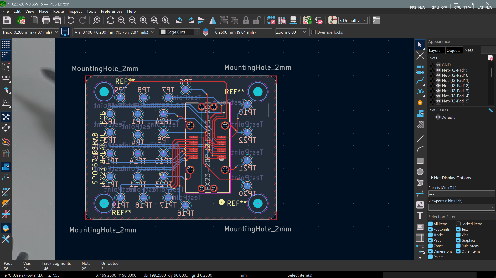
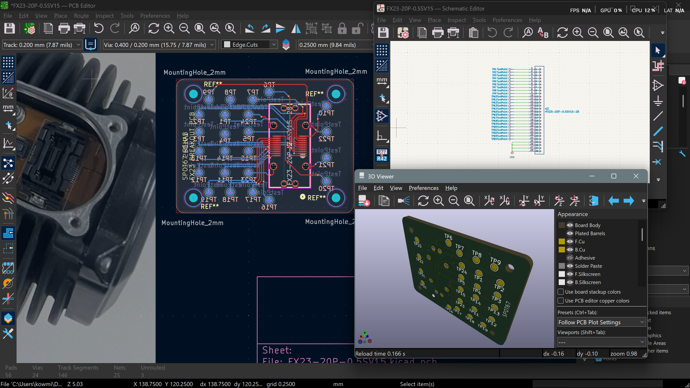
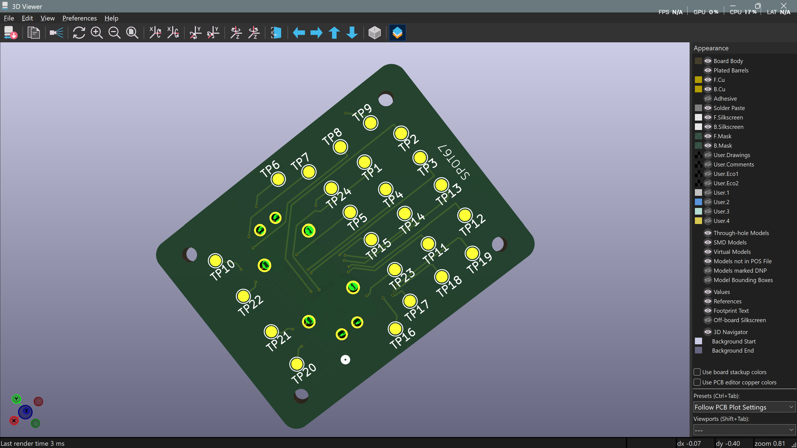
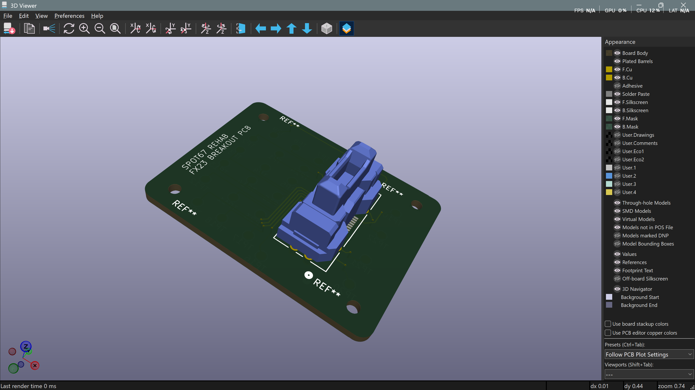

# FX23 encoder breakout — final revision & board order

**Date:** 06-07-2026

**Duration:** 3h

**People:** Ming

**Subsystem:** 🦿 Actuators & Legs

**Outcome:** ✅ Complete — all pre-fab items closed, **board ordered**

**Objective:**
>Close out the open items from the [04-07 design review](2026-07-04-fx23-breakout-design-test-plan.md) (unrouted nets, mounting, fab capability, silkscreen) and get the FX23 breakout board to fabrication, so bench readout of the secondary encoder's serial output can proceed once boards arrive.

**Resources:**
>[04-07 design review & test plan](2026-07-04-fx23-breakout-design-test-plan.md)
>[HIROSE FX23/FX23L Series datasheet](../assets/HIROSE-FX23-datasheet.pdf)

****
## TL;DR

Final layout revision closed blocking/recommended hardware items from the design review. **four 2mm corner holes** added with board resized and layou redesigned, for pcb to mount properly onto motor. The fab confirmed it supports the two capability floors this design sits on (0.15mm clearance, 0.2mm drill). A second design re-review verified the updated layout against the review checklist with no new issues. **Board ordered 06-07-2026.** Next action is run the bench test plan. Matching encoder chip (iC-MU Y2HC) was also bought for replacement of eL encoder once bench testing is complete and full diagnosis of the fault is done.

## Work done

#### Layout revision 
**Mounting added with 4× 2mm corner holes**
- addresses the Hirose datasheet warning about the connector taking mate/unmate loads alone (relevant here: bring-up needs several of the connector's ≤100 rated cycles).
- Resized the board for mounting holes to align with that on the motor, redesigned layout to accommodate the holes while keeping the 24 TestPoints and 28-pin FX23 footprint intact.

#### Re-review of the updated layout
- Verified the revision against the 04-07 checklist from the updated editor view + 3D renders. Pad/net accounting still self-consistent: **56 pads** (24 TestPoints + 28 on J1 + 4 mounting holes), **24 vias** (one per TP net), **25 nets** (24 TP + shared GND). No new issues introduced by the revision.
- The small circular mark near TP16 that looked like a stray footprint in the renders was identified as **part of the FX23 footprint itself** (Ultra Librarian artwork), not an orphan element, no action needed.

#### Fab capability — confirmed
- Both "check with the fab" flags from the review **pass**: minimum copper clearance supports the ~0.17mm actual pad spacing inside the J1 footprint (covered by the scoped DRC rule), and minimum drill supports the 0.2mm/0.4mm vias. The design is within standard (non-HDI) service capability.

#### Order placed
- **Board sent to fab 06-07-2026.**
- **iC-MU Y2HC encoder chip also ordered** for replacement of eL once bench testing is complete and full diagnosis of the fault is done.

## Decisions
NIL

## Roadblocks
NIL

## Next steps
- [ ] Boards arrive → run the bench test plan
- [ ] replace the eL encoder with the new iC-MU Y2HC chip and re-test to confirm the fault is resolved.

## Media

*(Pre-revision design views are in the [04-07 log's](2026-07-04-fx23-breakout-design-test-plan.md) Media section; below is the final as-ordered revision.)*

Final layout in the PCB editor — 4× 2mm corner mounting holes, silkscreen title. (Status bar reads "Unrouted 3" only because the GND net's copper was hidden for track visibility in this screenshot — the saved board reports 0 unrouted; 3 = exactly the 4-pad tab net's connection count.)

Overview — final layout alongside the revised 28-pin schematic and the 3D preview:

Final 3D render, top side — TP1–TP24 and the four corner holes:

Final 3D render with the FX23 connector model mounted (the `REF**` texts are the deliberately-left mounting-hole references; the small white dot near TP16 is part of the FX23 footprint artwork):

