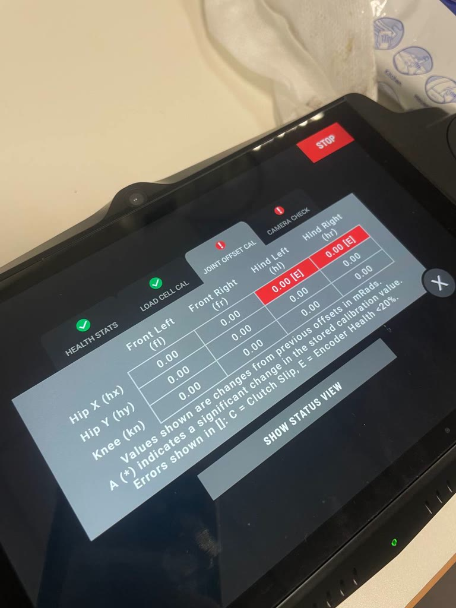

# Encoder board swap L↔R — third SpotCheck & hypothesis re-ranking

**Date:** 15-07-2026

**Duration:** 6h

**People:** Ming, Yizhang

**Subsystem:** 🦿 Actuators & Legs

**Outcome:** 🔧 WIP — swap changed nothing (both hind hip-X still `[E]`); rules out a single bad board — socket-side cause (discs / air gap / seating) now ranked first over both-boards-bad

**Objective:**
>Discriminate board-side vs socket-side causes of the double hind hip-X `[E]` flag from [14-07](2026-07-14-encoder-chip-swap.md): swap the two hind hip-X encoder **boards** between legs (discs stay on their rotors) and run a third SpotCheck. If `[E]` travels with a board, that board is bad; if both sockets stay `[E]`, the cause sits on the socket side (disc, air gap, mounting) — or both boards are independently bad.

**Resources:**
>[14-07 chip swap & double encoder-health fault](2026-07-14-encoder-chip-swap.md)
>[01-07 SpotCheck diagnosis](2026-07-01-spotcheck-diagnosis.md)

****
## TL;DR

Swapped the hind hip-X encoder boards left↔right (left socket: **eR board + mL disc**; right socket: **NEW-chip board + mR disc**) and ran SpotCheck run 3. Result: **every joint reports a change of exactly 0.00 mRad, and both hind hip-X joints still flag `[E]`.** This rules out any explanation with exactly one bad board (its `[E]` should have moved and the vacated socket cleared). There are two explanations survive, and the swap alone cannot distinguish them: **a socket-side cause in both hind hips (magnet-disc damage from repeated remounts, air gap, seating)** or **both boards independently bad**. The former is ranked first as the latter needs two independent failures. all-exactly-0.00 across all 12 joints (including the front legs, which jittered ±0.3–1.7 mRad between runs 1 and 2) suggests the calibration may not have actually recomputed this run and a clean, observed re-run is needed before the conclusion is firm.

## Work done

- Swapped the two hind hip-X secondary encoder **boards** between legs. Magnet discs never left their rotors. Config after swap: **left socket = eR (original right board) + mL disc; right socket = NEW-chip board (third-party iC-MU on the original eL PCB) + mR disc.**
- Booted, ran SpotCheck (run 3), photographed the offset table.

## Findings & data

#### SpotCheck run 3 — changes from stored offsets, mRad

| Joint | Front Left | Front Right | Hind Left | Hind Right |
|---|---|---|---|---|
| Hip X | 0.00 | 0.00 | **0.00 [E]** | **0.00 [E]** |
| Hip Y | 0.00 | 0.00 | 0.00 | 0.00 |
| Knee | 0.00 | 0.00 | 0.00 | 0.00 |

No `*` flags anywhere. Health Stats ✅ and Load Cell Cal ✅; Camera Check ❗ (known rear-camera fault).

#### Full swap timeline (all sessions)

Continued from the [01-07 log's](2026-07-01-spotcheck-diagnosis.md) timeline; `NEW` = the original eL PCB carrying the third-party iC-MU chip from the [14-07 rework](2026-07-14-encoder-chip-swap.md).

| Stage | Config (legL / legR) | Result |
|---|---|---|
| Baseline (pre-06-30, original assembly) | legL = eL+mL, legR = eR+mR | legL FROZEN ≈ -0.880 rad; legR fine |
| 06-30 A — rotor+encoder swapped, magnet stays home | legL = eR+mL, legR = eL+mR | Both respond (no freeze); legL ~30° offset; PLUS a per-joint loadcell fault (loadcell moved with the rotor), denying motor power |
| 06-30 B — rotor+loadcell reverted, encoder stays swapped | legL = eR+mL, legR = eL+mR (same sensor config as A) | Loadcell fault gone; both respond; legL ~30° offset / angle-limit fault (denies motor power); legR reads fine. Full-ROM offsets: RL ≈ 0.5255 rad (~30°), RR ≈ 0.1185 rad (~6.8°) |
| 01-07 step 1 — magnets swapped | legL = eR+mR, legR = eL+mL | Both still respond; magnet swap alone changed nothing |
| 01-07 step 2 — SpotCheck run (same config) | legL = eR+mR, legR = eL+mL | FAILED joint-offset-cal; hr.hx (legR, eL) Encoder Health <20% [E], "Joint Encoder Unhealthy — contact Boston Dynamics"; hl.hx (legL, eR) healthy |
| 01-07 step 3 — walked/stood (same config) | legL = eR+mR, legR = eL+mL | Both legs track fine while powered (incremental tracking off the healthy primary encoder) |
| 01-07 step 4 — cold power-cycle (same config) | legL = eR+mR, legR = eL+mL | legR (eL) FROZEN ≈ -0.982 rad |
| 01-07 step 5 — magnets swapped back | legL = eR+mL, legR = eL+mR (**note: sensor config now identical to 06-30 A/B**) | legR (eL) STILL FROZEN, magnet-independent. Same physical config as 06-30 B, which did NOT freeze → eL's own behavior changed between 06-30 and now, not just its magnet pairing |
| 14-07 A — eL board pulled, third-party iC-MU chip reworked on, boards to native sockets | legL = NEW+mL, legR = eR+mR | Boot fault `hr.hx` out of bounds (too low) → cleared with the jog trick; SpotCheck run 1: hl.hx **+114.68\* [E]**, hr.hx **-5.54\* [E]**; robot walks |
| 14-07 B — cold power cycle, SpotCheck run 2 | legL = NEW+mL, legR = eR+mR (unchanged) | First cold-boot survival on record for this fault; run 2: hl.hx **-2.05 [E]**, hr.hx **+111.23\* [E]**; walks, but hind gait bent inward + transient "Sensor misread" faults on both hind hip-X |
| 15-07 — encoder boards swapped L↔R, magnets stay home | legL = eR+mL, legR = NEW+mR | SpotCheck run 3: ALL 12 joints exactly 0.00, no `*`; **both hind hip-X still [E]** — the flags did not follow the boards |

#### Interpretation

- **Observation:** the swap changed nothing as both hind hip-X joints still flag `[E]` (per-joint flags read directly from the photographed offset tables; SpotCheck attributes health per joint) and all offset deltas read 0.00. Evidence caveat: we trust SpotCheck's per-joint attribution, and if run 3's cal never actually recomputed (see data-quality caveat below), the two `[E]` flags could be stale carry-overs rather than fresh measurements.
- **Ranked hypotheses (updated):**
  1. **Magnet discs / air gap / seating in both hind hips.** Both discs were pressed off and remounted during the 30-06 → 01-07 magnet swaps; the only healthy reading ever recorded was mR's *first* remount, and everything after the second remounts is `[E]`. Cumulative remount damage (height/concentricity error, cracking, contamination, adhesion) explains every SpotCheck result in the timeline with one cause.
  2. **Comms-side damage.** solder joints, harness/connector wear from 5+ unbolt/rebolt cycles. The health metric's exact definition is unknown (BD doesn't publish it); it plausibly aggregates the iC-MU's self-reported signal-quality flags (AGC/amplitude), but could also count serial read errors — which would point at connectors/joints rather than magnetics. Inspect both when the boards are next out.
  3. **Both boards independently bad** (rework failure AND eR degraded) disfavored because it requires two coincidences timed to the same reassembly window.
- **The 14-07 ~113 mRad mystery is resolved as bookkeeping.** The stored cals dated from 01-07, which was run with the magnets crossed; the magnets were swapped back afterwards without recalibrating, so each hind socket's stored offset described the *other* leg's disc. The 14-07 recal then absorbed the same |mL↔mR disc-zero difference| on each side — hl +114.68 in run 1, hr +111.23 in run 2 (committed a run late), not a genuinely wandering encoder. Run 3's near-zero deltas are consistent: this time the discs didn't move, and disc orientation dominates the encoder zero.
- **Data-quality caveat:** all 12 joints reading *exactly* 0.00 is unprecedented as even the failed 01-07 run reported real numbers, and the front legs normally jitter ±0.3–1.7 mRad run-to-run. The calibration step may not have recomputed at all. The hypotheses and ~113 mRad mystery conclusion holds only if the `[E]` flags were freshly measured. a clean re-run is needed to clear this.

## Decisions

>**Decision:** Design and fab a second breakout PCB for the transceiver-side connector (the one that actually carries the encoder's RS-485 serial into the driver board), reversing the 14-07 deferral.

**Why:** The board swap has exhausted what SpotCheck-level evidence can discriminate cheaply. Direct encoder data (raw serial, per-chip diagnostic/status flags) is the only bench-observable signal that can tell disc/air-gap degradation apart from comms damage and it removes the dependence on BD's opaque health metric entirely.

**Alternatives considered:** wait for BD support but concluded it was not possible to send back for repairs.

## Roadblocks

- Run 3's all-exactly-0.00 table means the calibration may not have recomputed, conclusions above carry that caveat until a clean re-run.
- Both hind hip-X joints remain `[E]`: robot restricted to flat-floor diagnostics.

## Next steps

- [x] **Clean SpotCheck re-run** — confirm the sweep visibly completes on all 12 joints; expect normal small jitter on the fronts and (presumably) both `[E]` flags persisting.
- [x] **Breakout PCB v2** for the transceiver-side connector: design, review, fab which runs in parallel with robotic-sequence work.
- [ ] **Robotic sequence** development in parallel (autonomous navigation routines), doubles as the eventual proof-of-repair test.
- [x] **Bench with encoder data** once the v2 breakout arrives: capture raw serial / diagnostic flags from both hind units to diagnose directly from the chip's own reporting.
- [x] **If no good conclusion/solution from the above:** replace the right encoder chip as well (same third-party iC-MU rework path as eL).
- [ ] **If that also fails:** close the project at the current repair stage (robot walks and survives cold boots) with recommendations for further fixes (**replace the magnetic discs**, the remaining untested part class) and the robotic sequence as proof of repair success and as the platform for Spot autonomous-navigation testing & development.

## Media

SpotCheck run 3 (boards swapped) — all deltas exactly 0.00, both hind hip-X still `[E]`:

