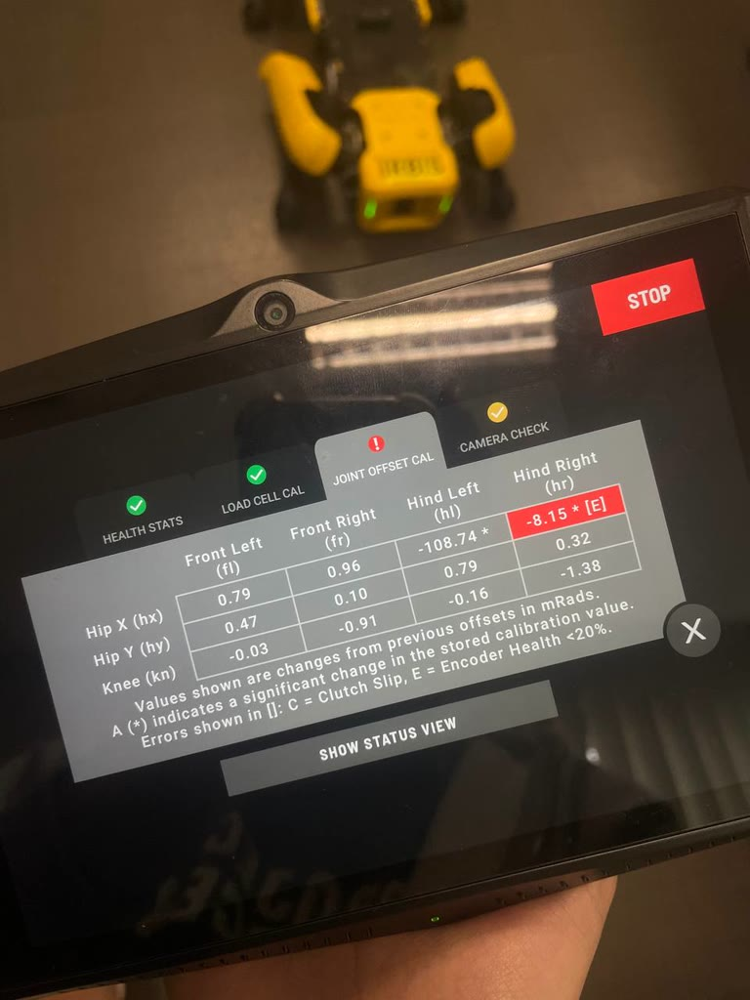
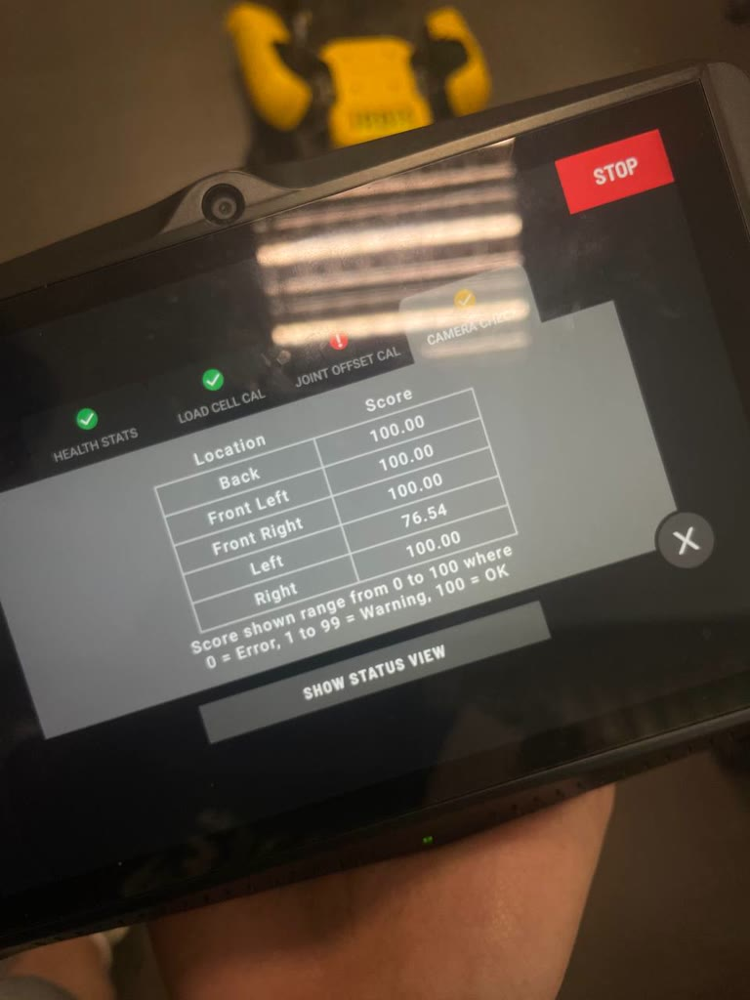

# Left hip-X healthy: air-gap fix; rear camera firmware transplant

**Date:** 17-07-2026

**Duration:** 6h

**People:** Ming, Yizhang

**Subsystem:** 🦿 Actuators & Legs + 📷 Sensors & Cameras

**Outcome:** 🔧 WIP — **LEFT hind hip-X HEALTHY** (first since 01-07) and **rear camera FIXED**. right hip-X still `[E]`, gap treatment pending

**Objective:**
>Correct the air gap on the left hind hip-X socket (file the spacer, leaving the eR PCB and mL disc in place) to test the disc/air-gap hypothesis from the [15-07 board swap](2026-07-15-encoder-board-swap-spotcheck3.md). simultaneously repair the rear depth camera (StereoProto fault since 18-06) by firmware transplant and verify both with SpotCheck.

**Resources:**
>[15-07 board swap & hypothesis re-ranking](2026-07-15-encoder-board-swap-spotcheck3.md)
>[14-07 chip swap & double encoder-health fault](2026-07-14-encoder-chip-swap.md)
>[01-07 SpotCheck diagnosis](2026-07-01-spotcheck-diagnosis.md)

****
## TL;DR

Filed the left socket's **spacer down to close the air gap from ~0.2 mm to 0.15 mm. No encoder or chip was replaced** — the eR PCB has sat in the left socket unchanged since the 15-07 board swap. SpotCheck run 4: **`hl.hx` -108.74\* with NO `[E]`, the first healthy hind hip-X since 01-07, and the first healthy reading ever taken through the mL disc.** `hr.hx` (untreated right socket: NEW1 + mR at the old gap) still flags `[E]` (-8.15\*). **The air gap was the only change from run 3 (same eR+mL, ~0.2 mm gap, flagged), so the recovery is attributable to the gap alone.** Walking is transformed: **stairs up and down plus forward/backward flat-ground walking all passed with no recovery routine**, green lights throughout, and "Sensor misread" faults now come only from `hr.hx` and immediately go historic. Working root-cause model: **two-phase failure: the original fault was the eL chip, the diagnosis teardowns then degraded both magnet discs, which is why fixing eL didn't clear the flags. Closing the gap compensates: the chip sits closer to the weakened disc, so the measured field is strong enough again.** The right socket is now the confirmation experiment. Separately, the **rear camera was un-bricked by dumping the right camera's BD firmware and flashing it unsigned** with camera Check: Back 100 (new watch item: Left 76.54 warning).

## Work done

#### Left socket air-gap reduction
- **Filed the spacer down to close the air gap to 0.15 mm** (previously estimated ~0.2 mm). The eR PCB and mL disc were left in place from the 15-07 board swap. **No encoder or chip was replaced this session**, the air gap was the sole change.

#### Rear camera repair: firmware transplant
Root cause: connecting the camera to `realsense-viewer` had led to accepting its firmware-update prompt (the viewer nags, and likely won't display without updating), which **replaced BD's proprietary firmware v5.11.3.50 with generic Intel v5.17.0.10**, wiping the BD hardware identifiers → Core I/O rejected the module with a StereoProto fault. BD declined to supply their OEM firmware, so one of Spot's own cameras became the donor:
1. **Extract** — raw flash dump from the working **right camera** (extraction from the encrypted `.bde` failed): `rs-fw-update -l` to identify, then `rs-fw-update -s 137322071775 -b bd_fw_5_11_3_50.bin` (HID/FishEye capability warnings are expected — BD's custom hardware profile).
2. **Flash** — the raw dump isn't a signed update payload, so Intel's signature check blocks a normal flash; bypassed with the unsigned flag: `rs-fw-update -s <DEFECTIVE_SERIAL> -f bd_fw_5_11_3_50.bin -u` (use `-r` instead of `-s` if the camera is in recovery mode).
3. **Reinitialise** — reinstalled the module, pulled the main battery for 60 s to clear the cached USB hardware tree, powered on → StereoProto fault cleared.
⚠️ **Standing warning:** never accept `realsense-viewer`'s firmware-update prompt on a Spot camera, that is exactly what bricked this one.

#### SpotCheck run 4 + walking session
- Ran SpotCheck, then an extended walking session to test motors and perception:
  - **Stair climbing, up and down** a full stairwell flight (videos in Media).
  - **Forward and backward walking on flat ground.**
- **All passed with no recovery routine**: green lights throughout, the only faults were transient `hr.hx` sensor misreads that immediately went historic.

## Findings & data

#### SpotCheck run 4 — changes from stored offsets, mRad

| Joint | Front Left | Front Right | Hind Left | Hind Right |
|---|---|---|---|---|
| Hip X | 0.79 | 0.96 | **-108.74 \*** (no [E]!) | **-8.15 \* [E]** |
| Hip Y | 0.47 | 0.10 | 0.79 | 0.32 |
| Knee | -0.03 | -0.91 | -0.16 | -1.38 |

Health Stats ✅, Load Cell Cal ✅; 
Camera Check now **yellow (warning)** rather than ❗: 
| Location | Score | 
|---|---|
| Back | **100 (transplant verified)** | 
| Front left | 100 |
| Front right |100 | 
| Left | **76.54 (warning — new)** | 
| Right | 100 | 

#### Full swap timeline (all sessions)

`NEW1` = original eL PCB + third-party iC-MU chip ([14-07 rework](2026-07-14-encoder-chip-swap.md)). The left socket holds the original `eR` PCB (unchanged since the 15-07 board swap), this session changed only its air gap.

| Stage | Config (legL / legR) | Result |
|---|---|---|
| Baseline (pre-06-30, original assembly) | legL = eL+mL, legR = eR+mR | legL FROZEN ≈ -0.880 rad; legR fine |
| 06-30 A — rotor+encoder swapped, magnet stays home | legL = eR+mL, legR = eL+mR | Both respond (no freeze); legL ~30° offset; PLUS a per-joint loadcell fault (loadcell moved with the rotor), denying motor power |
| 06-30 B — rotor+loadcell reverted, encoder stays swapped | legL = eR+mL, legR = eL+mR (same sensor config as A) | Loadcell fault gone; both respond; legL ~30° offset / angle-limit fault (denies motor power); legR reads fine. Full-ROM offsets: RL ≈ 0.5255 rad (~30°), RR ≈ 0.1185 rad (~6.8°) |
| 01-07 step 1 — magnets swapped | legL = eR+mR, legR = eL+mL | Both still respond; magnet swap alone changed nothing |
| 01-07 step 2 — SpotCheck run (same config) | legL = eR+mR, legR = eL+mL | FAILED joint-offset-cal; hr.hx (legR, eL) Encoder Health <20% [E], "Joint Encoder Unhealthy — contact Boston Dynamics"; hl.hx (legL, eR) healthy |
| 01-07 step 3 — walked/stood (same config) | legL = eR+mR, legR = eL+mL | Both legs track fine while powered (incremental tracking off the healthy primary encoder) |
| 01-07 step 4 — cold power-cycle (same config) | legL = eR+mR, legR = eL+mL | legR (eL) FROZEN ≈ -0.982 rad |
| 01-07 step 5 — magnets swapped back | legL = eR+mL, legR = eL+mR (**note: sensor config now identical to 06-30 A/B**) | legR (eL) STILL FROZEN, magnet-independent. Same physical config as 06-30 B, which did NOT freeze → eL's own behavior changed between 06-30 and now, not just its magnet pairing |
| 14-07 A — eL board pulled, third-party iC-MU chip reworked on, boards to native sockets | legL = NEW1+mL, legR = eR+mR | Boot fault `hr.hx` out of bounds (too low) → cleared with the jog trick; SpotCheck run 1: hl.hx **+114.68\* [E]**, hr.hx **-5.54\* [E]**; robot walks |
| 14-07 B — cold power cycle, SpotCheck run 2 | legL = NEW1+mL, legR = eR+mR (unchanged) | First cold-boot survival on record for this fault; run 2: hl.hx **-2.05 [E]**, hr.hx **+111.23\* [E]**; walks, but hind gait bent inward + transient "Sensor misread" faults on both hind hip-X |
| 15-07 — encoder boards swapped L↔R, magnets stay home | legL = eR+mL, legR = NEW1+mR | SpotCheck run 3: ALL 12 joints exactly 0.00, no `*`; **both hind hip-X still [E]** — rules out any single-bad-board explanation |
| 17-07 — left socket air gap filed 0.2 → 0.15 mm (no chip/encoder change) | legL = eR+mL @ 0.15 mm, legR = NEW1+mR (untreated) | SpotCheck run 4: hl.hx **-108.74\*, HEALTHY — no [E]** (first healthy hind hip-X since 01-07, first healthy mL reading ever); hr.hx **-8.15\* [E]**. Walking session: stair climbing up AND down + forward/backward walk on flat ground, all passed, NO recovery routine; green lights, misreads hr-only and immediately historic |

#### Interpretation

- **mL is not inherently dead.** It had flagged `[E]` under every board ever placed over it. it now reads healthy → the failure lived in the signal-path geometry (air gap vs disc strength), not in an unusable disc. **The fix is attributable to the tighter air gap alone.** Run 3 (legL = eR+mL at ~0.2 mm gap) flagged, and run 4 (legL = eR+mL at 0.15 mm gap) is healthy: the encoder board and magnet were unchanged and only the gap differed, so this is a clean single-variable result.
- **The -108.74\* could be run 1's garbage cal walking back.** Run 1 baked +114.68 into hl's stored offset *through an `[E]` encoder*, the first healthy measurement reverted it (net ≈ +4 mRad vs the pre-14-07 baseline). Offsets calibrated through flagged encoders are junk, expect a similar walk-back on hr when it's fixed if this theory is true.
- **Run 3's all-0.00 caveat is retroactively confirmed:** the fronts are back to normal jitter this run (0.79/0.96/…), so run 3's implausibly perfect table very likely never recomputed.
- **Working root-cause model — two-phase failure:**
  1. **Phase 1 (original): the eL chip was the fault**, as concluded 01-07 (fault followed eL between legs, magnet-independent).
  2. **Phase 2: the diagnosis teardowns degraded both magnet discs.** The many remount cycles weakened the discs below what the chips could read at the stock ~0.2 mm gap, which is why fixing eL didn't clear the flags (runs 1–3: `[E]` everywhere regardless of board placement), and why eR "went bad" without ever changing. Filing the spacer compensates: the chip sits closer to the weakened disc, the measured field crosses the health threshold again.
  - This dissolves the "two coincidences" objection to two-fault explanations, the second fault was *caused by* diagnosing the first.
  - **Reproduction to watch:** applying the same gap treatment to the right socket should clear `hr.hx`. If it does not, NEW1's rework quality re-enters as a suspect on that socket.
- **Compensation, not restoration.** The discs remain weak; margin above the 20% threshold is thin, and further wear or contamination could dip either socket back under. **Disc replacement stays the durable-fix recommendation** for project close-out.
- **Left camera 76.54 (new warning, unassessed).** The Camera Check score plausibly reflects depth-data quality (the SDK's `spot_check.proto` implements this check as a depth-plane fit per camera). Likely causes, cheapest first: dirty lens/cover window, environment (glossy floor / IR interference / low texture — re-run elsewhere to test repeatability), condensation, weak IR projector, stereo cal drift (BD's recal routine needs the official target board). Note: the donor was the *right* camera, so this is not obviously transplant-related, but the back camera now shares the right camera's serial, so per-serial bookkeeping mix-ups aren't excluded either. Not blocking: Spot fuses all five cameras.

## Decisions

>**Decision:** Filed down the spacer between the left socket's encoder board and disc to ~0.15 mm. No chip or encoder was replaced, the eR PCB and mL disc were left in place from the 15-07 swap. SpotCheck run 4 confirmed **hl.hx healthy (-108.74\*, no [E])**; the first healthy hind hip-X since 01-07 and the first healthy reading ever taken through mL. The right socket remains untreated as the reproduction experiment.

**Why:** To test the disc/air-gap hypothesis from the 15-07 board swap. Because run 3 (eR+mL, ~0.2 mm gap) flagged and run 4 (eR+mL, 0.15 mm gap) is healthy, and nothing but the gap changed, the left socket's recovery is already cleanly attributable to the air gap. Treating the right socket (NEW1 + mR) confirms the fix reproduces on a second socket.

**Alternatives considered:** Swapping the magnetic discs but it was not possible to source replacements in time, hence filing was seen as a possible quick fix.

>**Decision:** Un-brick the rear camera with an unsigned raw-dump transplant from the robot's own right camera.

**Why:** BD declined to provide OEM camera firmware, and extraction from the encrypted `.bde` failed. the raw flash dump of a working unit was the only remaining source, `-u` bypasses the signature check that a raw dump can't satisfy.

**Alternatives considered:** no choice because BD support did not want to send us the firmware and said this could not be solved remotely (it could). 

## Roadblocks

- **`hr.hx` still `[E]`** — right socket untreated; cold-boot seeding on the right hip remains at risk until it gets the gap fix.
- **The gap fix is compensation** — both discs remain degraded; long-term margin unknown.
- **Camera caveats:** the repaired back camera inherited the right camera's **serial number and intrinsic lens calibration** — two modules now share a serial, and the back camera runs another unit's optics calibration (first suspect if rear depth ever looks off). Left camera 76.54 warning unassessed.

## Next steps

- [ ] **File the right socket's spacer to ~0.15 mm** → SpotCheck run 5. `hr.hx` healthy = two-phase model confirmed; still `[E]` = NEW1 rework quality back in play.
- [ ] After a healthy run 5: verify the gait fully straightened and misreads gone; expect an ~mR-sized cal walk-back on hr.
- [ ] **Left camera:** clean both apertures of the left stereo pair, re-run Camera Check in a different location (matte floor, even lighting) — establishes whether 76.54 is repeatable before any deeper work.
- [ ] Continue the [15-07 roadmap](2026-07-15-encoder-board-swap-spotcheck3.md): robotic-sequence development.
- [ ] For close-out documentation: record **magnetic disc replacement** as the durable fix; the robotic sequence doubles as proof of repair and the platform for autonomous-navigation testing & development.

## Media

SpotCheck run 4 — `hl.hx` healthy (-108.74\*, no [E]) after the left-socket rebuild; `hr.hx` still [E]:

Camera Check after the firmware transplant — Back 100; Left 76.54 warning:

Walking session — stair climb up:

  <video width="360" height="480" controls>
    <source src="../assets/stair-climb-up.mp4" type="video/mp4">
    Your browser does not support the video tag.
  </video>

Stair climb down:

  <video width="360" height="480" controls>
    <source src="../assets/stair-climb-down.mp4" type="video/mp4">
    Your browser does not support the video tag.
  </video>

