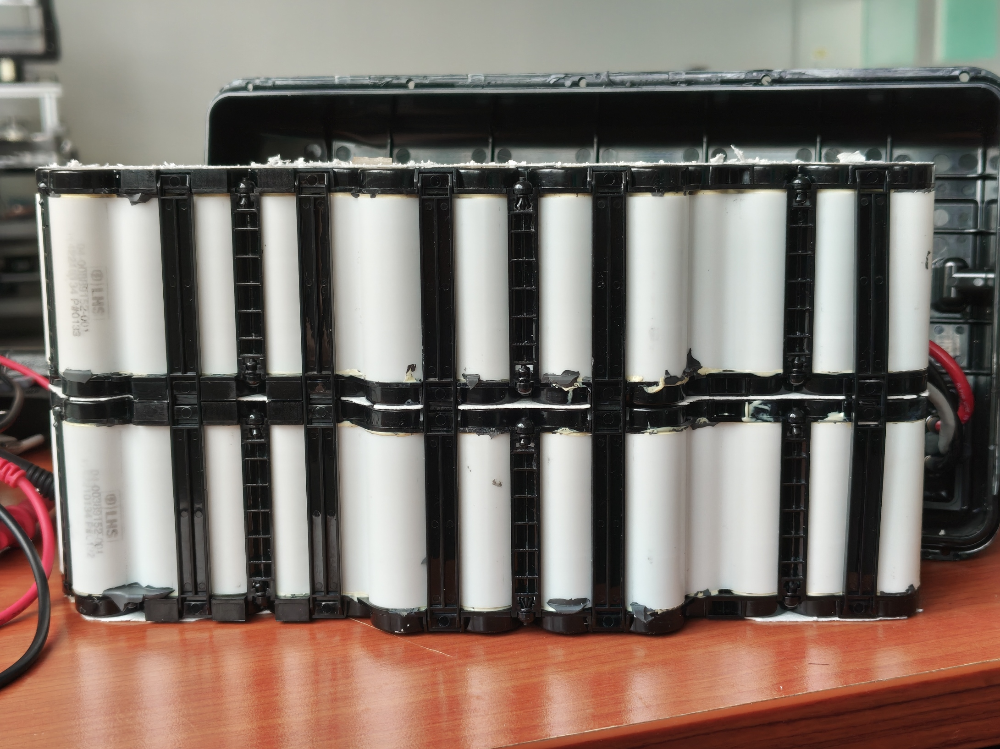
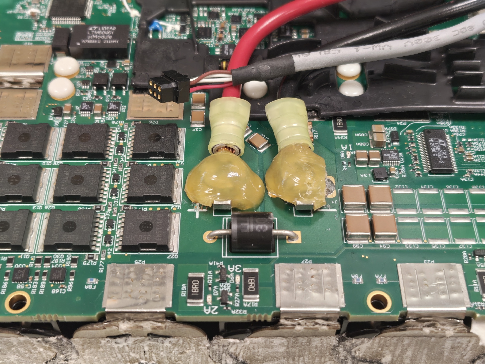
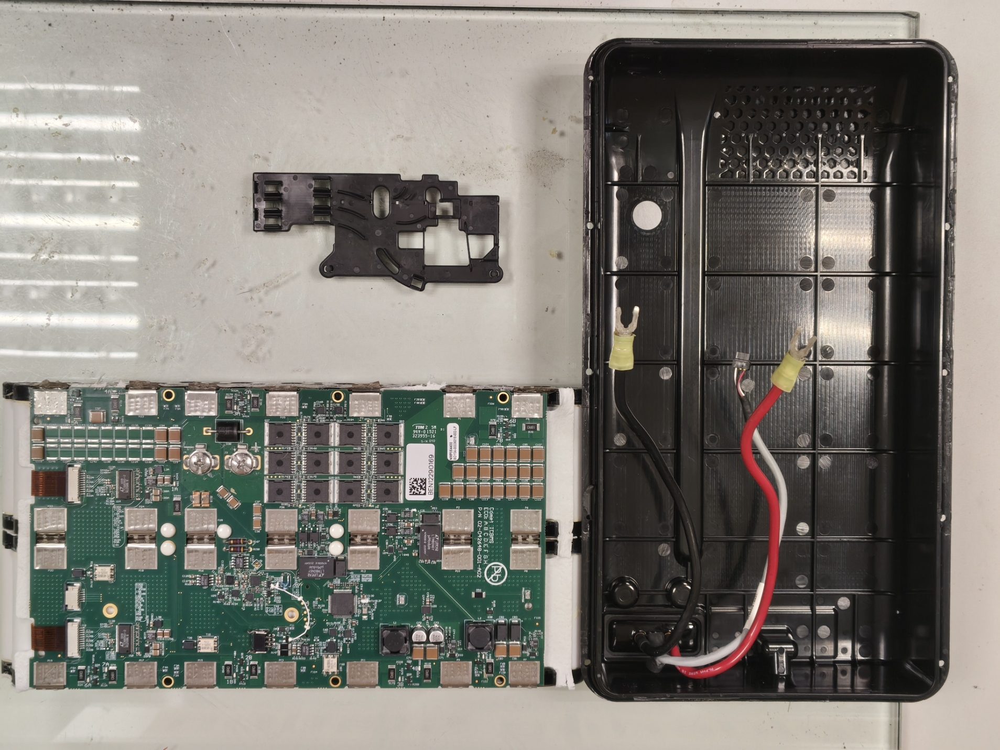
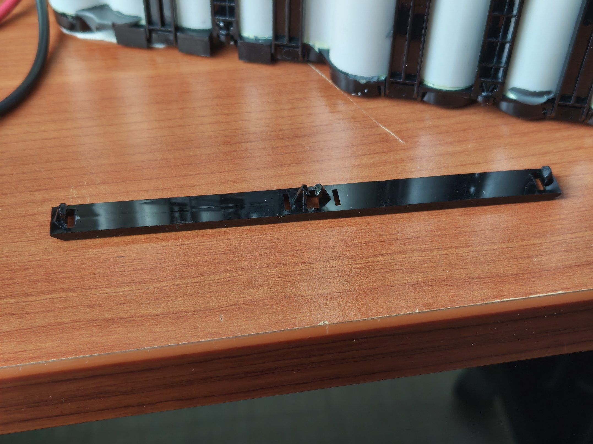
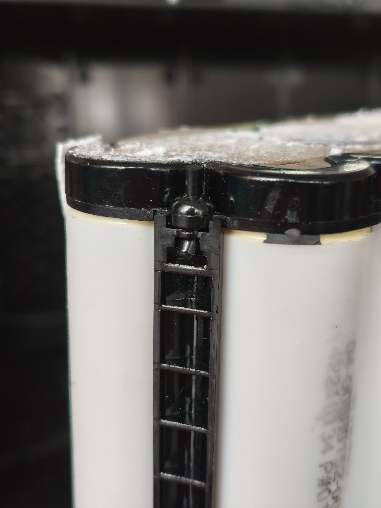
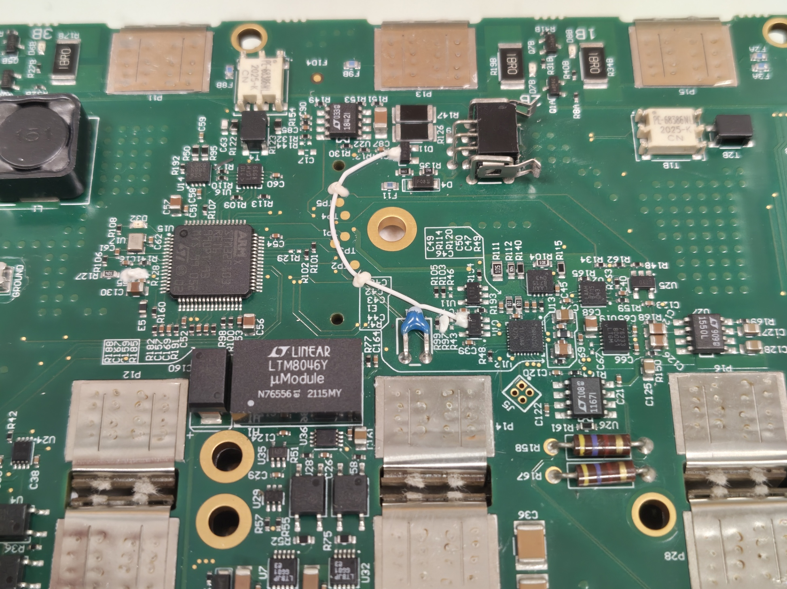
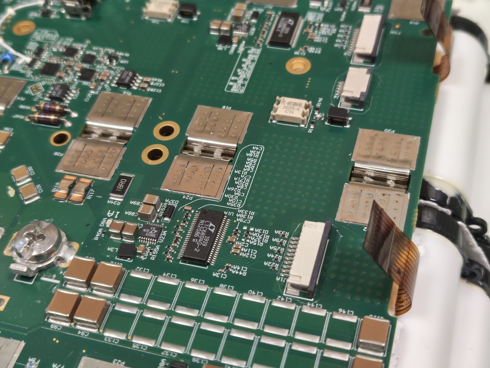
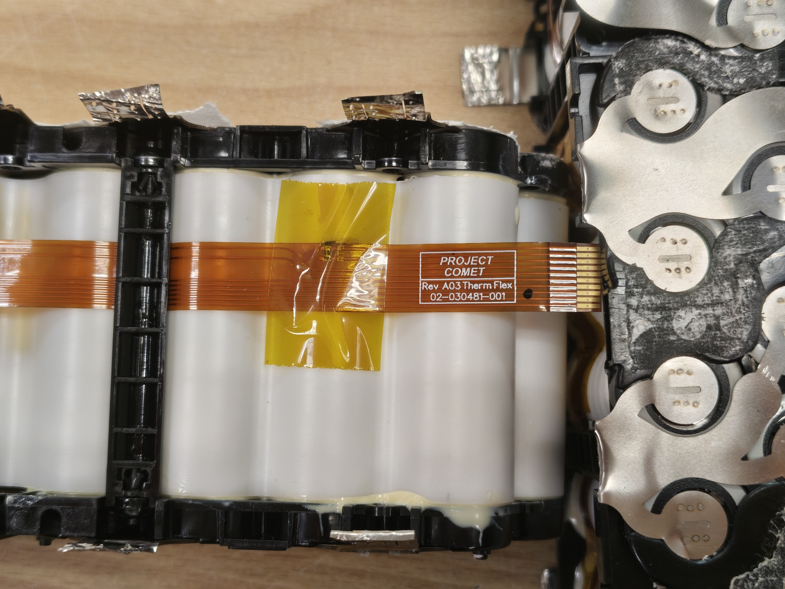

# Battery module complete disassembly
**Date:** 21-05-2026

**Duration:** 7hrs

**People:** Yizhang

**Subsystem:** 🔋 Power & Battery

**Outcome:** ✅ Pass

**Objective:**
>Disassemble the lithium cells from the BMS and source new cells.

**Resources:**
>[Spot Battery Safety Data Sheets (SDS)](https://support.bostondynamics.com/s/article/Spot-Battery-Safety-Data-Sheets-SDS-49922)
>[18650 SAMSUNG 30Q 3000MAH Battery Cell](https://www.falconpev.com.sg/products/18650-samsung-30q-3000mah?_pos=3&_sid=ede1ee71e&_ss=r)

****
## TL;DR
Fully separated the two 7s4p cell packs from the BMS - removing glued power cables, the CAN cable, spot-welded nickel strips, rivets, and the thermistor strips. Confirmed the cell type (Samsung INR18650-30Q, 3000 mAh, 15 A). Started sourcing replacements: local stores don't stock the exact cell, awaiting quotes (Falcon PEV for original Samsung; others for alternatives).

## Work done
#### Disassemble power & CAN cables
- Removed the tough glue blob holding the power cables — cut it into smaller chunks and pried it off bit by bit.
- Unscrewed the power cables and unplugged the CAN cable, then pried off the plastic insulator covering 3 of the battery pads.

#### Separate cell packs from PCB
- Pried out the white plastic rivets securing the plastic frame (and the nickel strips) with a flathead screwdriver.
- Tried cutting the nickel strips but the plastic frame behind blocked the cutter; instead pried the spot-welded strips off the PCB with some force, leaving little welded-nickel bumps on the pads (to post-process later).
- Unplugged 2 flexible PCBs before removing the cell packs.

#### Separate A/B cell packs
- Removed the long plastic snap-connector clipping the two packs together — pry both ends loose and twist slightly to disengage the center clips.
- Removed the shorter connector held by black rivets — push the center axle out from the bottom.

#### Remove thermistor strips
- Each pack has a long flexible PCB kapton-taped to it, connecting to the BMS.
- Each strip carries 5 SMD NTC thermistors monitoring temperature across the pack, with a thermal adhesive underneath for better heat transfer.
- Strips are labelled A and B to track their original side (likely interchangeable since the PCBs are identical, but kept just in case).

## Findings & data
- **Cell type:** Samsung INR18650-30Q (per BD's SDS) — 3000 mAh, 15 A discharge / 30 A peak.
- The 56 cells are arranged as 2× 7s4p packs, labelled A and B.
- Nickel strips are spot-welded to the BMS pads; pads will need post-processing (residual nickel bumps).
- Thermistors: 5 SMD NTC per pack on a kapton-taped flexible PCB, thermal-adhesive bonded.

## Decisions
- **Decision (tentative):** Source the original Samsung INR18650-30Q from Falcon PEV.
  **Why:** Cheapest source found for the original cell, keeping the spec identical to stock.
  **Alternatives considered:** LG HG2 (same 3000 mAh capacity, slightly higher 20 A rating; ~$663 for 56 on Shopee); Samsung INR18650-35E from Sim Lim (higher capacity & amperage, but pricier).
  *(Pending Falcon PEV's reply/quote.)*

## Roadblocks
- Lack of local suppliers for the exact replacement cell.

## Next steps
- [x] Wait for response from Falcon PEV.
- [x] Wait for response from the global 18650 battery shop.

## Media

