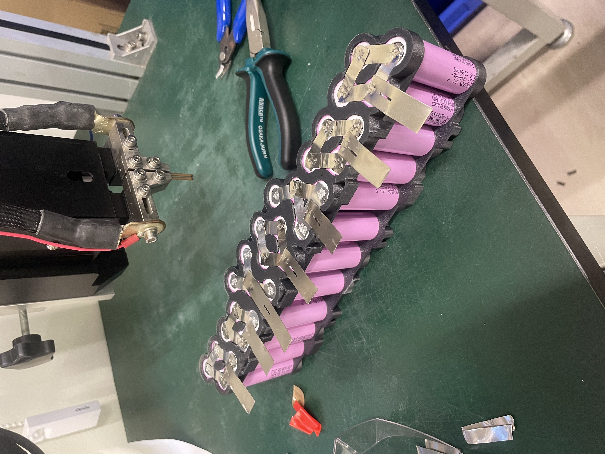

# Replacement battery assembly

**Date:** 2026-05-28

**Duration:** 8hr

**People:** Ming, Yizhang

**Subsystem:** 🔋 Power & Battery

**Outcome:** 🔧 WIP

**Objective:**
>3D print battery spacers, spot-weld the replacement batteries, connect to BMS for testing

**Resources:** NIL

****
## TL;DR

Replacement INR18650-30Q cells are inserted into 3D printed spacer and spot welded at Sodion with the help of gooner Wonje. Moderate amount of explosions but no casualties yet.

## Work done
#### 3D print spacers
- The 4 spacers are 3D printed with PC-CF over 10 hours.
- Spacers came out looking good, except the first print where supports were disabled and some overhangs drooped. However, functionality is unaffected.
- We suspect that the PC-CF from Taobao was actually PETG disguised as PC. It adhered to the bed a little too well and was almost too easy to print?

#### Spot welding at Sodion
- Went to Sodion to _borrow_ some stuff. The only nickel strip they had was 10mm wide, hence it was trimmed down to ~8mm before use.
- Spot welded the battery group terminal together with nickel strips.
- The China spot welder took some connvincing to get working, but it did sort of work in the end.
- The 12mm PCB tabs tend to explode when we tried to spot weld it onto the 8mm strips below. Hence, the 12mm tabs will be soldered later instead.
- Sodion did not have any thermal pads :(
  
## Findings & data
- The spot welder does not seem to work properly with more than 1 nickel strip at a time. It was unable to weld 2 strips stacked together to the battery terminals no matter how much we tried.

## Decisions
- —

## Roadblocks
- Figuring out optimal settings for spot welding negative terminals. will have to experiment and test out in the next session.

## Next steps
- [ ] Finish spot welding both battery packs
- [ ] spot weld/solder packs onto BMS

## Media

