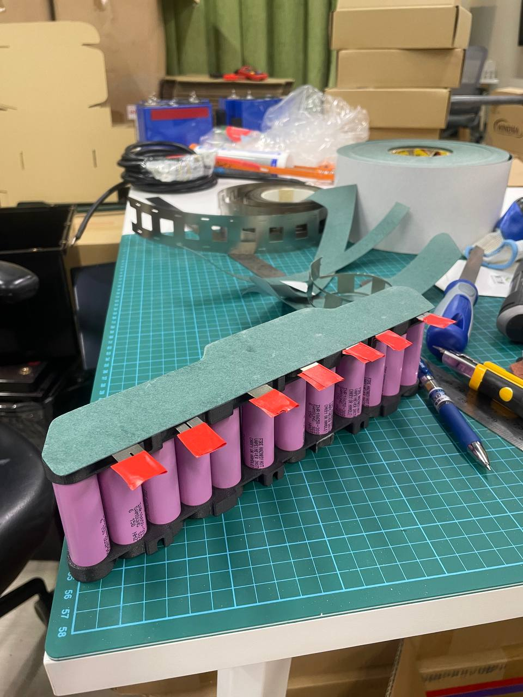
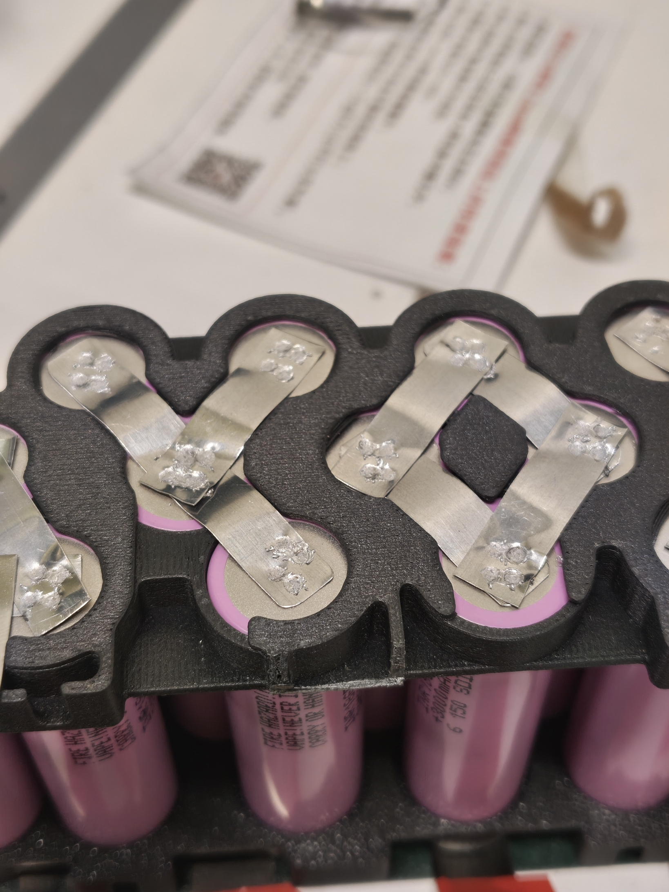
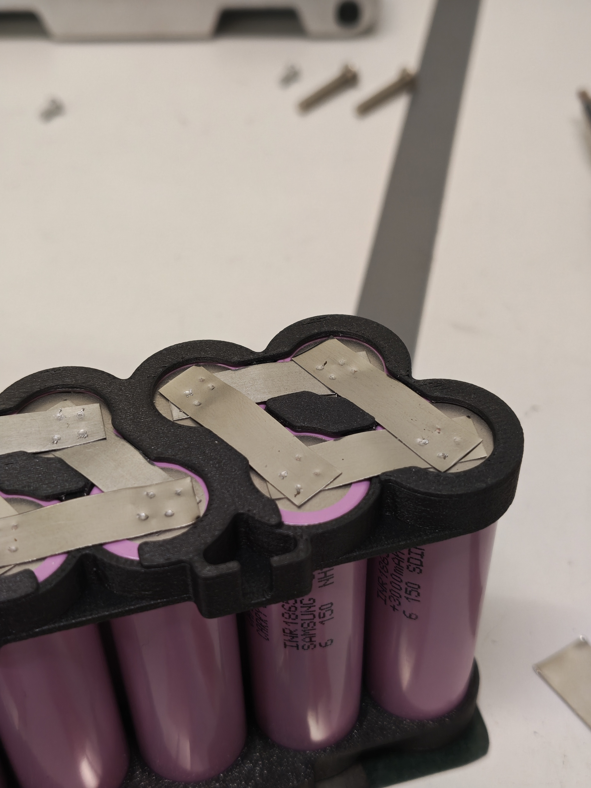

# Replacement battery assembly

**Date:** 2026-06-04

**Duration:** 8hr

**People:** Ming, Yizhang

**Subsystem:** 🔋 Power & Battery

**Outcome:** ✅ Pass

**Objective:**
>3D print battery spacers, spot-weld the replacement batteries, connect to BMS for testing

**Resources:** NIL

****
## TL;DR

Spot welding of BMS onto battery pack, charge test and Spot power on test.

## Work done
#### Spot welding at Sodion
- Continuation of spot welding of battery packs to BMS
- Ground ends of the packs were spot welded to the BMS first, then the positive ends.
- The battery groups were welded in no specific order, but maybe it would be better to follow the numerical labels on the BMS PCB.
- Some red indicator LEDs on the BMS lit up and blinked when each battery group is welded on. 
- The pack was closed with the original foam pieces inserted to keep battery seated firmly.

#### Battery charge test
- Pressing the SoC (State of Charge) button on the battery pack shows 1 blinking green bar, indicating a low charge.
- The charger indicator LED flashed green when connected to the battery, indiciating successful charging.
- However, after about 20 minutes of charging, the charger LED remained a static green, indicating a full charge despite the SoC still showing only 1 bar of charge.
- The battery refused to charge further, and the BMS PCB had the had 3 red indicator LEDs flashing.
- During normal charging, the BMS PCB should only have a single green LED lit beside the on board STM32 MCU. When the 3 red LEDs turn on, the green LED turns off and the battery stops charging.
- According to the battery manual, a reported full charge when the actual SoC is caused by highly unbalanced cells.

#### Robot power on test
- Anyways there were some charge in the battery and we decided to attempt powering on the Spot dog.
- After inserting the battery and holding the power button for 2 seconds, Spot powered on with some pretty loud fans spinning. The status LED on Spot's face blinked yellow, indicating it was booting up.
- After about 2 minutes, the indicator LEDs turned a static blue, indicating it has successsfully booted up.
- We connected to the Spot access point using it's default IP address `192.168.80.3`, and logged into the admin console.
- Based on the displayed metrics, Spot had 3% battery and the battery balance index was around 0.213. The manual suggests that anything >0.1 requires the battery to be actively balanced by the charger.
- However, due to outdated firmware and legacy charger model, auto active cell balancing was not supported (only in battery firmware >V45, currently V33).
- Spot firmware version is 3.3.1

## Findings & data
- Diagnosed fault of spot welder machine failure to be damage to one of the capactior modules due to broken solder joint.

## Decisions
- utilised hand held spot welder to continue spot welding the battery packs whilst the spot welder machine was being fixed.

## Roadblocks
- —

## Next steps
- [x] spot weld/solder packs onto BMS

## Media

