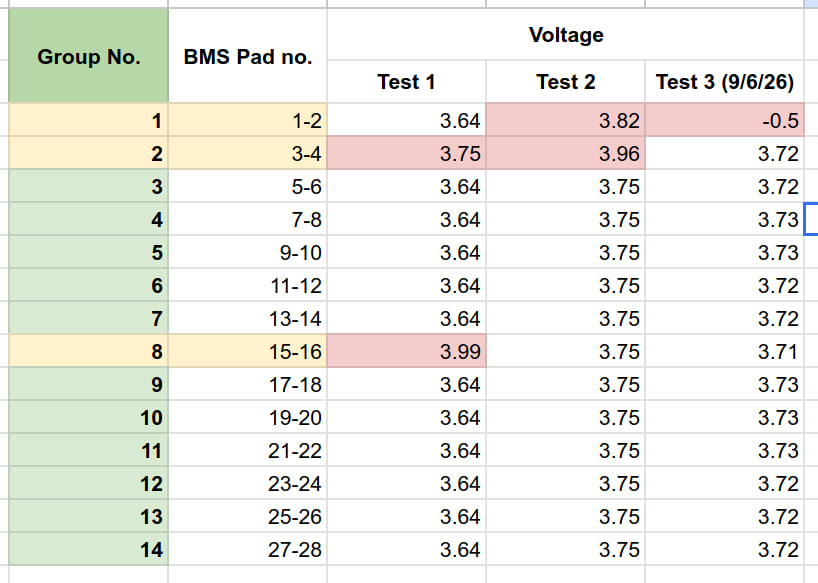

# Replacement battery assembly
**Date:** 2026-06-11

**Duration:** 6hr

**People:** Ming, Yizhang

**Subsystem:** 🔋 Power & Battery

**Outcome:** ✅ Pass

**Objective:**
>Diagnose battery fault problem, fix bad weld joints and recharge battery.

**Resources:** NIL
****
## TL;DR

Battery stopped working, showing battery fault with all SOC lights blinking when inserted into SPOT, as well as when charging was attempted. Diagnosed fault to be disconnected battery group due to bad spot weld resulting in phantom voltage across BMS Pad P1-P2, and fixed all bad spot welds.

## Work done
#### Battery diagnostic
- After leaving battery overnight, when attempting to power on SPOT, there was a battery fault indicated and SPOT did not power on
- Attempting to charge the battery resulted in the same fault lights (all SOC lights on and blinking)
- probed all battery groups and found that group P1-P2 had -0.5V? while the rest was 3.71-3.72V (more under findings and data)
- Diganosed the issue to be a broken spot weld on the negative terminals of the P1-P2 group, resulting in the battery group disconnecting from the BMS pads and hence the phantom voltage across the BMS pads to be measured. Measuring across the positive and negative terminals of the battery group directly yielded 3.71V, isolating the issue away from a battery cell one.
- Likely cause of the broken weld joint is the mechanical strain on it when operating SPOT (probably when we flipped SPOT over and we asked it to self-right)

#### Rewelding of bad spot welds
- Headed back to Sodion Energy to reweld all bad weld joints.
- After rewelding, SOC no longer showed the fault lights, and charged as per normal.
- Battery hit full charge for the first time, indicative of good spot weld joints allowing for balanced cell voltage.

## Findings & data
#### Individual battery cell group voltage test
  
We did a third test of the voltage across each individual cell groups.

From the voltage data, cell groups 1 has an abnormally -0.5V while the other groups are perfectly balanced (even the previous unbalanced ones)

The data indicated that cell group 1 was causing the battery fault. The voltage differential was too large/negative voltage was detected triggering the lockout. We hypothesised various failure modes before narrowing down to the most possible one.
1. No visible damage on the BMS indicates likely not a blown MOSFET, resistor etc.
2. No abnormal resistance across the nickel strips along the positive end of the cell group, indicating not a bad weld joint on the positive end.
3. Cell degradation was unlikely as there was no issue whilst running the robot, pointing it towards a physical hardware disruption

We decided to probe the cells directly to check for cell degradation. The negative terminal was disconnected and when probing the cell group 1 separate from the BMS, we got a voltage reading of 3.71V. When probing on the negative terminal BMS pad (P2) to the positive terminal of cell group 1, we got -0.5V.

Upon further testing, we realised we do not get 3.71V all the time when probing the cells directly. We only get it if we press the nickel strips on the negative terminal down very hard. This indicated to us that the weld joint on the negative terminal is the broken one.

Hence, our diagnosis of the failure mode was the bad weld joint on the negative terminal of cell group 1. This resulted in the group being entirely disconnected, and the -0.5V was likely phantom voltage (reverse bias of an internal protection diode or the voltage drop across a balancing bleed-resistor on the BMS circuit). 

## Decisions
>**Decision:** Disassemble entire battery pack to check and reweld all spot welds.

**Why:** Ensure that all weld joints are properly done, not just the identified bad ones. THis is to prevent further bottlenecks in our work so that we can move on to proper diagnosis and repair of the bad hind leg motor. 

**Alternatives considered:** NIL

## Roadblocks
- —

## Next steps
- [x] Buy 52x lithium cells for 2nd battery pack (have 4 leftover from previous repair).
- [x] Optimize battery spacer design.
- [x] 3D print new battery spacers.
- [x] Continue work on diagnosis of motor issue using visualiser in admin console, checking range of motion of leg, and running the diagnostics script

## Media