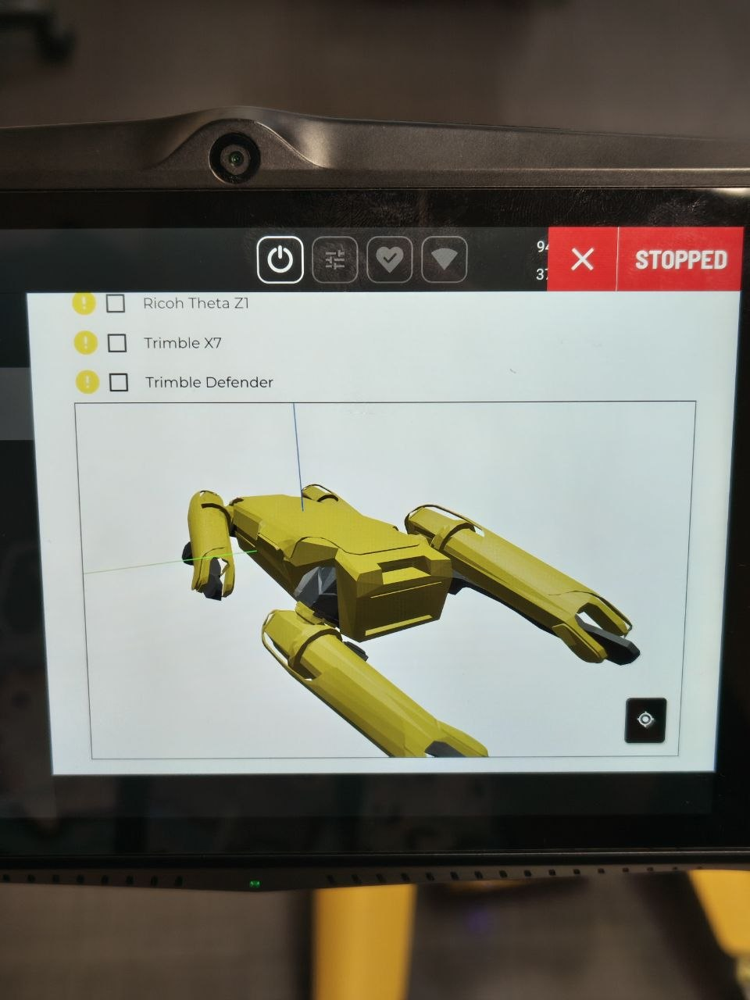

# Joint Diagnosis
**Date:** 2026-06-12

**Duration:** 6hr

**People:** Ming, Yizhang

**Subsystem:** 🦿 Actuators & Legs, 🧠 Compute & Mainboard

**Outcome:** ✅ Pass

**Objective:**
>Diagnosis of actuator fault and data collection of fault.

**Resources:** 
- [ROS2 Wrapper for Boston Dynamics SPOT SDK](https://github.com/rai-opensource/spot_ros2)
- [Boston Dynamics SPOT SDK](https://github.com/boston-dynamics/spot-sdk)

****
## TL;DR

Further testing of all actuators to confirm the faulty leg and motor, running a custom diagnostic script and web UI visualiser, with comparision to the robot visualiser on the SPOT admin console. Successfully diagnosed the faulty motor to be the left_hind_x leg motor, with the fault likely to be an encoder issue.

## Work done
#### Motor Diagnostic via SPOT Admin console visualiser
- Per the Boston Dynamics Engineer's suggestion, we utilised the visualiser on the admin console to diagnose and identify the fault motor.
- moved all 4 legs around and checked if the visualiser showed the same movement on the robot.
-  all joints and motors were fine except for the left hind leg, frozen at one spot with 0 movement despite being moved around

#### Motor lockout test
- we locked out the motors and tried moving all the legs.
- all did not move except the left hind leg.

#### Motor Diagnostic via custom diagnostics script with web UI visualiser using ROS2
- further analysis and visualisation of data was required to confirm the exact motor and fault
- Utilised custom diagnostics python script with a web UI visualiser, running through ROS2
- ROS2 wrapper for the SPOT SDK run through a docker environment (Ubuntu 22.04 & ROS2 Humble)
- Data visualisation and analysis revealed that it was likely an encoder fault on the left_hind_x motor

## Findings & data
#### Admin Console Visualiser Test
We visualised the movement of the spot joints on the admin console visualiser whilst moving all the legs.

  <video width="360" height="480" controls>
    <source src="assets/visualiser-test.MOV" type="video/mp4">
    Your browser does not support the video tag.
  </video>

- as seen from the video, all movements in real life results in the corresponding movements in the visualiser. However, when this same action is performed on the left hind leg, only 2/3 of the motors had the correct movements in the visualiser (knee joint and left_hind_y). the left_hind_x remained frozen in place despite actual movement.
- This corresponds to our previous tests on self-right and our hypothesis on the left hind leg being the faulty leg.
- We hypothesised it to be an encoder fault: the encoder is likely not detecting any movement in the motor and hence the value stays frozen despite actual movement

#### Motor Lockout Test
- We activated motor lock out to further test this hypothesis.

  <video width="360" height="480" controls>
    <source src="assets/motor-lockout.MOV" type="video/mp4">
    Your browser does not support the video tag.
  </video>

- all motors activated lockout state except for left_hind_x motor. Even the knee and left_hind_y motor was in lockout.
- this further supported our hypothesis: as the encoder is frozen at a specific angle, the lockout is "activated" as it thinks the motor is not moving based on the encoder data, hence despite being in lockout the motor is still able to be manually moved. 

#### /joint_states Visualiser and Data analysis
- We decided to get concrete data for analysis via the SPOT SDK. For ease of development, we utilised the ROS2 wrapper for the SPOT SDK by RAI-opensource to be able to receive and visualise joint data via the /joint_states topic, instead of having to utilise the SDK directly.
- 2 tests were conducted: a graphical anaylsis of position and raw data visualisation (position, effort, velocity)

|Data Type| Intepretation |
|-----------|:---:|
| Position | Angle of the motor relative to a set 0 |
| Effort | Real-time electrical torque (current) the motor controller is actively commanding |
| Velocity | Speed at which the motor/joint is moving |

Graphical visualisation:

  <video width="360" height="480" controls>
    <source src="assets/graph-test.MOV" type="video/mp4">
    Your browser does not support the video tag.
  </video>

  <video width='780' height='480' controls>
    <source src="assets/graph-analysis.mp4" type="video/mp4">
    Your browser does not support the video tag.
  </video>

Raw data visualisation:

  <video width="360" height="480" controls>
    <source src="assets/data-test.MOV" type="video/mp4">
    Your browser does not support the video tag.
  </video>

  <video width='780' height='480' controls>
    <source src="assets/data-analysis.mp4" type="video/mp4">
    Your browser does not support the video tag.
  </video>

- From the raw data visualisation and the graphical visualisation, it can be seen tht the position of the left_hind_x motor remains constant at -0.880 rad, and this value does not change despite movement of the joint (as seen from the flatline and the constant value)
- The Hall IC on the rear_left_hip_x motor drive board hasn't severed its connection (otherwise it would throw a NaN or noisy data spike), but it is digitally frozen.
- Effort and velocity showed no change as well, indicating that there is no electrical torque commanded by the motor controller. Because the motor controller is constantly receiving a perfectly valid (but wrong) signal of -0.880, it calculates exactly zero error. It thinks the leg is exactly where it is supposed to be, so it commands 0.00 amps of current.

## Decisions
>**Decision:** Teardown the SPOT and open up the left hind leg for checks and testing.

**Why:** After further discussion, we concluded that this is not enough to confirm the encoder is the problem. Whilst mechanically the motor may still be functioning, magnetically it may be fault (demagnetised or broken magnets in rotor), that result in the frozen position value. Hence, there are still 2 fault points: the motor and the encoder, but the problem has been confirmed to be isolated to the left_hind_x motor.

The test to isolate the fault to the motor/encoder will proceed in this manner:
1. teardown and disassemble SPOT to take out the left hind leg.
2. Check for any faulty wiring whilst doing so.
3. when left hind leg is removed, open up the left_hind_x motor to check the controller board with the encoder for any physical defects or faults
4. If everything passes, swap this controller board with that of the other working hind leg
5. Run the diagnostics and admin console visualiser again to see if the fault swaps to the other leg. If so, its an encoder fault. If it does not, it is a motor/rotor fault.

**Alternatives considered:** Utilising joint-level API on the SPOT SDK, but this requires a specific special-permissions license that we do not have.

## Roadblocks
- —

## Next steps
- [x] Teardown SPOT

## Media
