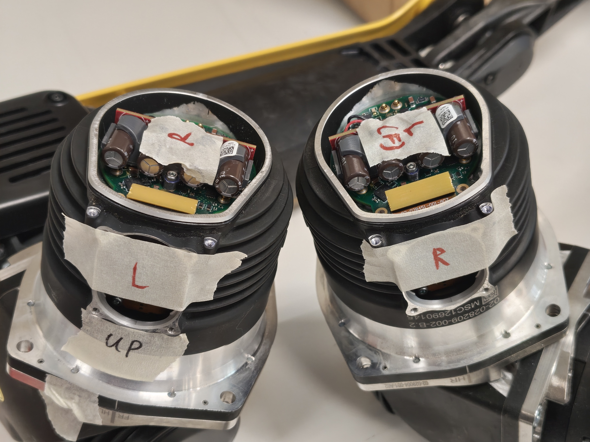
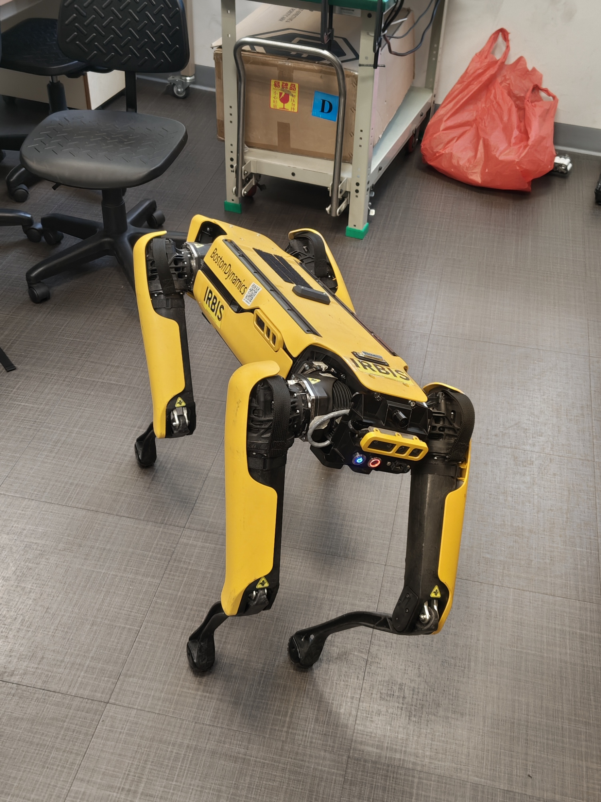

# ABA component diagnostics

**Date:** 19-06-2026

**Duration:** 6hrs

**People:** Ming, Yizhang

**Subsystem:** 🦿 Actuators & Legs

**Outcome:** ✅ Complete

**Objective:**
>Swap around different components for the 2 hind legs to identify faults.

**Resources:**
NIL

****
## TL;DR

Hind hip motor drivers and cables were swapped around and the joint angle diagnostics re-ran. Frozen joint angle problem still local to left hip after every component swap. Motor drivers, communications and electrical connections to the hip motor are cleared of faults.

## Work done

#### Motor driver comparison
- Both the left and right hip motors were opened and their drivers compared.
- No visible differences between the 2 drivers.
- No difference in placement/alignment/height offset of the encoder magnet on the rotor.

#### Swapping motor driver boards
- Both drivers seem identical and are swapped out before the legs were placed back in Spot and powered on.
- No faults regarding the motors were displayed during initialization and power up.
- Rotating the legs around while motors are powered down reveals that the frozen joint angle problem is still local to left hip joint.
- Attempting the self-right again reveals the mobility issue is still local to the left hip only.

#### Swapping of hip motor cables
- Another hypothesis was that communication to the left hip motor was faulty, hence the main compute module is unable to send commands etc.
- The hip motor cables were inspected and they were identical.
- The hip motor connector PCB was also inspected and probed to ensure they were not mirror images of each other. This was to ensure the correct orientation of power/ground pins after swapping cables.
- The cables were swapped **only for the hip motor** and the robot powered on again.
- The problem of frozen joint angles is still local to the left hip when legs are manually rotated with motors powered down.
- Self-right still fails with the robot stuck in a perpectual loop trying to move the left leg.
- However, commanding it to "stand" actually worked by sheer luck. We hypothesize this is due to a software confusion as the left hip is routed to the right. Hence when the robot enters a loop of perpectual self-correct but in the wrong direction, but it was still able to detect movement and hence bypass the faults before.

## Findings & data
| Action                            | Observation                                                                                                                                    | Conclulsion                           |
|-----------------------------------|------------------------------------------------------------------------------------------------------------------------------------------------|---------------------------------------|
| Exchange L/R hip driver boards    | Static angle feedback problem is still local to left hip only. Right hip has movement while attempting self-right.                             | Both driver modules are operational.  |
| Exchange L/R hip connector cables | Static angle feedback reflected in right hip on console, which is still the left hip on the robot. The other hip is responsive and works fine. | Connector and cables are operational. |

The above diagnostics eliminates the driver and connector faults from the list of hypothesized issues. This leaves only a **local angle sensing/feedback** issue as the root cause.

## Decisions
>**Decision:** Narrow the scope to the angle/position feedback mechanism of each joint.

**Why:** Driver and connection issues are eliminated from tests above.

**Alternatives considered:** A software issue where the angles are not updated/published. However this is less likely as a stale angle update should not affect the motor's position control logic during lockout, which is handled locally by the motor driver and independent of live telemetry feedbacks.

## Roadblocks
NIL

## Next steps
- [x] Disassemble joint motors further and look inside for clues.

## Media
 
 
