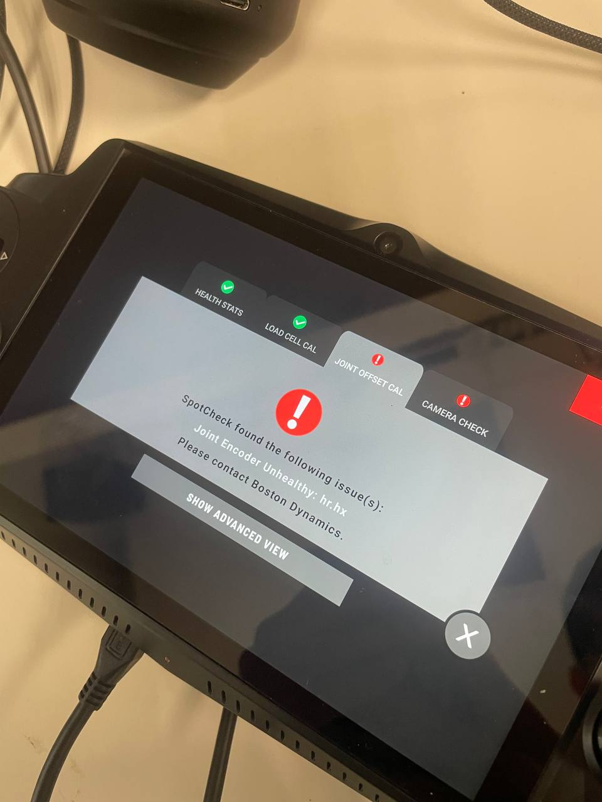
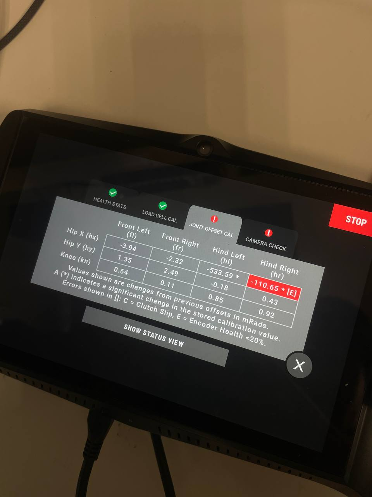

# SpotCheck diagnosis + magnet swap

**Date:** 01-07-2026

**Duration:** 8h

**People:** Ming, Yizhang

**Subsystem:** 🦿 Actuators & Legs

**Outcome:** ✅ Complete

**Objective:**
>Continue isolating which physical component (encoder vs magnet vs pairing) is causing the hind hip-X fault, using Boston Dynamics' SpotCheck diagnostic tool plus a magnet swap.

**Resources:**

****
## TL;DR

From the 06-30 end-state (encoder-only swap: legL = eR+mL, legR = eL+mR — both legs tracking fine, legL carrying a benign ~30° calibration offset), swapped the MAGNETS between the two rotor assemblies this session (motors/loadcells/encoders untouched), giving legL = eR+mR, legR = eL+mL — i.e. the original eL+mL pairing now sits in the right leg, a full left↔right swap relative to the very first baseline. Both legs still tracked fine after the magnet swap alone. Decided to try to "trick" the robot by moving the joint such that it became within bounds on boot, allowing for motor power on and SpotCheck. Then ran SpotCheck, which FAILED joint-offset calibration with "Joint Encoder Unhealthy: hr.hx — contact Boston Dynamics": the first quantitative, tool-reported encoder health metric we've had, as opposed to just eyeballing whether a jogged joint updates. Walked/stood the robot fine on the current seed, but a cold power-cycle then froze the right leg's reading; swapping the magnets back afterwards did NOT clear the freeze, proving the fault travels with the encoder chip (eL) itself, independent of which magnet it reads.

## Full swap timeline (all sessions)

| Stage | Config (legL / legR) | Result |
|---|---|---|
| Baseline (pre-06-30, original assembly) | legL = eL+mL, legR = eR+mR | legL FROZEN ≈ -0.880 rad; legR fine |
| 06-30 A — rotor+encoder swapped, magnet stays home | legL = eR+mL, legR = eL+mR | Both respond (no freeze); legL ~30° offset; PLUS a per-joint loadcell fault (loadcell moved with the rotor), denying motor power |
| 06-30 B — rotor+loadcell reverted, encoder stays swapped | legL = eR+mL, legR = eL+mR (same sensor config as A) | Loadcell fault gone; both respond; legL ~30° offset / angle-limit fault (denies motor power); legR reads fine. Full-ROM offsets: RL ≈ 0.5255 rad (~30°), RR ≈ 0.1185 rad (~6.8°) |
| 07-02 step 1 — magnets swapped | legL = eR+mR, legR = eL+mL | Both still respond; magnet swap alone changed nothing |
| 07-02 step 2 — SpotCheck run (same config) | legL = eR+mR, legR = eL+mL | FAILED joint-offset-cal; hr.hx (legR, eL) Encoder Health <20% [E], "Joint Encoder Unhealthy — contact Boston Dynamics"; hl.hx (legL, eR) healthy |
| 07-02 step 3 — walked/stood (same config) | legL = eR+mR, legR = eL+mL | Both legs track fine while powered (incremental tracking off the healthy primary encoder) |
| 07-02 step 4 — cold power-cycle (same config) | legL = eR+mR, legR = eL+mL | legR (eL) FROZEN ≈ -0.982 rad |
| 07-02 step 5 — magnets swapped back | legL = eR+mL, legR = eL+mR (**note: sensor config now identical to 06-30 A/B**) | legR (eL) STILL FROZEN, magnet-independent. Also notable: this is the exact same physical config as 06-30 B, which did NOT freeze, meaning eL's own behavior changed between 06-30 and now, not just its magnet pairing |

The last row's "same config, different result" is itself evidence that eL was actively degrading over the session gap (foreshadow: this drives a separate hypothesis discussed elsewhere).

## Work done
#### Config recap
- Recapping the 06-30 end-state: legL = eR+mL, legR = eL+mR. Both legs tracking, legL carrying a benign ~30° calibration offset.

#### Magnet swap
- Swapped the MAGNETS between the two hind rotor assemblies this session — nothing else (motors, loadcells, encoders) touched.
- New config: legL = eR+mR, legR = eL+mL. This puts the original eL+mL pairing back together, but now sitting in the right leg, a full left↔right swap relative to the very first baseline.
- Jogged both legs manually, both still tracked position live, no freeze. The magnet swap alone changed nothing observable.

#### SpotCheck run
- Tried "tricking" the robot by moving the joint to a within bounds position then powering it on, which actually worked. out-of-bounds fault was cleared and motors could power on, SpotCheck could be ran.
- Ran SpotCheck (Boston Dynamics' built-in joint self-test / calibration routine).
- Result: FAILED joint-offset calibration, fault message "Joint Encoder Unhealthy: hr.hx — contact Boston Dynamics" (see spotcheck-encoder-unhealthy-fault.jpg).
- SpotCheck's per-joint offset readout (spotcheck-offset-health-table.jpg) shows hr.hx = -110.65 mRad, flagged [E] where [E] = Encoder Health <20%. hl.hx = -533.59 mRad, no flag = healthy.
- Since hr.hx = right hip-X = legR = the socket currently holding eL, and hl.hx = left hip-X = legL = the socket holding eR, this is the first quantitative evidence tying the fault specifically to the eL chip, independent of socket or magnet.

#### Power-cycle test
- Despite the failed health check, powered up and walked/stood the robot — both hind legs tracked normally during active operation. The joint controller runs incrementally off the healthy primary motor-side encoder while powered, so a degraded secondary doesn't show up during motion.
- Power-cycled (full cold boot) in the same physical configuration → the right leg's reading (the eL socket) came up FROZEN at approximately -0.982 rad, no longer updating when jogged.

#### Magnet swap-back
- To rule out the magnet as a contributing factor, swapped the magnets back (right leg reverts to eL+mR) — the right leg reading STAYED frozen.
- This rules out the magnet and any magnet/encoder pairing theory: the freeze travels with the encoder IC regardless of which magnet it reads.

## Findings & data
#### SpotCheck offset & encoder health

| Joint (leg)              | Offset reading | SpotCheck encoder health |
|---------------------------|-----------------|--------------------------|
| hr.hx (legR, holds eL)     | -110.65 mRad     | <20%, UNHEALTHY [E]       |
| hl.hx (legL, holds eR)     | -533.59 mRad     | healthy                   |

#### Frozen reading comparison

Frozen reading after this session's cold boot: ≈ -0.982 rad (right leg, eL socket).

Cross-referencing against the very first baseline (before any swaps): legL (eL+mL) was frozen at -0.880 rad. Both frozen values are consistent with the SAME underlying stuck raw read out of eL, differing only because each leg applies its own calibration offset on top.

## Decisions
>**Decision:** Treat eL specifically (not eR, not either magnet, not the loadcells, not a pairing effect) as the confirmed root cause; stop further leg/magnet swap experiments.

**Why:** Two independent lines of evidence now agree — SpotCheck's own encoder-health metric follows the eL chip between sockets, and the freeze survives a magnet swap-back, closing off the last remaining confound.

**Alternatives considered:** Continuing to try further pairing combinations — rejected, every combination has now effectively been covered and results are consistent.

>**Decision:** Escalate to Boston Dynamics support for a replacement secondary-encoder Hall-IC PCB rather than attempting an on-site recalibration.

**Why:** SpotCheck's own fault message says to contact Boston Dynamics; its SDK (spot_check.proto) only exposes START/ABORT/REVERT_CAL with no settable encoder-zero, and a <20%-health encoder shouldn't be recalibrated against since recalibration can't fix a degraded raw signal.

## Roadblocks
The robot completed a short walk/stand test fine but cannot be relied on to boot cleanly afterward — a persistent frozen-encoder fault will re-appear on every subsequent cold boot until the part is physically replaced.

## Next steps
- [x] Determine which physical component is at fault — DONE this session (eL)
- [x] Open a Boston Dynamics support request for a replacement secondary-encoder Hall-IC PCB
- [x] Investigate why the eL fault presented intermittently across power cycles rather than consistently from the start (tracked as a separate follow-on investigation)

This session's magnet-swap approach supersedes the two "Next steps" items left open in the 2026-06-30 log ("swap back the encoders and test again", "if swap fails, rotate housing by 1 screw") — we found a more conclusive path via SpotCheck instead of blind encoder re-swapping, so those two are no longer needed.

## Media
Spotcheck:

  <video width="360" height="480" controls>
    <source src="assets/spotcheck-1.MOV" type="video/mp4">
    Your browser does not support the video tag.
  </video>

  <video width="360" height="480" controls>
    <source src="assets/spotcheck-2.MOV" type="video/mp4">
    Your browser does not support the video tag.
  </video>

  <video width="360" height="480" controls>
    <source src="assets/spotcheck-3.MOV" type="video/mp4">
    Your browser does not support the video tag.
  </video>

Walking test:

  <video width="360" height="480" controls>
    <source src="assets/walking.MOV" type="video/mp4">
    Your browser does not support the video tag.
  </video>

