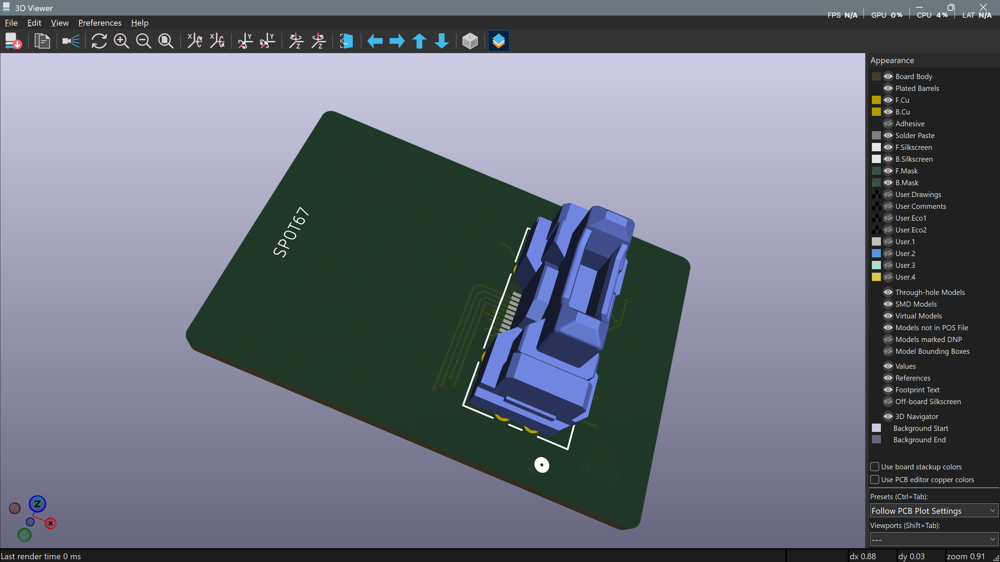

# FX23 encoder breakout — final revision & board order

**Date:** 06-07-2026

**Duration:** _fill in actual session time_

**People:** Ming

**Subsystem:** 🦿 Actuators & Legs

**Outcome:** ✅ Complete — all pre-fab items closed, **board ordered**

**Objective:**
>Close out the open items from the [04-07 design review](2026-07-04-fx23-breakout-design-test-plan.md) (unrouted nets, mounting, fab capability, silkscreen) and get the FX23 breakout board to fabrication, so bench readout of the secondary encoder's serial output can proceed once boards arrive.

**Resources:**
>[04-07 design review & test plan](2026-07-04-fx23-breakout-design-test-plan.md)
>[HIROSE FX23/FX23L Series datasheet](../assets/HIROSE-FX23-datasheet.pdf)

****
## TL;DR

Final layout revision closed both blocking/recommended hardware items from the design review — the GND tab net is now fully routed (0 unrouted) and the single mounting hole was replaced with **four 2mm corner holes**. The fab confirmed it supports the two capability floors this design sits on (0.15mm clearance, 0.2mm drill). A second design re-review verified the updated layout against the review checklist with no new issues. **Board ordered 06-07-2026.** Next action is Phase 0 bare-board validation when boards arrive; the 5-phase bench bring-up plan from the 04-07 log is unchanged.

## Work done

#### Layout revision (closing the 04-07 review items)
- **Routed the GND tab net** — the 3 unrouted connections flagged as blocking in the review were exactly the 4-pad retention-tab GND net (4 pads = 3 connections, the board's only multi-pad net). Now fully connected; the board reports **0 unrouted**.
- **Mounting upgraded from 1 hole to 4× 2mm corner holes** — exceeds the review's "add a second, diagonally-placed hole" recommendation and fully addresses the Hirose datasheet warning about the connector taking mate/unmate loads alone (relevant here: bring-up needs several of the connector's ≤100 rated cycles).
- Added a silkscreen board title (`SPOT67 REHAB / FX23 BREAKOUT PCB`).

#### Re-review of the updated layout
- Verified the revision against the 04-07 checklist from the updated editor view + 3D renders. Pad/net accounting still self-consistent: **56 pads** (24 TestPoints + 28 on J1 + 4 mounting holes), **24 vias** (one per TP net), **25 nets** (24 TP + shared GND). No new issues introduced by the revision.
- The small circular mark near TP16 that looked like a stray footprint in the renders was identified as **part of the FX23 footprint itself** (Ultra Librarian artwork), not an orphan element — no action needed.

#### Fab capability — confirmed
- Both "check with the fab" flags from the review **pass**: minimum copper clearance supports the ~0.17mm actual pad spacing inside the J1 footprint (covered by the scoped DRC rule), and minimum drill supports the 0.2mm/0.4mm vias. The design is within standard (non-HDI) service capability.

#### Order placed
- **Board sent to fab 06-07-2026.**

## Decisions

>**Decision:** No "PROBE ONLY" silkscreen note at TP21–24 (the power-contact test pads).

**Why:** Judged unnecessary — the power contacts aren't intended for functional use at all, the constraint (0.15mm traces ≪ the pins' 3A rating) is documented in the 04-07 log, and the board has a single user (this bench).

>**Decision:** Leave the unannotated `REF**` reference texts on the silkscreen (mounting holes).

**Why:** Cosmetic only, on a one-off internal test fixture — not worth a re-annotation pass. No electrical or assembly impact.

## Roadblocks

- None for the order itself. Full pinout of the 20 signal + 4 power contacts remains unknown until Phase 1 bench continuity mapping, post-fab.

## Next steps

- [ ] Boards arrive → run the 5-phase bench bring-up exactly as planned in the [04-07 log](2026-07-04-fx23-breakout-design-test-plan.md): Phase 0 bare-board validation → Phase 1 unpowered pin-mapping against the encoder PCB → Phase 2 current-limited power-up (~100mA) → Phase 3 RS-485 capture via a proper transceiver → Phase 4 eR baseline comparison → Phase 5 RPi cutover.

## Media

Final layout (4× corner mounting holes, GND tab net routed) and 3D render — see the [04-07 log's](2026-07-04-fx23-breakout-design-test-plan.md) Media section for the full set:

