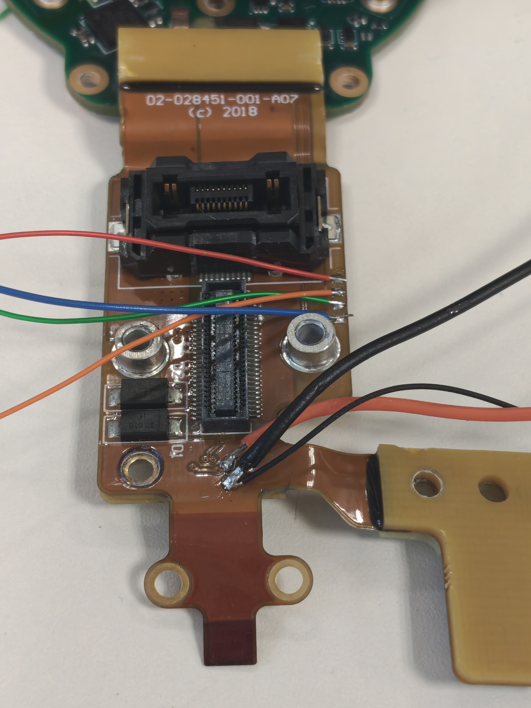

# Title

**Date:** 16-07-2026

**Duration:** 6hrs

**People:** Ming, Yizhang

**Subsystem:** 🦿 Actuators & Legs

**Outcome:** ❌ Fail

**Objective:**
>Tap RS485 connections from the IC-MU offset encoder board and attempt to read the raw sensor registers while installed in actuator housing.

**Resources:**
- [LTC2863 transceiver datasheet](https://www.analog.com/media/en/technical-documentation/data-sheets/2862345fc.pdf)
- [LT3029 LDO datasheet](https://www.analog.com/media/en/technical-documentation/data-sheets/3029fb.pdf)

****
## TL;DR

Failed to read IC-MU sensor over RS422 due to lack of hardware transceivers. The motor driver STM32 MCU also either cannot be powered manually, or is configured to not continuously read the sensor.

## Work done
#### Test pads mapping
- There are a few test pads exposed on the flex PCB between the motor driver and IC-MU encoder section.
- The previous test with the actuator main connector breakout board shows no direct connections from the main connector to the IC-MU section.
- There are also no RS422 test pads on the motor driver itself although the differential signal pairs are tested to connect directly to the driver.
- Hence, we theorize the offset encoder's differential pairs may be exposed as the test pads for better accessibility near the main connector.
- Probing for connectivity reveals the 4 test pads directly beside the main connector is indeed the `A/B/Y/Z` differential pairs from the IC-MU's LTC2863 transceiver.
- Another 2 test pads nearby was confirmed to be the `+5V` and `GND` to power the encoder section.

#### Attempt to read sensor
- To establish communication with the IC-MU sensor over the transceiver, we either need a similar full-duplex 4-wire transceiver or use 2x standard RS485 transceivers. Which we had none.
- A suggested alternative is to try to use the motor driver's STM32 to establish communication, and attach a oscilloscope/logic analyser to the data output lines of the transceiver to monitor the sensor readings.
- Wires were soldered to the test pads, and the motor driver is connected to the flex PCB.
- When supplying 5V through the test pads, the bench supply shows around 0.11A of current draw. The IC-MU board is powered, but probing the 3.3V test pads on the driver board only shows a voltage of about 0.4V.
- There were no indicator LEDs on the driver, but we probed and noticed the STM32's VIN pins are connected to the 3.3V test pad/rail. Hence, the 0.4V means the STM32 is not powered.
- The 5V test pad on the driver, however, reads a proper 4.994V.
- Checking the SMD components, we identified the 5V is fed into a 3.3V LDO regulator (LT3029), and the 3.3V test pad is for the LDO output.
- It seems the LDO may be enabled by another voltage rail instead of the 5V supply.
- We tried to power the STM32 directly from the 3.3V test pad using a separate channel from the bench supply.
- Oscilloscope probes were hooked up to the `A` and `Y` signal lines to monitor any dataframes being transmitted/received.
- No edges were detected on either line. We were hoping the STM32 is configured to periodically request for sensor readings to trigger an output, but this did not seem like the case.

## Findings & data

## Decisions
>**Decision:** Ignore sensor misread warnings; robot is operable with the warning and only stutters when walking backwards occasionally.

**Why:** Not enough time to buy new hardware to connect and test sensor readings

**Alternatives considered:** Purchase 2x RS485 to serial transceivers and attempt to read again

## Roadblocks
- Actual sensor diagnostics

## Next steps
- [x] Reassemble Spot

## Media

