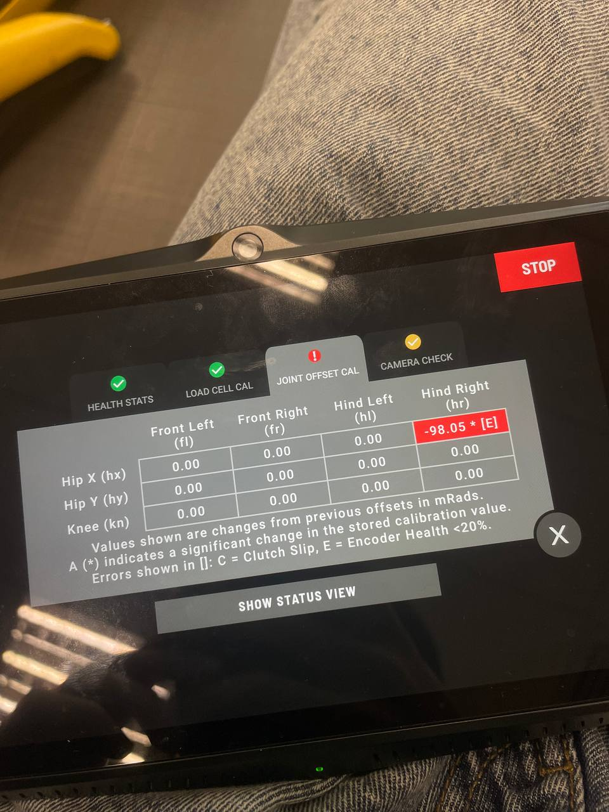
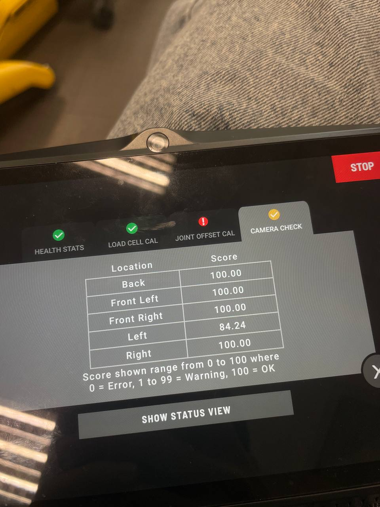
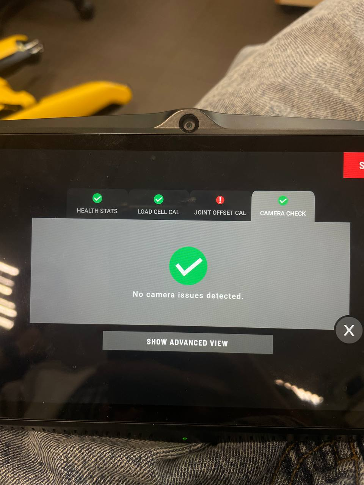
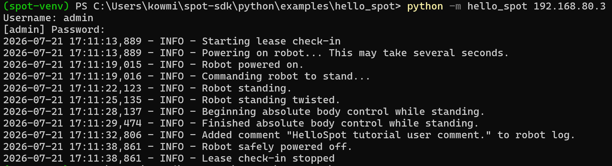
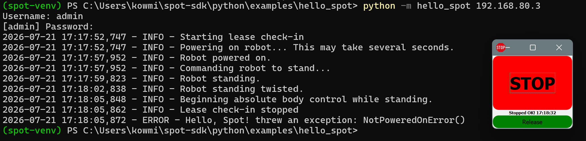
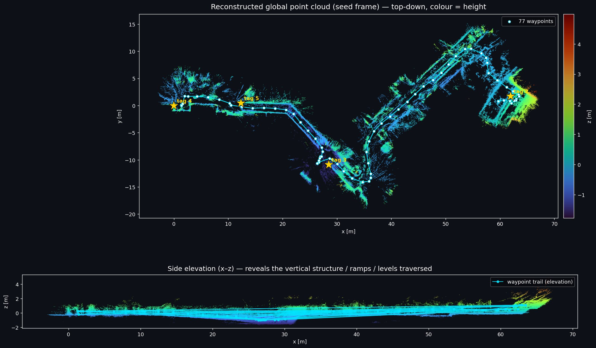
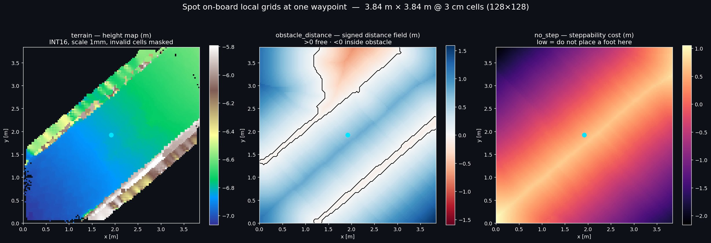
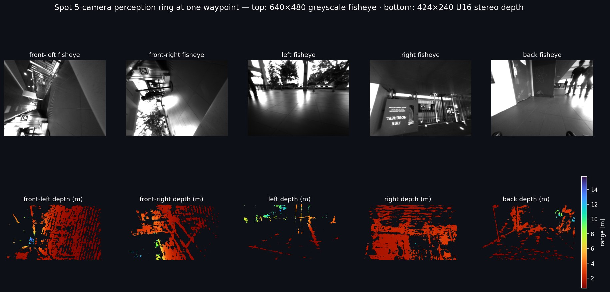

# 2026-07-22 - Autonomy capability tests: Autowalk, Spot SDK, and Autowalk decode

**Date:** 22-07-2026

**Duration:** 7h

**People:** Ming, Yizhang

**Subsystem:** 🦿 Actuators & Legs + 🧠 Compute & Autonomy + 📷 Sensors & Cameras

**Outcome:** ✅ Actuator repair CLOSED as complete, and autonomy validated end to end. Left hip-X healthy, right hip-X functionally usable (residual intermittent misreads, fewer than before and immediately historic). The right-socket gap reduction helped but did not lift its health above 20%, consistent with a more degraded magnet disc. Future work: replace the magnet discs or re-rework the right encoder chip. Also: three Autowalk missions, Spot SDK control with E-Stop, a full Autowalk decode, and the left-camera warning resolved as a lighting artefact.

**Objective:**
> Confirm the actuator repair holds under load, then exercise the full autonomy stack: Autowalk missions with waypoint actions, direct SDK control, and a decode of a recorded Autowalk to document what GraphNav stores.

****

## 1. Air gap and SpotCheck

Filed the right socket's spacer to 0.15 mm, the reproduction test carried over from 17-07, and re-ran SpotCheck. The right hip-X still flags `[E]`: the gap reduction did not lift its encoder health above the 20% threshold.

However, we believe the reduction did help in improving the encoder health. Across the walking, stair, and Autowalk tests below, the intermittent `hr.hx` misreads were less frequent than in the previous session and cleared immediately. We believe the underlying fault is a degraded magnet disc, worn by the repeated diagnosis teardowns, and reducing the air gap is the compensation, not the fault: seating the sensing chip nearer the weakened disc restores the measured field. On the left socket that compensation was enough to bring health back over the threshold. On the right socket, whose mR disc is likely more degraded (or whose NEW1 chip rework is marginal), it helped but fell short.

On that basis the actuator repair is closed as complete. The robot stands, walks forward and back, climbs stairs, and runs autonomous missions, with the left hip-X healthy and the right functionally usable. The durable fix for the motors are to replace the magnet discs or re-rework the encoder chip for the right motor, recorded as future work.

The left camera was cleaned before the run and returned an improved Camera Check score.

SpotCheck run — right hip-X still flagged, left-camera score improved after cleaning:

Camera Check after cleaning the left camera:

A second SpotCheck, run with the ceiling light blocked from the left camera, passed the camera check outright and returned an identical joint-calibration result. The left-camera warning first seen on 17-07 is therefore an ambient-lighting artefact, not a hardware fault.

Camera Check passes with the ceiling light blocked from the left camera:

## 2. Walking test

Forward and backward walking on flat ground completed cleanly, with no recovery routine on the reverse leg.

Walking test — front and back:

  <video width="360" height="480" controls>
    <source src="../assets/walking-test-frontback.mov" type="video/mp4">
    Your browser does not support the video tag.
  </video>

## 3. Autowalk missions

Three Autowalk missions were recorded and replayed, each with fiducial localisation and pose actions at its waypoints. All three passed with no issues.

**Controlled indoor loop.** A simple loop in a room, with fiducial localisation and pose actions at waypoints.

  <video width="360" height="480" controls>
    <source src="../assets/autowalk-elab-indoor.mov" type="video/mp4">
    Your browser does not support the video tag.
  </video>

**Stairs.** A steep flight, testing mobility on stairs with the same waypoint actions.

  <video width="360" height="480" controls>
    <source src="../assets/autowalk-stairs.mov" type="video/mp4">
    Your browser does not support the video tag.
  </video>

**Patrol inspection (lt6).** A longer route integrating extended navigation and stair climbing, run as a complete end-to-end Autowalk capability test.

  <video width="360" height="480" controls>
    <source src="../assets/autowalk-lt6-inspection.mov" type="video/mp4">
    Your browser does not support the video tag.
  </video>

## 4. Spot SDK: hello_spot and E-Stop

Set up and trialled the Spot SDK with the `hello_spot.py` example and the E-Stop client. Over Wi-Fi the client communicated with Spot, acquired the lease, powered on the motors, commanded body poses, captured an image, and triggered a successful E-Stop.

`hello_spot` — body pose and image capture:

E-Stop activated over the SDK:

SDK `hello_spot` run and E-Stop trigger:

  <video width="360" height="480" controls>
    <source src="../assets/sdk-hellospot-estop.mov" type="video/mp4">
    Your browser does not support the video tag.
  </video>

## 5. Autowalk decode

Decoded the `lt6 inspection.walk` recording to document what GraphNav stores. An Autowalk is a directory of serialized protobufs: a topological `graph` of 77 waypoints and 76 edges, one perception snapshot per waypoint (fused point cloud, 10 raw camera images, and five 3 cm cost grids), a foot-fall trace per edge, and an anchoring solve that pins the relative pose-graph to four AprilTags. Decoding with `bosdyn-api` and chaining the `seed ← waypoint ← odom ← sensor` transforms places every waypoint cloud into one globally consistent frame. Full method and field-level notes are in [spot-autowalk-deep-dive.md](../../data/software/spot-autowalk-deep-dive.md).

Three products were rendered from the recording:

Stitched global point cloud (top-down and elevation) with the waypoint graph and fiducials:

One waypoint's terrain-height, obstacle signed-distance, and no-step cost grids:

The five-fisheye and five-depth perception ring captured at one waypoint:

