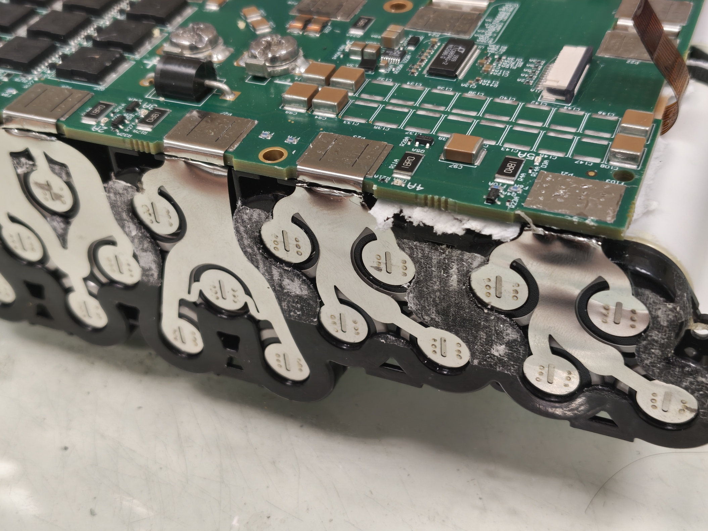
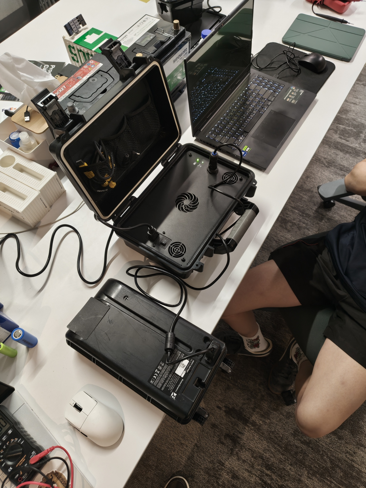
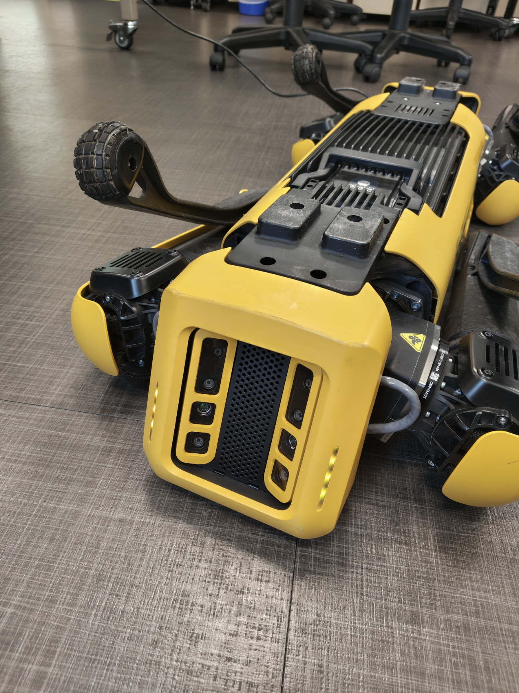

# Spot Battery Pack — Repair Report

| | |
|---|---|
| **Subsystem** | 🔋 Power & Battery |
| **Status** | ✅ Pack #1 repaired & verified (full balanced charge achieved) |
| **Period covered** | 13 May – 11 June 2026 |
| **Authors** | Yizhang, Ming |
| **Contributors** | Wonje (Sodion Energy — spot-welding); Royston (initial module teardown) |

---

## 1. Summary

Both of Spot's battery modules failed to charge. Investigation traced the fault to deeply
over-discharged 18650 lithium cells — averaging roughly **90 mV** against a 2.5 V safe-minimum —
that could not be recovered: the cells warmed and self-discharged through internal shorts, and the
OEM charger falsely reported a full charge. The module was therefore fully disassembled, its 56 dead
cells replaced with the OEM-spec **Samsung INR18650-30Q**, and the pack rebuilt onto the original BMS
in its native **14s4p** configuration using a custom PC-CF cell spacer.

The rebuild's reliability proved to be gated entirely by spot-weld quality. Early builds suffered from
weak and intermittent welds that produced cell-group imbalance and, ultimately, a battery-fault lockout
caused by a single disconnected cell group. After re-welding every joint, the pack reached a **full,
balanced charge for the first time**. Pack #1 is now repaired and verified.

A second battery module (improved bracket design, professionally welded) and the hind-leg actuator
fault remain open; both are tracked in separate reports.

---

## 2. Background & System Overview

Spot was received non-operational. The immediate blocker was power: **both battery modules failed to
charge**. On the OEM charger, the charge indicator flashes red briefly and then goes dark, instead of
the steady green blink that indicates normal charging. The handheld controller, by contrast, powered
on and connected normally — confirming the fault was specific to the battery, not the wider system.

*Figure 1 — Connecting a module to the OEM charger: the indicator flashes red and dies rather than
blinking steady green, signalling a refused charge.*

The module's internal architecture was established from a published Spot teardown report and confirmed
during our own disassembly (Section 4). At a glance:

| Property | Value |
|---|---|
| Nominal energy | ~500 Wh |
| Rated runtime | ~1.5 h |
| Cell | Samsung INR18650-30Q (3000 mAh, 15 A cont. / 30 A peak) |
| Cell count & topology | 56 cells in **14s4p**, built as two **7s4p** sub-packs (A & B) |
| BMS | Single PCB, STM32 MCU, **CAN bus** to the robot |
| Measurement pads | 28 pads — positive terminals along the long PCB edges, common negative down the centre |
| Thermal sensing | One flexible PCB per sub-pack carrying 5 SMD NTC thermistors |
| Thermal / safety | Phase-change thermal material around the cells; fish-paper terminal insulation; foam seating |

> **Objective:** restore the power subsystem by diagnosing the charge fault and, if the cells were
> unrecoverable, rebuilding the pack on the original BMS in its OEM form factor.

---

## 3. Fault Diagnosis & Decision to Rebuild

The sealed module was opened (its perimeter is held by a tough adhesive bead) to gain direct access to
the cells and the BMS measurement pads.

**Initial state.** Cell-group voltages averaged only **~90 mV** — far below the 2.5 V minimum safe
voltage for an 18650 cell, indicating severe over-discharge.

**Recovery attempt.** Each accessible cell group was slowly bench-charged at 2.0 V / 1.5 A; once groups
reached ~2.0 V, the limits were raised to 16 V / 5 A across up to five groups at a time. The pack rose
to ~14.5 V on the supply (P1–GND measured 13.3 V combined), so it would *take* charge.

*Figure 2 — Staged bench-charging of the individual cell groups in an attempt to nurse them back above
the safe minimum.*

**It would not hold.** Returned to the OEM charger, the BMS status LED blinked (a successful CAN
handshake), but the charge indicator went green and then static — a reported *"full"* charge on cells
that were clearly empty. Per the Spot manual, a false "full" indicates highly imbalanced cells; the
suggested fix (leave plugged in to auto-rebalance) had no effect. After idling, the cells were warm to
the touch and pack voltage collapsed from ~1.6 V to ~0.6 V.

*Figure 3 — The OEM charge indicator sitting static green ("full") moments after the pack measured
near-empty — the signature of dead, imbalanced cells.*

The warmth combined with the rapid voltage collapse is consistent with **resistive self-discharge
through dead cells now behaving as internal short circuits**. The cells were degraded beyond recovery.

| Decision | Rationale |
|---|---|
| Replace the cells rather than recover them | Cells over-discharged to ~90 mV, warm and self-discharging through internal shorts; the charger only reports a false "full". |
| Reuse the original BMS and form factor; rebuild as standard 14s4p, spot-welded onto the original pads | Keeps the OEM BMS, CAN interface and casing; 14s4p is a standard, replaceable configuration. |

---

## 4. Teardown & Disassembly

Having decided to rebuild, the module was fully disassembled — both to strip out the dead cells and to
document the OEM construction so the replacement pack could match it.

### 4.1 Disassembly process

- **Power & CAN cables.** A large glue blob securing the power cables was cut into chunks and pried off
  piece by piece. The power cables were unscrewed and the CAN cable unplugged, then a plastic insulator
  covering three of the BMS pads was removed.
- **Cells from the PCB.** White plastic rivets holding the plastic frame (and the nickel strips) were
  pried out with a flathead. The nickel strips are spot-welded to the BMS pads and could not be cut
  cleanly (the plastic frame blocked the cutter), so they were pried off the pads — leaving small
  welded-nickel bumps that need post-processing before re-welding.
- **Sub-pack separation.** Two flexible thermistor PCBs were unplugged before the cell packs came free.
  The two 7s4p sub-packs are joined by a long plastic snap-connector (pry both ends and twist to
  release the centre clips) and a shorter connector held by black rivets (push the centre axle out from
  below).
- **Thermistor strips.** Each sub-pack carries a long flexible PCB, kapton-taped and bonded with thermal
  adhesive, holding five SMD NTC thermistors that monitor temperature across the pack. The strips were
  labelled A and B to preserve their original side.

*Figure 4 — The module fully separated into its sub-packs, BMS, frame, connectors and thermistor
strips.*

*Figure 5 — The spot-welded nickel strips had to be pried off the pads, leaving residual nickel bumps
for later clean-up.*

### 4.2 Original pack architecture (as found)

The teardown confirmed the topology in Section 2 and revealed several construction details that drove
the rebuild design:

- **Cell layout is deliberately irregular.** Cells are unevenly spaced with awkward dimensions, and
  cells within the same row are not collinear — the centre cells sit slightly higher than the rest.
  This irregularity had to be reproduced in the replacement spacer (Section 6.2).
- **BMS pad layout.** 28 pads — positive terminals run along the two long edges of the PCB, with the
  common negative down the centre. Three pad sets sit beneath the plastic insulator under the power
  wires and are awkward to reach.
- **Thermal management** is provided by phase-change material packed around the cells (absorbs heat as
  it melts, keeping cells at a uniform temperature and buffering thermal-runaway energy) plus the
  thermistor array for monitoring.

*Figure 6 — The OEM cell arrangement. Spacing is irregular and the centre cells in each row sit
proud of their neighbours.*

*Figure 7 — The BMS PCB with cabling removed, showing the pad layout the replacement packs weld onto.*

*Figure 8 — One of the two flexible PCBs, each carrying five SMD NTC thermistors thermally bonded to
the cells.*

---

## 5. Replacement Cell Sourcing

The cell was identified from Boston Dynamics' Spot Battery Safety Data Sheet as the **Samsung
INR18650-30Q** — 3000 mAh, 15 A continuous / 30 A peak discharge. Fifty-six cells were required to
rebuild one module.

Local suppliers did not stock the exact cell, so several options were compared:

| Cell | Capacity | Discharge | Notes |
|---|---|---|---|
| **Samsung INR18650-30Q** *(chosen)* | 3000 mAh | 15 A / 30 A peak | OEM spec; cheapest source found at Falcon PEV — keeps the pack identical to stock. |
| LG HG2 | 3000 mAh | 20 A | Same capacity, slightly higher rating; ~$663 for 56 (Shopee). |
| Samsung INR18650-35E | 3500 mAh | higher | More capacity and current, but pricier (Sim Lim). |

The original Samsung INR18650-30Q was selected to keep the rebuild electrically identical to the OEM
pack.

---

## 6. Pack Design

### 6.1 Electrical / power budget

Spot's power draw was estimated to size the inter-cell conductors:

- Pack rated ~500 Wh; datasheet runtime ~1.5 h. Assuming 1.5 h down to 20 % SoC, average power ≈
  0.8 × 500 / 1.5 ≈ **267 W**. The manual specifies a 38–52 V supply, giving an operating current of
  **~5.1–7.0 A**.
- Sizing with a 50 % margin (~400 W continuous) gives a peak pack current of **~10.5 A**, or about
  **2.63 A per cell** across the 4-parallel groups.

| Conductor | Spec | Basis |
|---|---|---|
| Inter-cell links | 0.1 × 8 mm pure nickel | Per-cell current only ~2.63 A |
| 4s pack leads | 0.15 × 12 mm pure nickel | Rated ~17 A optimal / 25.5 A acceptable — comfortable for ~10.5 A pack max |

*(The OEM pack uses 12 mm strip throughout; matching that everywhere would be overkill for the actual
current.)*

### 6.2 Mechanical — cell spacer

The irregular OEM cell layout (Section 4.2) was replicated in CAD and 3D-printed as a four-piece
spacer in **PC-CF** (polycarbonate / carbon-fibre), chosen for its high operating-temperature limit
and strong inter-layer bond for rigidity. The four spacers printed over ~10 hours. *(The supplied
filament adhered suspiciously well and printed easily, raising the suspicion it was PETG sold as
PC-CF — functionally adequate for this part regardless.)*

*Figure 9 — The four PC-CF cell spacers that replicate the OEM cell positions.*

### 6.3 Thermal & safety

- **Fish-paper** insulation cut to shape across the cell terminals to prevent accidental shorts.
- A **silicone thermal sheet** between the pack and the shell, both for heat transfer and to seat the
  cells firmly in the casing grooves.
- Phase-change material was researched for the latent-heat thermal buffering the OEM pack uses, but no
  easy-to-work-with off-the-shelf PCM was found for this rebuild.
- Completed sides were fitted with insulating sheets and the exposed ends taped during assembly.

---

## 7. Assembly & Spot-Welding

The cells were seated in the spacers and their terminals spot-welded with nickel strip at Sodion
Energy. Only 10 mm strip was available, so it was trimmed to ~8 mm before use. The 12 mm BMS PCB tabs
tended to "explode" when welded onto the thinner strip below, so those tabs were **soldered** instead.

*Figure 10 — A cell sub-pack with nickel strips spot-welded across the terminals.*

**Welder reliability was the main obstacle.** The bench spot-welder failed mid-job with an
*Error 22 — transistor fault* (a pop, then a smell of smoke from the supply). The failure was
attributed to electrode fouling/mushrooming, thermal saturation of the IGBTs, and contact-pressure
drift; the root cause was later traced to a **cracked solder joint on a capacitor module** (burn marks
were visible on the PCB next to an otherwise-healthy capacitor). A handheld spot-welder was used to
finish welding both packs while the bench unit was out of service.

*Figure 11 — The handheld spot-welder that completed the job after the bench welder failed.*

**BMS reattachment.** The ground ends of the packs were welded to the BMS first, then the positive
ends. Each cell group's connection was confirmed by the BMS red indicator LEDs blinking as it was
welded on. The pack was then closed with the original foam pieces reinserted to keep the cells seated.

*Figure 12 — BMS indicator LEDs responding as each cell group is welded onto the board.*

---

## 8. Testing, Fault-Finding & Rework

### 8.1 First charge test — false "full" and imbalance

On the first charge test the SoC button showed a single blinking green bar (low charge). The charger
indicator flashed green (charging), but after ~20 minutes went static green ("full") while the SoC
still showed only one bar. The BMS then showed **three red LEDs flashing** and its green STM32 LED
turned off, halting charging.

*Figure 13 — First charge test of the rebuilt pack: a premature "full" report with the cells clearly
not full.*

From the admin console the battery balance index read **0.213** — anything above 0.1 calls for active
balancing. However, auto cell-balancing requires battery firmware **> V45** (the pack reported V33), so
the legacy charger could not rebalance it automatically. This pointed the investigation back at the
cells and their connections rather than the charging system.

The rebuilt pack did successfully **power the robot** for a power-on check, confirming the pack could
deliver load current even while imbalanced.

*Figure 14 — The rebuilt pack powering Spot through a boot cycle, confirming load delivery.*

### 8.2 Root cause — defective spot welds

After charging the pack until the charger again reported "full", each cell group's voltage was
measured and tabulated. Groups **1, 2 and 8** were abnormal while the rest were well balanced.

*Figure 15 — Per-group voltage sweep; groups 1, 2 and 8 read abnormally relative to the balanced
remainder.*

Inspection tied every anomaly to a **bad weld on the positive side**:

- **Groups 2 and 8** — the positive weld had popped off, leaving only two of the four cells connected
  in parallel, which raised their relative voltage.
- **Group 1** — a defective weld loosely joined the nickel strips, producing a very high contact
  resistance.

*Figure 16 — A defective weld joint of the type responsible for the group imbalance.*

*Figure 17 — Resistance across a sound weld (top) versus a poor one (bottom). An inconsistent weld
raises the trace resistance substantially and unbalances the pack.*

### 8.3 Battery-fault lockout — a disconnected cell group

After the pack was left overnight, Spot reported a **battery fault** and refused to power on; charging
produced the same fault, with **all SoC lights blinking**. A third full voltage sweep showed group 1
reading an impossible **−0.5 V** while every other group sat at a healthy, balanced 3.71–3.72 V
(including the previously unbalanced ones).

*Figure 18 — Third voltage sweep. Every group is balanced at ~3.71 V except group 1, which reads a
negative voltage.*

The negative reading across pads P1–P2 was the trigger for the BMS lockout. Candidate failure modes
were narrowed down:

1. **BMS damage** (blown MOSFET/resistor) — unlikely; no visible damage on the board.
2. **Positive-side weld** — ruled out; resistance along the positive nickel strips was normal.
3. **Cell degradation** — unlikely; the group had been fine in service.

Probing the cell group **directly** (negative terminal disconnected from the BMS) gave 3.71 V — but
only when the negative nickel strip was pressed down hard. That intermittent contact isolated the fault
to a **broken weld on the group's negative terminal**: the group had effectively disconnected from the
BMS, and the −0.5 V was a *phantom* reading — most likely the reverse bias of an internal protection
diode, or the drop across a balancing bleed-resistor on the BMS.

*Figure 19 — Group 1 reads a phantom −0.5 V at the BMS pads (top) while probing the cell group
directly reads a healthy 3.71 V (bottom) — confirming a broken negative-terminal weld, not a bad cell.*

The likely trigger was **mechanical strain on the joint during operation** — most plausibly when the
robot was flipped over for a self-right test.

### 8.4 Rework & verification

Rather than fix only the known-bad joints, the pack was returned to Sodion Energy and **every weld was
redone** to eliminate further intermittent connections. After re-welding:

- the SoC fault lights cleared,
- the pack charged normally, and
- it reached a **full charge for the first time** — the hallmark of sound welds allowing the cells to
  balance correctly.

| | Before rework | After rework |
|---|---|---|
| Group 1 (P1–P2) | −0.5 V (disconnected) | balanced, ~3.7 V |
| Charge behaviour | premature false "full", fault lockout | charges to full, no fault |
| Cell balance | groups 1/2/8 anomalous | all groups balanced |

---

## 9. Conclusion & Future Work

Battery module #1 has been **repaired and verified**. The dead OEM cells were replaced with matching
Samsung INR18650-30Q cells and rebuilt onto the original BMS in the stock 14s4p configuration; the pack
now charges to a full, balanced state and powers the robot.

The dominant lesson is that **the rebuild's reliability was governed entirely by spot-weld quality**.
Bracket-induced bends and stress points in the nickel-strip routing caused repeated weld failures —
first as cell-group imbalance, then as a full battery-fault lockout from a single disconnected joint.

**Open items (tracked separately):**

- Build the **second battery module** with an improved spacer/bracket design that removes the nickel-
  strip bends and stress points, and offload the welding to a battery specialist (Unicell Pte. Ltd.)
  for consistent joints.
- Purchase 52 cells for the second pack (4 spares already on hand).
- *Out of scope for this report:* the Spot firmware update, the DB25 port-cover detection bypass, and
  the hind-leg actuator / self-right diagnosis are covered in their own subsystem reports.

---

## References

### Source repair logs

| Date | Session |
|---|---|
| 13 May 2026 | [Battery & controller inspection](../../battery/2026-05-13-battery-controller-inspection.md) |
| 20 May 2026 | [Battery restoration attempt](../../battery/2026-05-20-battery-restoration-attempt.md) |
| 21 May 2026 | [Battery module complete disassembly](../../battery/2026-05-21-battery-disassembly-sourcing.md) |
| 25 May 2026 | [DIY pack design & safety research](../../battery/2026-05-25-battery-pack-design.md) |
| 25 May 2026 | [Battery spacer CAD](../../battery/2026-05-25-cad-battery-spacer.md) |
| 28 May 2026 | [Replacement battery assembly (1)](../../battery/2026-05-28-battery-assembly.md) |
| 29 May 2026 | [Replacement battery assembly (2)](../../battery/2026-05-29-battery-assembly-2.md) |
| 02 Jun 2026 | [Replacement battery assembly (3)](../../battery/2026-06-02-battery-assembly-3.md) |
| 04 Jun 2026 | [Battery assembly — BMS & charge test](../../battery/2026-06-04-battery-assembly-4.md) |
| 05 Jun 2026 | [Battery diagnostics & Spot update](../../battery/2026-06-05-sw-update-and-test.md) |
| 11 Jun 2026 | [Battery fault diagnosis & re-weld](../../battery/2026-06-11-battery-assembly-5.md) |

### External

- [Spot Battery Safety Data Sheets (SDS) — Boston Dynamics](https://support.bostondynamics.com/s/article/Spot-Battery-Safety-Data-Sheets-SDS-49922)
- [Samsung INR18650-30Q — Falcon PEV](https://www.falconpev.com.sg/products/18650-samsung-30q-3000mah)
- [Battery Thermal Management — LHS Materials](https://www.lhsmaterials.com/thermal-regulation)
- [Comprehensive Teardown Report of Spot (Reddit)](https://www.reddit.com/r/IndiaTech/comments/1nwsba2/comprehensive_teardown_report_of_the_quadruped/)
