<!-- PB -->

# List of Figures {.unnumbered}

- **Figure 1** — Charge refusal on the OEM charger.
- **Figure 2** — Staged bench recovery of the over-discharged cell groups.
- **Figure 3** — The OEM charger reporting a false "full".
- **Figure 4** — The fully disassembled battery module.
- **Figure 5** — The irregular OEM cell layout.
- **Figure 6** — The BMS PCB and its pad layout.
- **Figure 7** — One of the two flexible NTC-thermistor PCBs.
- **Figure 8** — The four 3D-printed PC-CF cell spacers.
- **Figure 9** — A cell sub-pack spot-welded with nickel strip.
- **Figure 10** — The handheld spot-welder used after the bench welder failed.
- **Figure 11** — BMS indicator LEDs responding during welding.
- **Figure 12** — Per-group voltage sweep after the first full charge.
- **Figure 13** — A defective / popped weld joint.
- **Figure 14** — Sound versus poor weld resistance.
- **Figure 15** — Third voltage sweep: group 1 phantom −0.5 V.
- **Figure 16** — Phantom −0.5 V at the pads versus 3.71 V probed directly.
- **Figure 17** — The sheared SoC flex cable and its repair.
- **Figure 18** — Pack #2 V2 bracket CAD.
- **Figure 19** — Pack #2 laser-cut nickel strips and welded BMS.
- **Figure 20** — Spot opened for hind-leg removal.
- **Figure 21** — The two hind hip-X motor driver boards compared.
- **Figure 22** — The driver board, encoder side.
- **Figure 23** — The secondary output-encoder Hall-IC at the harmonic-drive output.
- **Figure 24** — The 50:1 harmonic drive.
- **Figure 25** — The rotor / output-encoder assemblies during the swap.
- **Figure 26** — The secondary output-encoder PCB, close up.
- **Figure 27** — The secondary output-encoder PCB components.
- **Figure 28** — The iC-MU pinout and connections.
- **Figure 29** — The connector-flex test pads.
- **Figure 30** — Test-pad map used for the bench read attempt.
- **Figure 31** — Wires soldered to the flex-PCB test pads.
- **Figure 32** — The oscilloscope bench read attempt.
- **Figure 33** — The DB25 payload-port cover pin shorts (Appendix D).

<!-- PB -->

# List of Tables {.unnumbered}

- **Table 1** — OEM battery module architecture (as found).
- **Table 2** — Replacement-cell sourcing comparison.
- **Table 3** — Inter-cell conductor sizing.
- **Table 4** — Battery pack #1 state before and after the weld rework.
- **Table 5** — Actuator component-swap actions and physical observations.
- **Table 6** — iC-MU Port-A (ExtSSI) pinout, as wired.
- **Table 7** — Hind hip-X full-range-of-motion mechanical offsets.
- **Table 8** — Selected iC-MU EEPROM configuration registers (full map in Appendix B).

<!-- PB -->

# Introduction

The Boston Dynamics *Spot* quadruped (hereafter **Spot**) held by the programme was
received non-operational, and this report documents the hardware-level work carried out to
return it toward service. Two independent faults were present on arrival. First, the power
subsystem was dead: both of Spot's battery modules refused to charge, so the robot could not
be powered from its own packs at all. Second, once external power was restored, one leg
actuator, the **left hind hip-X (abduction/adduction) joint** (hereafter **hip-X**, and
specifically `left_hind_x`), behaved abnormally, with the joint failing to reach commanded
positions while the other three legs moved normally. The mechanical and electrical nature of
that actuator was, at the outset, entirely unknown: it had never been opened, and no internal
documentation was available.

The work reported here pursues two objectives that together serve a single thesis: *to
rebuild Spot's power system and to physically and electrically reverse-engineer its faulty hip
actuator so that the hardware is characterised and the fault is localised to a physical part.*
The first objective was to restore the power subsystem by diagnosing the charge fault and,
should the cells prove unrecoverable, rebuilding each pack on its original battery management
system (BMS) in the OEM form factor. The second objective was to characterise the hip-X
actuator as a piece of hardware, covering its mechanical construction, its dual-encoder
architecture, and the electrical design of its output-encoder board, and then, through a
sequence of physical component swaps and bench measurements, to narrow the fault down to a
specific physical part.

The scope of this report is deliberately confined to the **hardware layer**. It describes
physical acts (teardown, cell replacement, spot-welding, component interchange, board probing)
and the hardware and electrical facts observed during them. The complementary *diagnostic
interpretation* of the actuator's control-signal behaviour, together with the eventual encoder
repair, was carried out on the signal/software layer and is reported in the companion report
[Ming, SS-TBD]; those results are cited here as single premise sentences and are never
re-derived. Every factual claim in this report is drawn from the project's own dated session
logs and reference pages; no external measurements were introduced.

The working approach throughout was bench-based and comparative. Because Spot's two hind legs
are nominally identical, the healthy hind leg served as a reference against which the faulty
one could be compared part by part, a strategy that recurs across the actuator chapters. The
remainder of the report is organised as follows. The **Background** section establishes the
battery and actuator architectures as found. Three methodology chapters then cover, in turn,
the **power-system rebuild**, the **actuator mechanical investigation**, and the **encoder
electrical reverse-engineering**. A combined **Evaluation, Limitations and Improvements**
section assesses what was achieved and what the bench work could not resolve, and the
**Conclusion** summarises the outcome and the planned future work.

# Background

## Battery module architecture

Spot is powered by two identical, hot-swappable battery modules. Each module is a sealed
assembly whose perimeter is held closed by a tough adhesive bead. The internal architecture was
first established from a published third-party teardown of the Spot platform [3] and then
confirmed directly during the project's own disassembly (Section 4). Each module carries
**56 Samsung INR18650-30Q lithium-ion cells**, a 3000 mAh cell rated 15 A continuous / 30 A
peak, identified from Boston Dynamics' Spot Battery Safety Data Sheet [1], arranged in a
**14s4p** configuration and physically built as **two 7s4p sub-packs** (labelled A and B). A
single BMS PCB, built around an STM32 microcontroller, manages the module and communicates with
the robot over a **CAN bus**. Table 1 summarises the construction as found.

Table: **Table 1 —** OEM battery module architecture, as established from the teardown report [3] and confirmed on disassembly.

| Property | Value |
|---|---|
| Nominal energy | ~500 Wh |
| Rated runtime | ~1.5 h |
| Cell | Samsung INR18650-30Q (3000 mAh, 15 A cont. / 30 A peak) |
| Cell count & topology | 56 cells in 14s4p, built as two 7s4p sub-packs (A & B) |
| BMS | Single PCB, STM32 MCU, CAN bus to the robot |
| Measurement pads | 28 pads: positives along the long PCB edges, common negative down the centre |
| Thermal sensing | One flexible PCB per sub-pack, each carrying five SMD NTC thermistors |
| Thermal / safety | Phase-change material around the cells; fish-paper terminal insulation; foam seating |

Two construction details established here proved decisive for the rebuild. The cell layout is
deliberately **irregular**: cells are unevenly spaced and are not even collinear within a row,
the centre cells sitting slightly proud of their neighbours, so any replacement spacer had to
reproduce those exact positions rather than assume a regular lattice. Thermal management is
provided by a phase-change material packed around the cells, which absorbs heat through its
latent heat of fusion and buffers thermal-runaway energy, supplemented by the two five-element
NTC-thermistor strips that monitor temperature across each sub-pack.

## Hip-X actuator architecture

Each of Spot's legs is driven by three actuators; the one of interest here is the **hip-X**
actuator, which abducts and adducts the leg. Its mechanical output is produced by a
brushless motor turning through a **50:1 harmonic drive (strain-wave reducer)**, so that a
large number of motor revolutions map to a small, high-torque motion of the leg. Bench
measurements on the hip motor established a **20-pole, 18-slot** machine (a slot/pole ratio of
0.9) with a phase resistance of approximately **0.5 Ω**.

The actuator carries **two** angle sensors rather than one, a fact that only became apparent
once the motor was opened (Section 6). The **primary encoder** is a motor-side **iC-MHM 14-bit
absolute Hall encoder** that reads rotor angle before the reduction. The **secondary output
encoder** is a separate **iC-Haus iC-MU Hall-IC** mounted at the harmonic-drive output stage,
reading the actual joint angle *after* the 50:1 reduction. The secondary encoder sits on its
own small PCB, which also carries an external configuration EEPROM and an RS-485/RS-422
differential transceiver, stacked with the joint's load-cell PCB behind the main motor
connector. The physical construction and electrical routing of that board are characterised in
this report (Sections 6 and 7); the *functional role* of the two encoders within Spot's
joint-control signalling is described in [Ming, SS-TBD].

# Methodology 1 — Power-system rebuild

## Fault diagnosis and the decision to rebuild

The power subsystem was the first blocker: with both modules unable to charge, Spot could not
be run from its own batteries. On the OEM charger the charge indicator flashed red briefly and
then went dark, rather than the steady green blink that signals normal charging. The handheld
controller, by contrast, powered on and connected normally (though it drained quickly),
confirming that the fault was specific to the battery modules rather than the wider system.

To gain direct access to the cells and the BMS measurement pads, a module was opened along its
adhesive seam. The initial cell-group voltages averaged only about **90 mV**, far below the
2.5 V minimum safe voltage for an 18650 cell, indicating severe over-discharge. A staged
recovery was nonetheless attempted before any decision to scrap the cells: each accessible
group was bench-charged slowly at 2.0 V / 1.5 A, and once groups reached roughly 2.0 V the
limits were raised to 16 V / 5 A across up to five groups at a time (Figure 2). The pack rose to
about 14.5 V on the supply (P1-GND measured 13.3 V combined), demonstrating that it would *take*
charge.

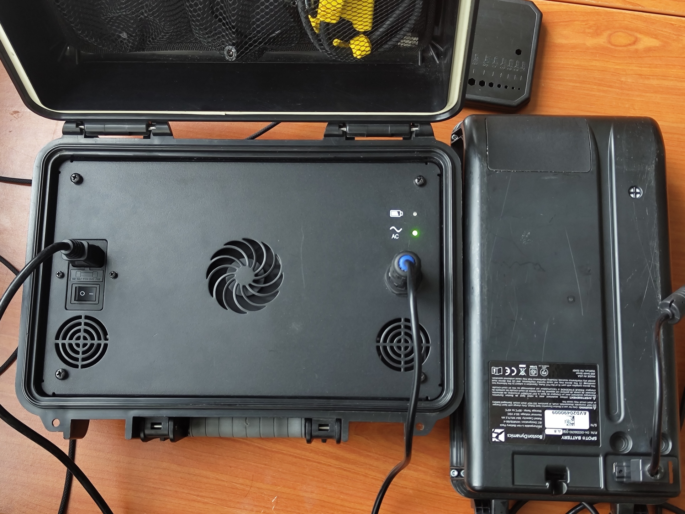{width=48%}

**Figure 1 —** Connecting a module to the OEM charger. The indicator flashes red and dies
rather than blinking steady green, signalling a refused charge.

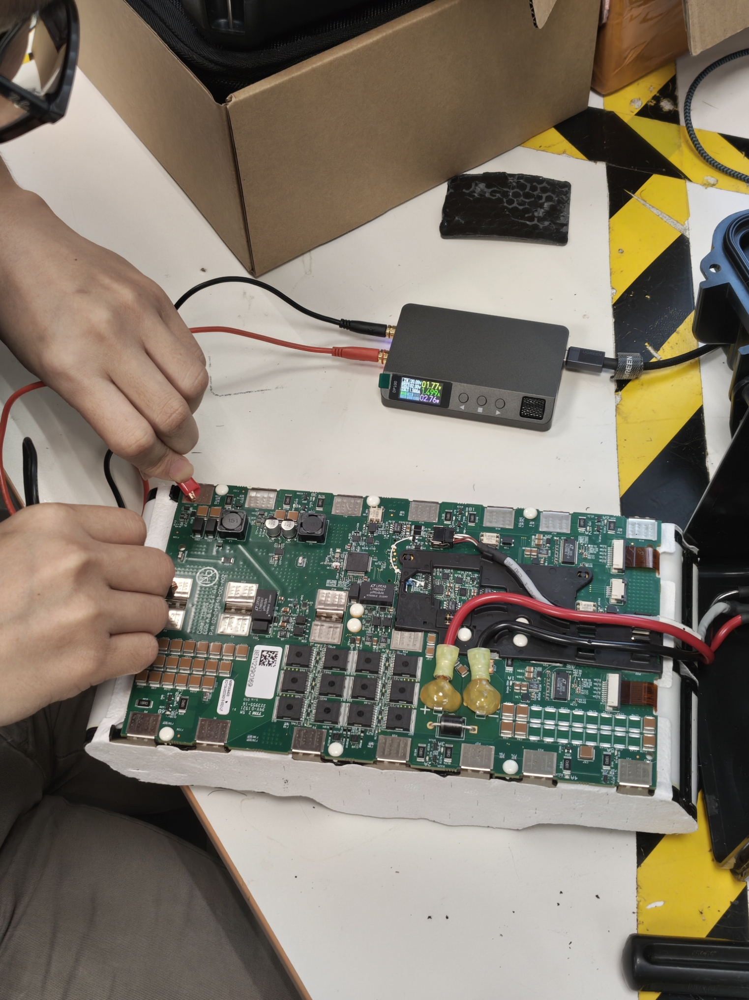{width=55%}

**Figure 2 —** Staged bench-charging of the individual cell groups, an attempt to nurse them
back above the safe minimum before committing to a rebuild.

The recovery did not hold, and the manner of its failure was itself the diagnosis. Returned to
the OEM charger, the BMS status LED blinked, a successful CAN handshake, but the charge
indicator went green and then static, reporting a *"full"* charge on cells that were plainly
empty (Figure 3). The Spot manual attributes a false "full" to highly imbalanced cells and
suggests leaving the pack plugged in to auto-rebalance, which had no effect. After idling, the
cells were warm to the touch and pack voltage collapsed from about 1.6 V to 0.6 V. The
combination of warmth and rapid voltage collapse is consistent with resistive self-discharge
through dead cells now behaving as internal short circuits; the cells were therefore judged
degraded beyond recovery. The decision followed directly: replace the cells rather than recover
them and, to preserve the OEM BMS, CAN interface and casing, rebuild onto the original board
in the standard 14s4p configuration by spot-welding replacement cells onto the original pads.

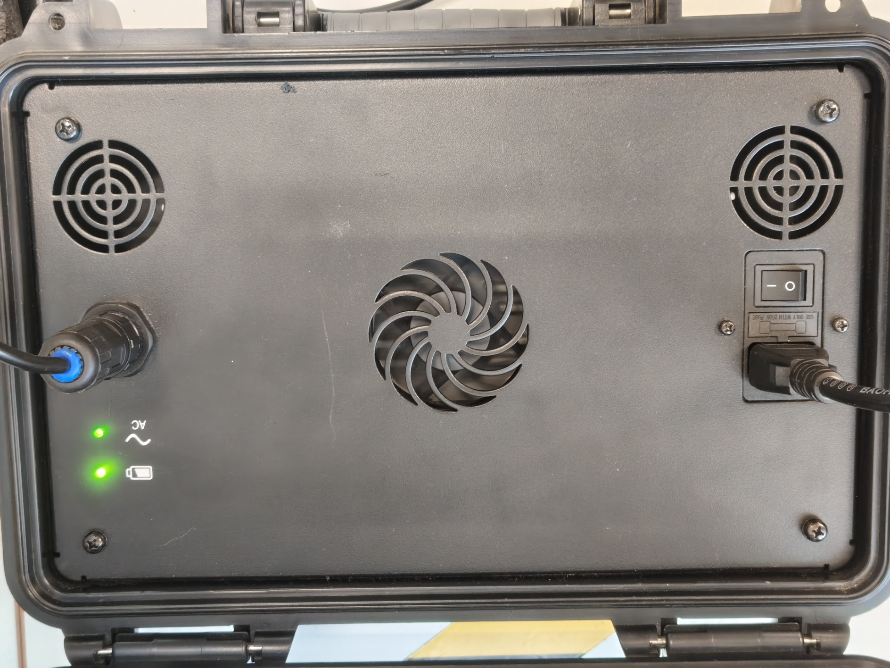{width=48%}

**Figure 3 —** The OEM charge indicator sitting static green ("full") moments after the pack
measured near-empty: the signature of dead, imbalanced cells.

## Teardown and OEM construction

Having resolved to rebuild, the module was fully disassembled, both to strip out the dead cells
and to document the OEM construction so the replacement pack could match it (Figure 4). The
power cables were freed by cutting away a large securing glue blob piece by piece, then
unscrewing the leads and unplugging the CAN cable; a plastic insulator covering three of the
BMS pad sets was removed. The nickel strips are spot-welded to the BMS pads and could not be cut
cleanly because the plastic frame blocked the cutter, so they were pried off the pads, leaving
small welded-nickel bumps that required clean-up before re-welding. The two 7s4p sub-packs were
then separated: a long plastic snap-connector releases by prying both ends and twisting the
centre clips, and a shorter connector by pushing its centre axle out from below. The two
flexible thermistor strips (Figure 7) were unplugged and labelled A and B to preserve their
original sides.

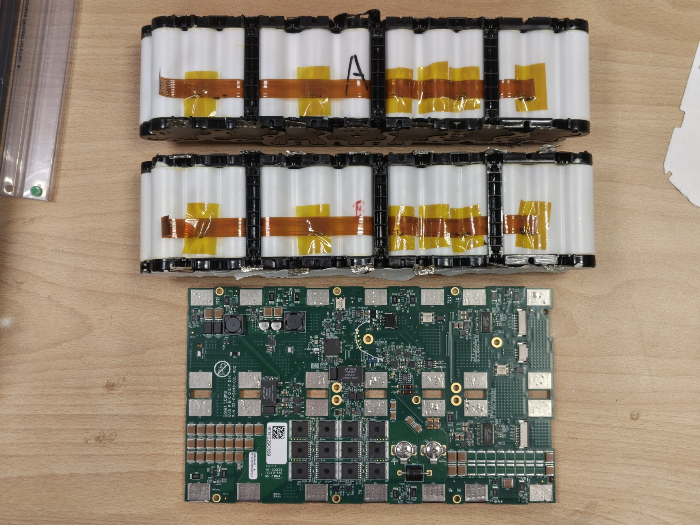{width=60%}

**Figure 4 —** The module fully separated into its sub-packs, BMS, frame, connectors and
thermistor strips.

The teardown confirmed the topology of Table 1 and fixed the two design constraints noted in
the Background: the irregular, non-collinear cell layout (Figure 5) that the replacement spacer
would have to reproduce, and the 28-pad BMS layout (Figure 6), positives along the long edges,
common negative down the centre, with three pad sets awkwardly recessed beneath the power-wire
insulator, onto which the new pack would weld.

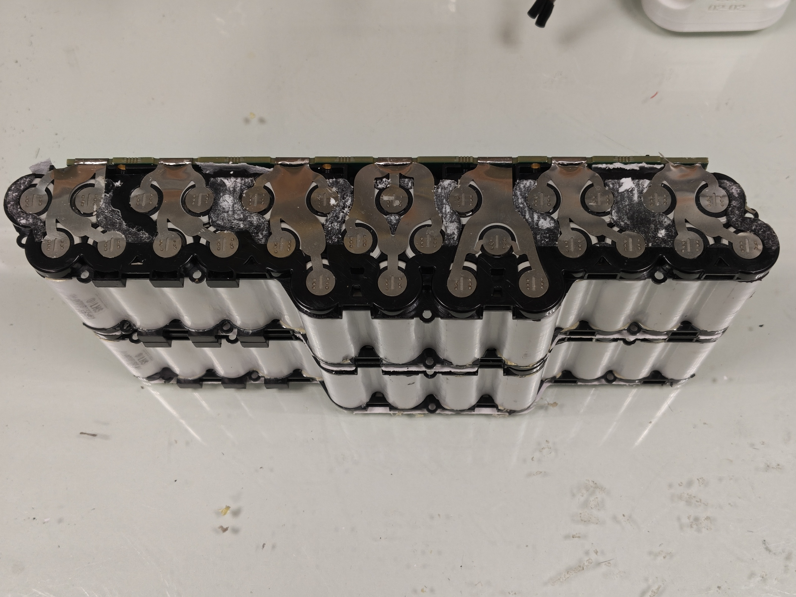{width=55%}

**Figure 5 —** The OEM cell arrangement. Spacing is irregular and the centre cells in each row
sit proud of their neighbours.

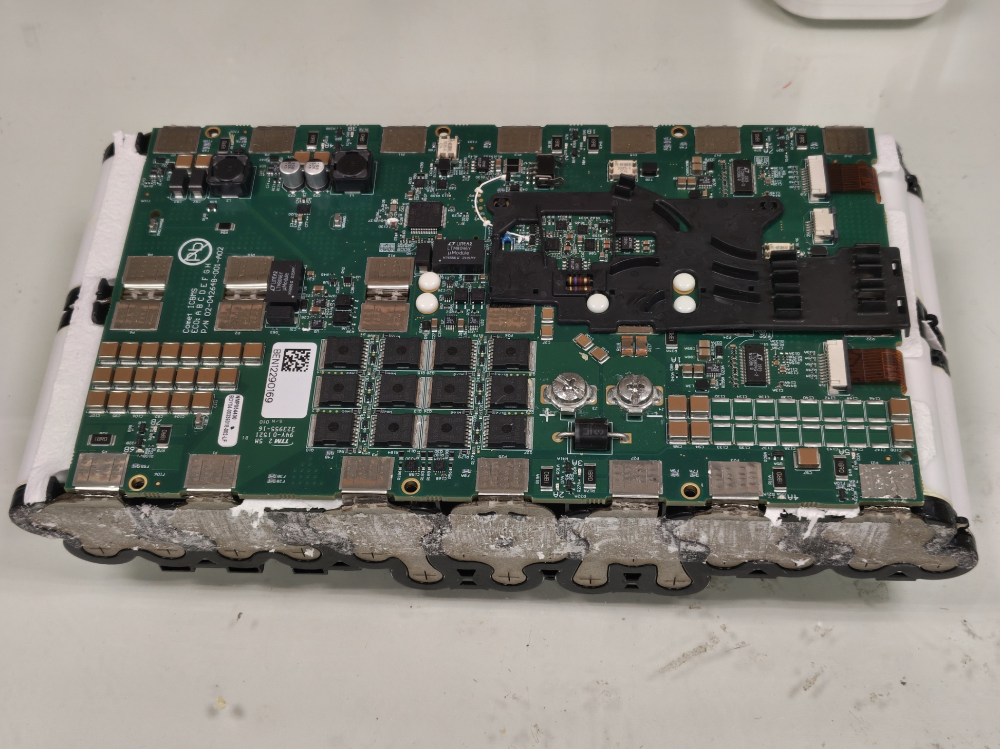{width=55%}

**Figure 6 —** The BMS PCB with cabling removed, showing the pad layout onto which the
replacement packs weld.

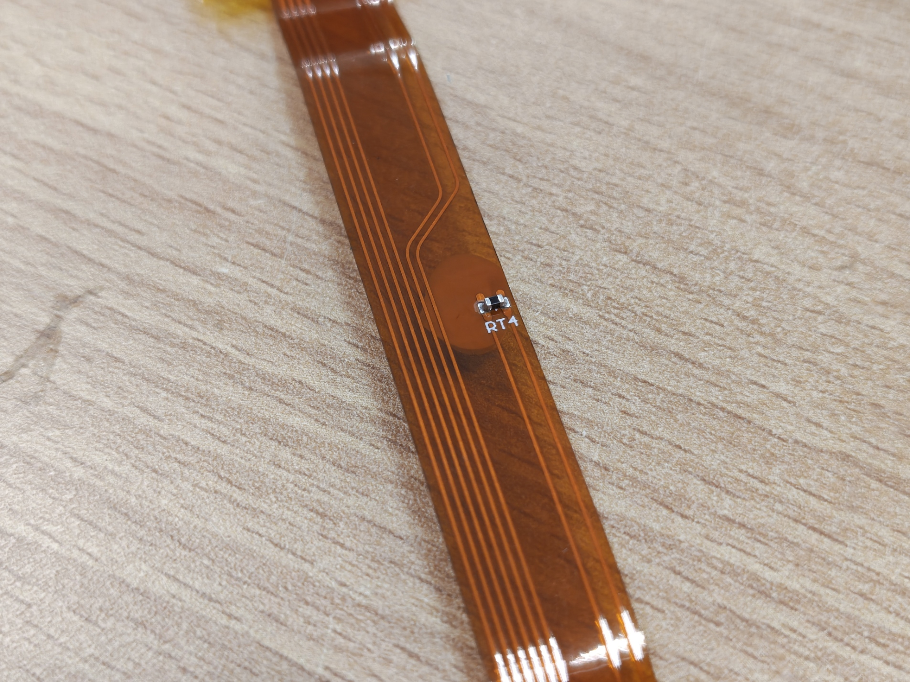{width=50%}

**Figure 7 —** One of the two flexible PCBs, each carrying five SMD NTC thermistors thermally
bonded to the cells.

## Cell sourcing

The replacement cell was fixed by the OEM specification: the Samsung INR18650-30Q identified
from the Spot Battery Safety Data Sheet [1], of which 56 were required per module. Because local
suppliers did not stock the exact cell, several options were compared (Table 2). The original
30Q was selected to keep the rebuild electrically identical to stock, the cheapest source being
Falcon PEV [2]; higher-capacity alternatives were rejected as unnecessary deviations from the
OEM design.

Table: **Table 2 —** Replacement-cell sourcing comparison. The OEM cell was chosen to keep the pack identical to stock.

| Cell | Capacity | Discharge | Notes |
|---|---|---|---|
| **Samsung INR18650-30Q** *(chosen)* | 3000 mAh | 15 A / 30 A peak | OEM spec; cheapest source found (Falcon PEV) [2]. |
| LG HG2 | 3000 mAh | 20 A | Same capacity, slightly higher rating (~S$663 for 56). |
| Samsung INR18650-35E | 3500 mAh | higher | More capacity and current, but pricier. |

## Pack design

Two design questions had to be settled before assembly: how to size the inter-cell conductors,
and how to hold the irregular cell lattice rigidly.

The conductor sizing followed from an estimate of Spot's power draw. With the pack rated at
about 500 Wh and a datasheet runtime of roughly 1.5 h, and assuming discharge to 20 % state of
charge over that time, the average power is approximately 0.8 × 500 / 1.5 ≈ **267 W**; against
the manual's 38-52 V supply this implies an operating current of about **5.1-7.0 A**. Sizing to
a 50 % margin (~400 W continuous) gives a peak pack current of about **10.5 A**, or roughly
**2.63 A per cell** across the four parallel cells in each group. Those figures set the strip
widths in Table 3; the OEM pack uses 12 mm strip throughout, which is comfortably conservative
for the actual current.

Table: **Table 3 —** Inter-cell conductor sizing, from the estimated ~10.5 A peak pack current.

| Conductor | Spec | Basis |
|---|---|---|
| Inter-cell links | 0.1 × 8 mm pure nickel | Per-cell current only ~2.63 A |
| 4s pack leads | 0.15 × 12 mm pure nickel | Rated ~17 A optimal / 25.5 A acceptable, ample for ~10.5 A pack max |

The irregular OEM layout was replicated in CAD from direct measurement of the original pack and
3D-printed as a four-piece cell spacer in **PC-CF** (polycarbonate / carbon-fibre), chosen for
its high operating-temperature limit and strong inter-layer bond, which maximise rigidity
(Figure 8). The four spacers printed over roughly ten hours. Safety and thermal provisions
mirrored the OEM approach where practical: fish-paper insulation cut to shape across the cell
terminals to prevent accidental shorts, and a silicone thermal sheet between the pack and the
shell for heat transfer and to seat the cells firmly in the casing grooves. An off-the-shelf
phase-change material equivalent to the OEM latent-heat filler [4] was researched but none easy
to work with was found, so it was omitted from this rebuild, on the basis that the current-sizing
estimate above already showed the cells operating well under their rated capacity even at peak
load: a deviation from stock noted here as a limitation.

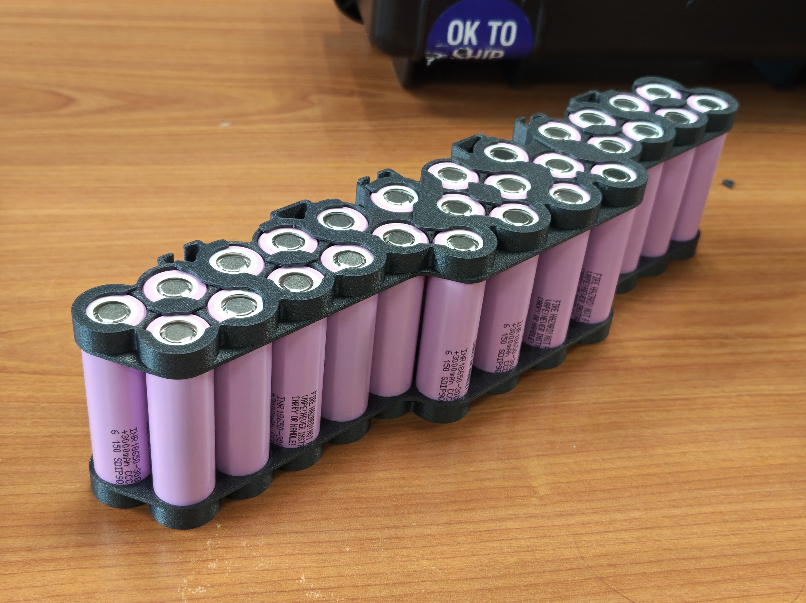{width=55%}

**Figure 8 —** The four 3D-printed PC-CF cell spacers, which replicate the irregular OEM cell
positions.

## Assembly and spot-welding

The cells were seated in the spacers and their terminals joined with nickel strip at a
partner facility, Sodion Energy. Only 10×0.15 mm strip was available, so it was trimmed to about
8 mm before use (Figure 9). The 12 mm BMS PCB tabs tended to "explode" when welded onto the
thinner strip beneath them, so some tabs that kept coming loose were **soldered** rather than
welded. A recurring practical constraint was that the welder could not reliably join more than
one nickel strip at a time, which ruled out strip-stacking and shaped the later V2 design.

{width=55%}

**Figure 9 —** A cell sub-pack with nickel strips spot-welded across the terminals.

Welder reliability was in fact the dominant obstacle of the whole rebuild. Partway through, the
bench spot-welder failed with an *Error 22 (transistor fault)*: after about thirty minutes of
use there was an audible pop and a smell of smoke from the supply. The immediate contributor was
assessed as thermal saturation of the welder's IGBTs; the underlying cause was later traced, on
opening the unit, to a **cracked solder joint on a capacitor module**, with burn marks on the PCB
beside an otherwise-healthy capacitor. A handheld spot-welder (Figure 10) was pressed into
service to finish both packs while the bench unit was out of action.

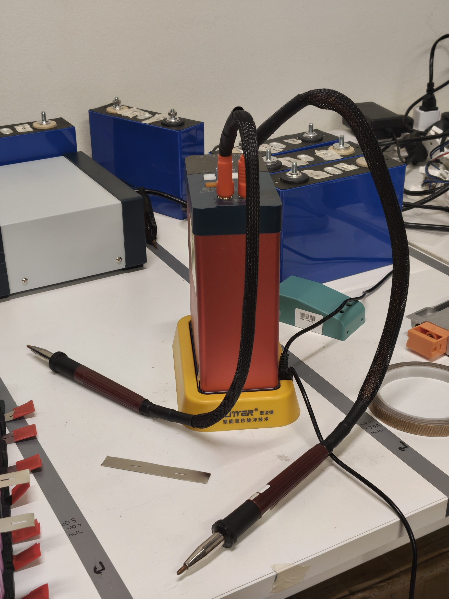{width=48%}

**Figure 10 —** The handheld spot-welder that completed the job after the bench welder failed
with an Error 22 transistor fault.

The pack was then reattached to the BMS, ground ends first and positive ends second. As each
cell group was welded on, the BMS's red indicator LEDs blinked in response, but in no
consistent order: static for a few groups, blinking for another few, unlit for the rest
(Figure 11). The module was finally closed with its original foam pieces reinserted to keep the
cells seated.

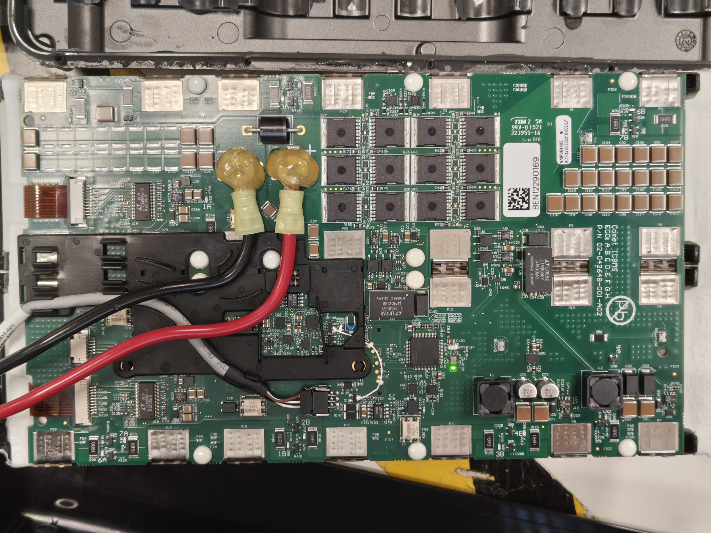{width=50%}

**Figure 11 —** BMS indicator LEDs responding as each cell group is welded onto the board.

## Testing, fault-finding and rework

The first charge test exposed the rebuild's central weakness. The state-of-charge (SoC) button
showed a single blinking green bar; the charger flashed green (charging) but, after about twenty
minutes, went static green ("full") while the SoC still showed one bar. The BMS then flashed
three red LEDs and extinguished its green STM32 LED, halting the charge.

From the admin console the battery balance index read **0.213**, well above the 0.1 threshold
that calls for active balancing. Automatic balancing, however, requires battery firmware later
than V45, whereas the pack reported V33, so the legacy charger was never going to rebalance it
on its own, and the premature "full" reading was a symptom of that imbalance rather than a
genuine end of charge.

The rebuilt pack did nonetheless power the robot through a boot cycle, confirming that it could
deliver load current even while imbalanced. That ruled out a dead pack outright and pointed the
investigation at the cells' connections rather than at the charging system.

After charging until the charger again reported "full", each group's voltage was measured and
tabulated (Figure 12). Groups 1, 2 and 8 read abnormally while the remainder were well
balanced, and inspection tied every anomaly to a **bad weld on the positive side**: on groups 2
and 8 the positive weld had popped off, leaving only two of the four parallel cells connected
and so raising the group's relative voltage; on group 1 a defective weld loosely joined the
nickel strips, producing a high contact resistance. A resistance comparison across sound and
poor joints (Figure 14) confirmed that an inconsistent weld raises the trace resistance
substantially and unbalances the pack.

{width=60%}

**Figure 12 —** Per-group voltage sweep after the first full charge; groups 1, 2 and 8 read
abnormally relative to the balanced remainder.

{width=48%}

**Figure 13 —** A defective / popped weld joint of the type responsible for the group
imbalance.

{width=42%}
{width=42%}

**Figure 14 —** Resistance across a sound weld (left) versus a poor one (right). The poor joint
reads a substantially higher resistance.

The weld problem then escalated from imbalance to a hard lockout. After the pack was left
overnight, Spot reported a **battery fault** and refused to power on, and charging produced the
same fault with all SoC lights blinking. A third voltage sweep (Figure 15) showed group 1
reading an impossible **−0.5 V** while every other group, including the previously unbalanced
ones, sat at a healthy 3.71-3.72 V. Candidate failure modes were narrowed by elimination: no
visible BMS damage argued against a blown MOSFET or resistor; normal resistance along the
positive nickel strips ruled out a positive-side weld; and the group's good service history made
cell degradation unlikely. Probing the group directly, with its negative terminal disconnected
from the BMS, gave 3.71 V, but only when the negative nickel strip was pressed down hard
(Figure 16). That intermittent contact isolated the fault to a **broken weld on the group's
negative terminal**: the group had effectively disconnected from the BMS, and the −0.5 V was a
phantom reading, most plausibly the reverse bias of an internal protection diode or the drop
across a balancing bleed-resistor on the BMS. The likely trigger was mechanical strain on the
joint during operation of the robot.

{width=48%}

**Figure 15 —** Third voltage sweep. Every group is balanced at ~3.71 V except group 1, which
reads a negative voltage.

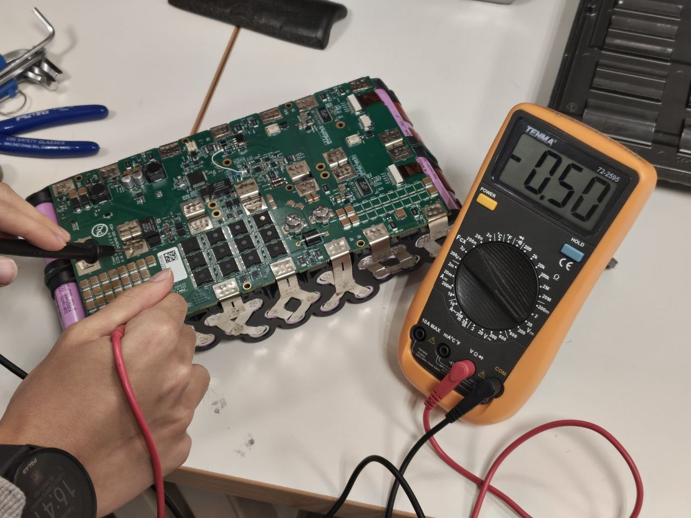{width=42%}
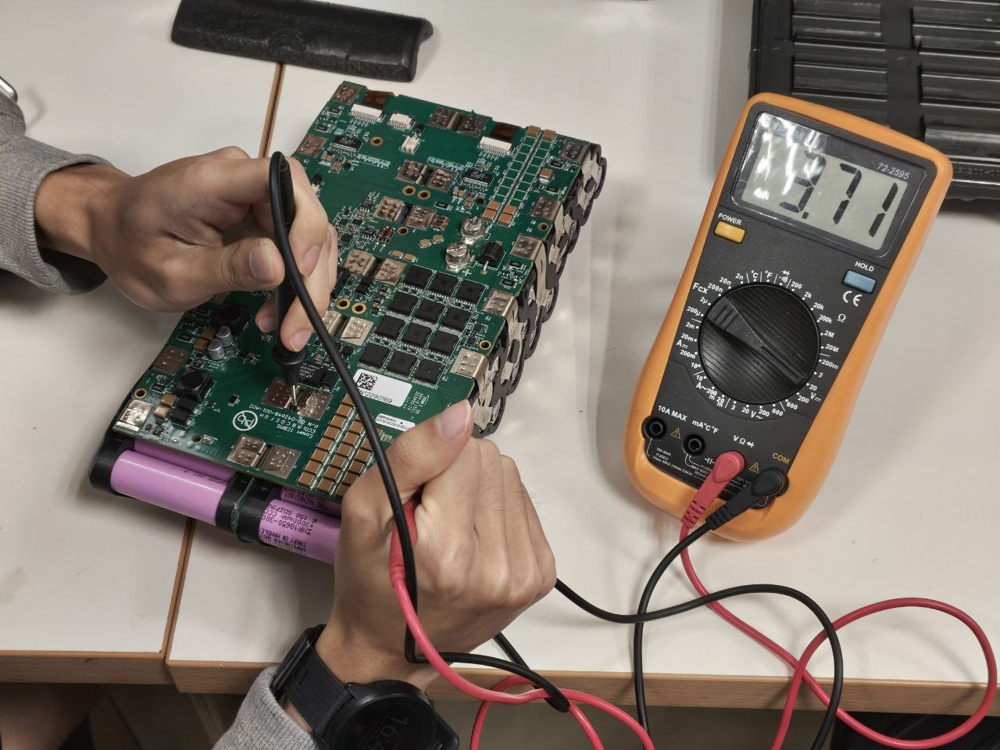{width=42%}

**Figure 16 —** Group 1 reads a phantom −0.5 V at the BMS pads (left) while probing the cell
group directly reads a healthy 3.71 V (right), confirming a broken negative-terminal weld,
not a bad cell.

Rather than repair only the known-bad joints, the pack was returned to the partner facility and
**every weld was redone** to eliminate any further intermittent connections. After re-welding,
the SoC fault lights cleared, the pack charged normally, and it reached a **full, balanced
charge for the first time**, the hallmark of sound welds allowing the cells to balance
correctly (Table 4). Battery module #1 was thereby repaired and verified.

Table: **Table 4 —** Battery pack #1 state before and after the weld rework.

| | Before rework | After rework |
|---|---|---|
| Group 1 (P1-P2) | −0.5 V (disconnected) | balanced, ~3.7 V |
| Charge behaviour | premature false "full", fault lockout | charges to full, no fault |
| Cell balance | groups 1 / 2 / 8 anomalous | all groups balanced |

## Second module: a V2 pack that validated the fixes

The single dominant lesson of pack #1, that reliability was governed almost entirely by
spot-weld quality and that weld failures traced to bends and stress points in the nickel-strip
routing imposed by the bracket design, was carried directly into a second module. The V2
brackets (Figure 18) added a further set of braces with tighter tolerances to hold the cell
lattice rigidly (pack #1's brackets had allowed some play when flexed), reincorporated the OEM
injection-moulded spacer positions for rigidity, and were re-dimensioned to fit the casing and
PCB more accurately after the lessons of V1. They were printed in glass-filled ABS (ABS-GF) for
dimensional stability at temperature, and the BMS mounting was changed from expanding rivets,
which had split the printed layer lines, to captured M3 nuts under 1.2 mm of plastic, secured
with M3×6 mm screws.

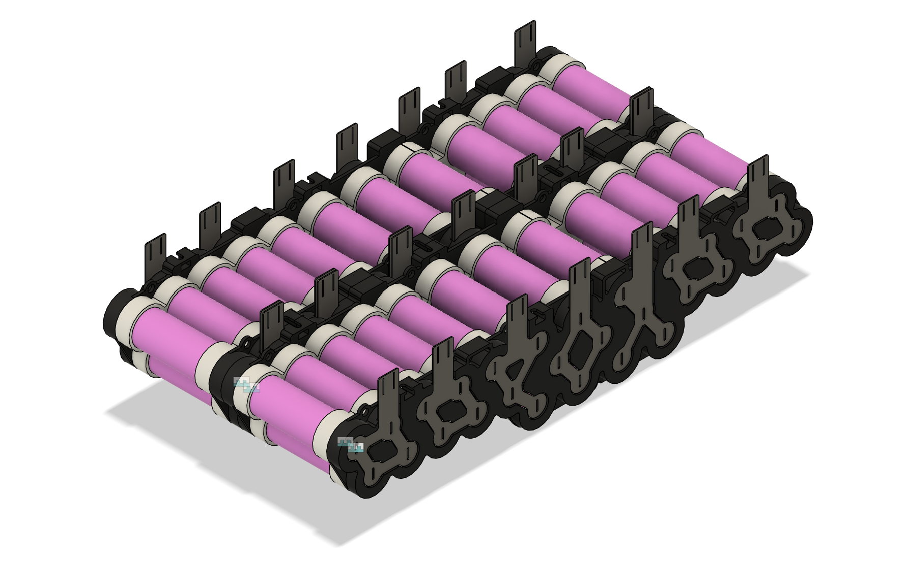{width=60%}

**Figure 18 —** The pack #2 V2 bracket CAD, adding braces, OEM spacer positions and captured-nut
BMS mounting.

The improvement was borne out in assembly (Figure 19). Custom nickel strips, laser-cut and
sourced via Taobao, eliminated strip-stacking, with a narrow slot cut into each weld site so
that the welder's current was directed through the layers rather than arcing across the
surface; the result was little to no sparking and joints that held firmly when the tabs were
pulled, with no re-welding required. Where pack #1 had taken two people three days, pack #2 was
completed by one person in a single afternoon. After assembly, the SoC button was initially
unresponsive; this was traced to a **sheared SoC flat-flex cable** near its base and a missing
connector fastener (Figure 17). The broken cable was repaired by scraping back the insulation on
both ends of the flex PCB and soldering the exposed traces, with kapton tape added as a strain
relief on the joints and a shim of cardboard standing in for the absent fastener; the SoC then
read correctly. Pack #2 charged to full within about an hour, reported a very healthy balance
index of **0.02**, and accepted a battery firmware update once installed in Spot. Both modules
were thereby restored to a full, balanced charge, meeting the power-system objective.

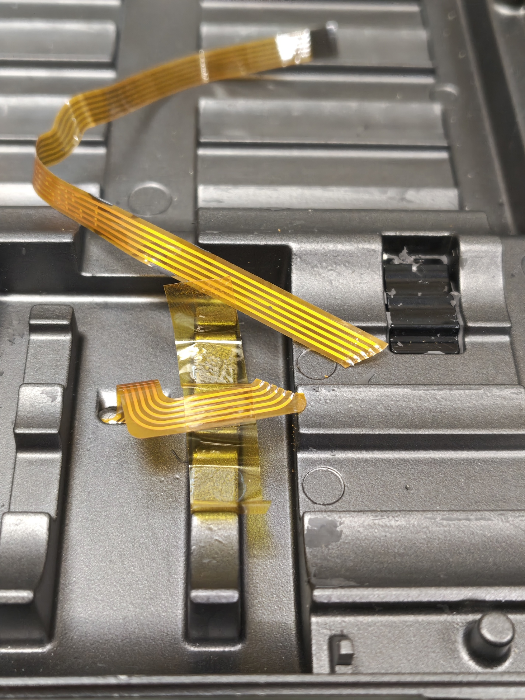{width=42%}
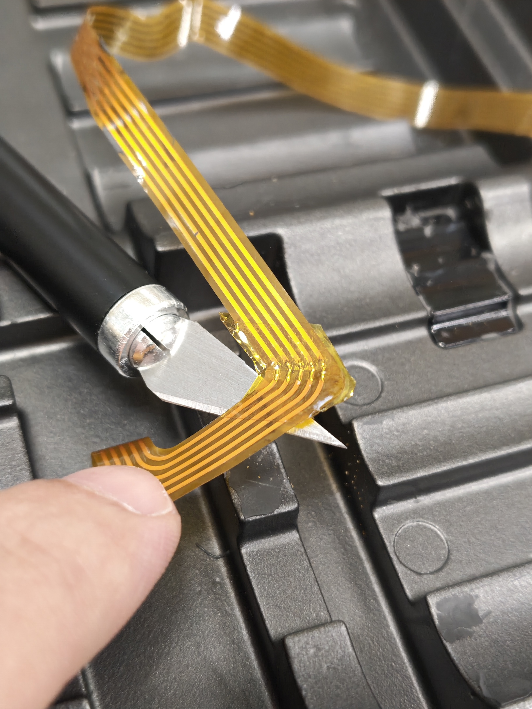{width=42%}

**Figure 17 —** The sheared SoC flat-flex cable (left) and the soldered, kapton-secured repair
(right).

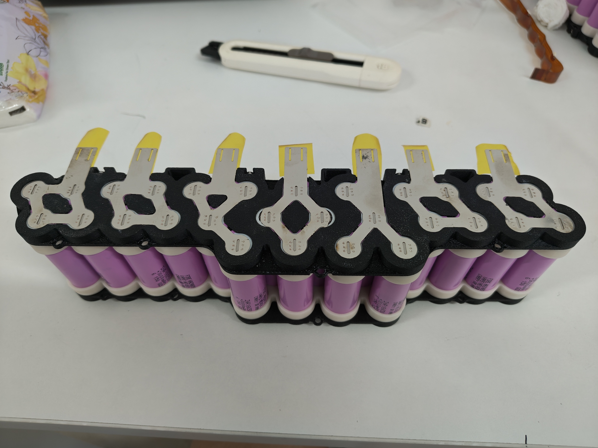{width=42%}
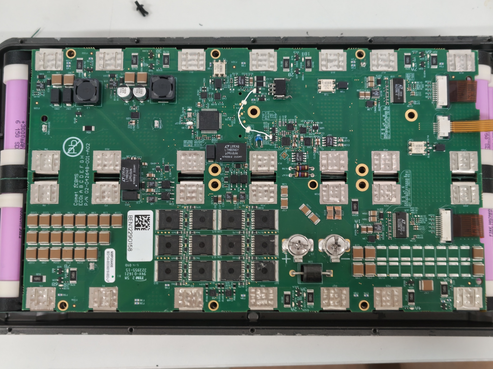{width=42%}

**Figure 19 —** Pack #2's laser-cut nickel strips (left) and the completed BMS weld (right),
both markedly cleaner than pack #1.

# Methodology 2 — Actuator mechanical investigation

With power restored, attention turned to the faulty `left_hind_x` actuator. The investigation
proceeded as a sequence of physical component swaps, each designed to move one candidate part
between the faulty left and the healthy right hind hip-X actuators and observe whether the
abnormal behaviour physically followed the part or stayed with the socket. This chapter reports
the swap *procedures* and the *physical* observations; for each swap, the corresponding
diagnostic reading and its interpretation belong to the signal layer and are reported in
[Ming, SS-TBD].

## Teardown and driver comparison

Spot was disassembled to extract the left hind leg together with its hip-X motor and controller
(Figure 20). During teardown the leg wiring and controller board were inspected for physical
defects and none were found; a layer of what appeared to be epoxy coating over the controller
board frustrated any attempt to probe its test points, as contact could not be made without
forcibly scraping the coating away. Because a purely visual inspection could not distinguish a
mechanically sound motor from a magnetically faulty one, the investigation was framed around
comparison with the healthy right hind leg.

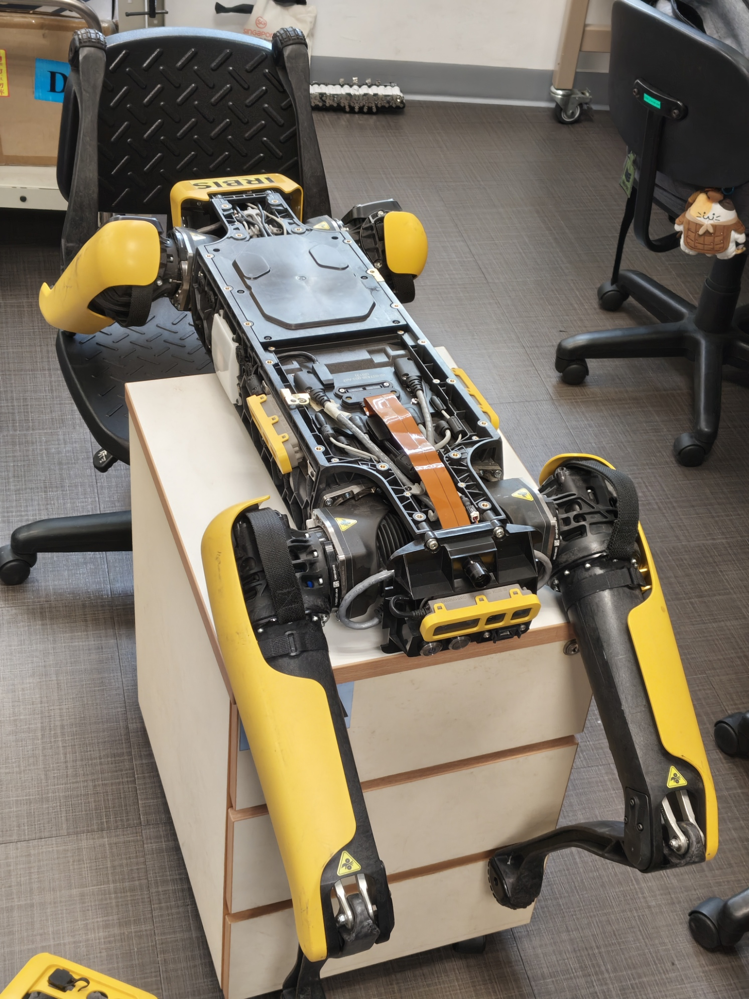{width=48%}

**Figure 20 —** Spot opened on the bench to remove the left hind leg and its hip-X actuator.

Both hind legs were then removed and their hip-X motor driver boards compared side by side
(Figures 21 and 22). The two drivers were physically identical, with no sign of component
degradation on either. Rotating each motor by hand confirmed that the encoder's diametric rotor
magnet was firmly seated, rotated freely, and stood at an identical protrusion height on both
sides, ruling out an obviously displaced or loose magnet as the cause.

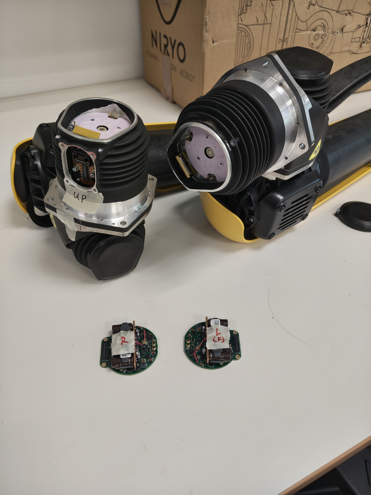{width=48%}

**Figure 21 —** The two hind hip-X motor driver boards removed for direct comparison.

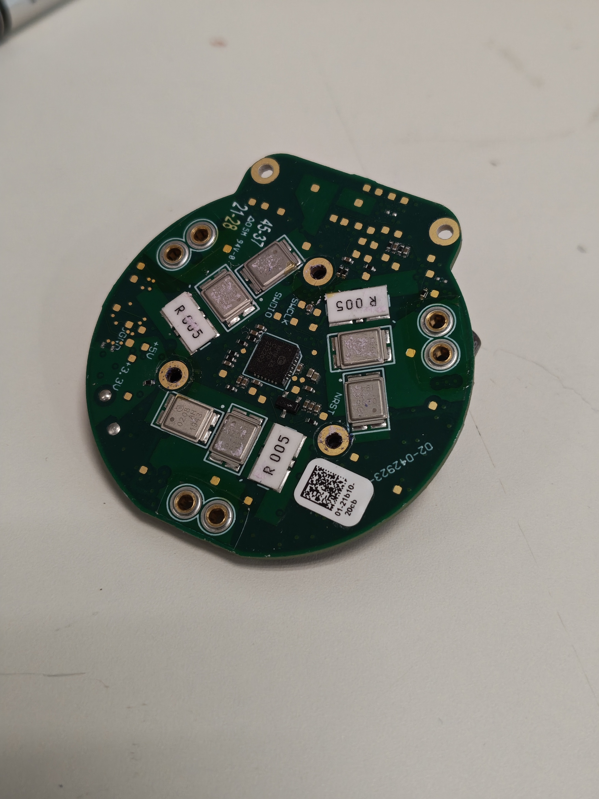{width=48%}

**Figure 22 —** The driver board, encoder side, showing the motor-side primary encoder region.

## Driver and cable swaps

Two swaps tested the driver electronics and the wiring. First, the left and right hip-X driver
boards were exchanged and the legs refitted; on power-up no motor faults were reported, but the
abnormal joint behaviour physically remained with the left socket rather than following the
swapped board. Second, the hip-X motor cables were exchanged, after probing the connector PCBs
to confirm they were not mirror images and that power and ground would map correctly, and again
the abnormal behaviour stayed with the left socket while the other joint operated normally.
Table 5 records the physical actions and observations; in both cases the diagnostic reading that
accompanied the swap, and the inference drawn from it, are reported in [Ming, SS-TBD].

Table: **Table 5 —** Actuator component-swap actions and the physical observations recorded. The diagnostic reading and interpretation for each swap are reported in [Ming, SS-TBD].

| Physical action | Physical observation |
|---|---|
| Exchange L/R hip-X driver boards | No motor faults on power-up; abnormal behaviour stayed with the left socket, not the board. |
| Exchange L/R hip-X connector cables | Abnormal behaviour stayed with the left socket; the other joint responsive and normal. |
| Exchange entire rotor + output-encoder + load-cell assemblies | Behaviour moved to the right socket, but a load-cell hard fault appeared (load cells are calibrated per joint). |
| Exchange output-encoder PCB only (rotors/load-cells returned to original sockets) | Abnormal frozen behaviour cleared on both joints; a residual mechanical offset remained on one joint. |

Taken together at the hardware level, the driver and cable swaps physically eliminated the
driver electronics and the motor wiring as the location of the fault, since neither swap moved
the abnormal behaviour with the part. That left the angle-sensing hardware inside the motor as
the remaining candidate, which motivated opening the motor itself.

## Motor disassembly — discovering the secondary encoder

Each hip-X motor was disassembled to further identify potential points of failure. To isolate
the hip-X (abduction) motor, the hip-Y (flexion) motor was first removed from the rotor housing
by undoing four very tight M5 Torx screws, after which a flange serving as both cover and
mechanical end-stop was freed by removing eight torqued-down M3 hex screws; the X-motor
assembly, held together without the flange only by a snug fit between the rotor bearing and
housing, could then be pulled apart with some force. The hex screws used by Boston Dynamics
were noted to be relatively soft, several stripping easily during disassembly. A further
construction detail was that the internal screws on the aluminium plate holding the stator in
place are numerically labelled, suggesting a defined tightening sequence to keep the rotor
centred.

The disassembly revealed the key architectural fact of the whole investigation: a **second Hall
sensor**, also from iC-Haus (the iC-MU), mounted beside the harmonic-drive stage (Figures 23 and
24). This was the secondary output encoder introduced in the Background, not visible in any
earlier inspection. Because the driver and cable swaps had already cleared the electronics and
wiring, and because the primary iC-MHM rotor encoder is a robust four-Hall device whose reading
is insensitive to small magnet-placement deviations (the rotor magnet having already been shown
well-seated on both sides), this newly exposed secondary encoder became the primary hardware
suspect for the abnormal joint behaviour. The sensor tracks a 32-pole Nonius magnet ring mounted
on the output of the harmonic drive, indicating that it is this encoder, not the motor-side
iC-MHM used to commutate the BLDC drive pre-reduction, that is responsible for the actual
joint-angle read-out.

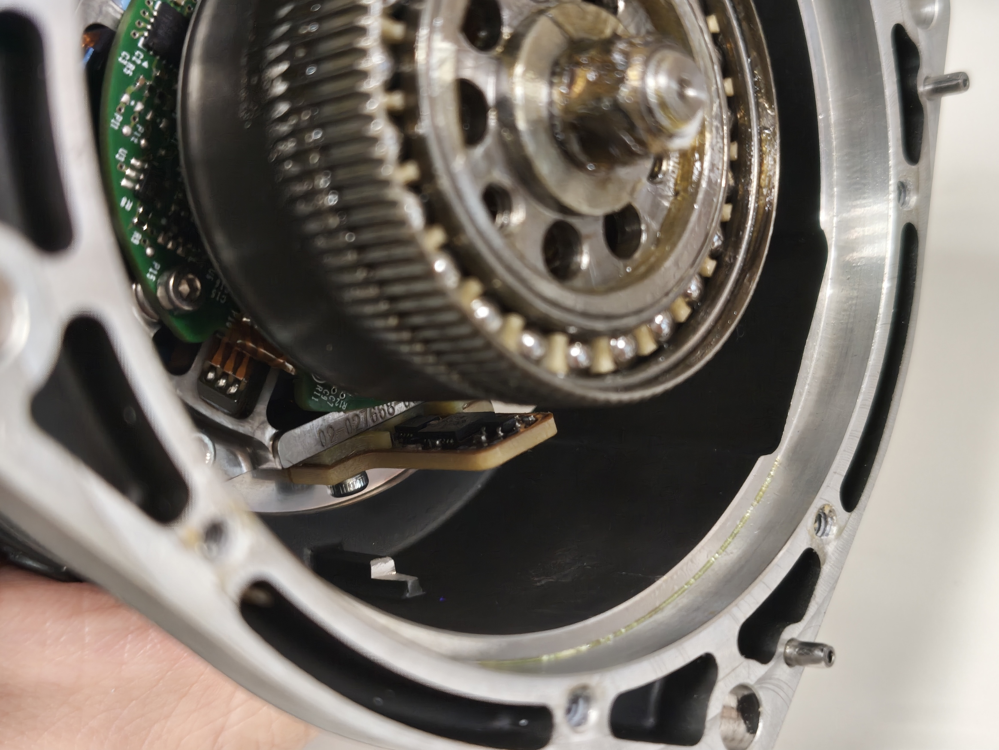{width=48%}

**Figure 23 —** The secondary output-encoder Hall-IC (iC-Haus iC-MU) found at the harmonic-drive
output stage of the hip-X motor.

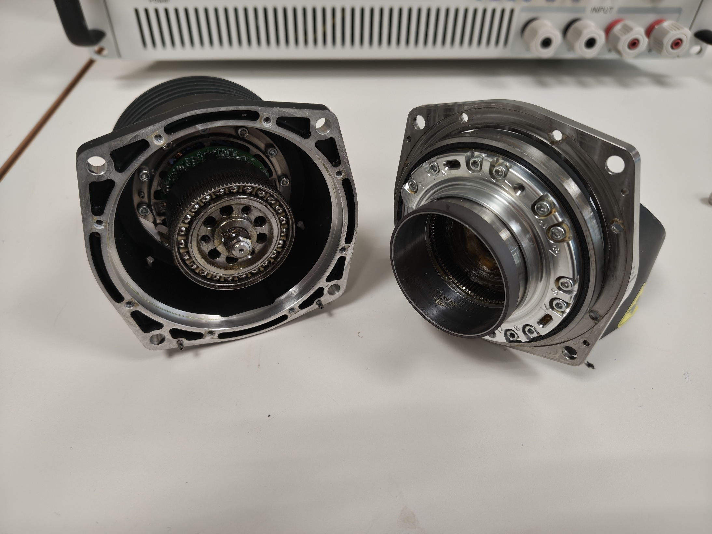{width=48%}

**Figure 24 —** The 50:1 harmonic drive of the hip-X actuator.

## The output-encoder swap

The decisive swap concerned the output encoder itself. As a first step, the entire rotor
assembly, main connector, encoder and force-feedback (load-cell) module together, was exchanged
between the two hind hip-X sockets. This moved the abnormal behaviour to the right socket as
intended, but it also raised a **load-cell hard fault**: the load cells are calibrated per
joint, so swapping them was not admissible, and the fault prevented the motors from powering
on. The swap was therefore refined (Figure 25): only the **main connector PCB carrying the
secondary output encoder** was exchanged, while each rotor and its load cell were returned to
their original stator. The driver boards were likewise returned to their original sides.

{width=48%}

**Figure 25 —** The rotor / output-encoder assemblies during the swap; only the secondary
output-encoder PCB was ultimately interchanged, with the load cells kept in their original
joints.

With the output-encoder PCBs interchanged between the hind hip-X sockets and the magnets held
fixed, the load-cell fault disappeared and both joints thereafter responded to articulation: the
previously frozen behaviour was gone (Figure 26). A residual mechanical offset remained on the
left joint, measurable as a consistent difference in the joint's centre position relative to the
opposite side when each leg was jogged by hand across its full range of motion; the per-joint
offsets recorded in this way are given in Table 7. The physical range (the delta between the
mechanical limits) was consistent across all four legs, indicating that the offset was a fixed
calibration/seating shift rather than a change in travel.

{width=48%}

**Figure 26 —** The secondary output-encoder PCB, close up, after the swap.

Table: **Table 7 —** Hind hip-X mechanical offsets from the horizontal centre, measured by manually jogging each leg to its limits. The physical range was consistent across joints. Interpretation of the readings is reported in [Ming, SS-TBD].

| Joint | Offset from centre |
|---|---|
| Right hind hip-X (reference side) | ~0.12 rad (≈6.8°) |
| Left hind hip-X (faulty side) | ~0.53 rad (≈30°) |

At the hardware level the swap sequence was conclusive in one specific sense: interchanging the
secondary output-encoder PCB physically moved the abnormal behaviour between joints, whereas
interchanging the drivers, cables, rotors and magnets did not. The fault therefore resides in a
**physical hardware difference at the secondary output encoder**, and not in the driver, wiring,
rotor or diametric magnet. The electrical nature of that board, and the question of what,
precisely, could differ between two nominally identical encoders, is taken up in Section 7.

# Methodology 3 — Encoder electrical reverse-engineering

Localising the fault to the secondary output-encoder board raised a hardware question that could
only be answered by reverse-engineering the board's electrical design: what does the board
consist of, how is it wired, and could a configuration or connection difference, rather than a
dead component, explain the behaviour? This chapter reports that reverse-engineering: the
board's components and pinout, the decoding of its configuration EEPROM, the routing that
connects it to the rest of the actuator, and the bench attempt to read the sensor directly.

## Board components and pinout

The secondary output-encoder PCB carries three principal devices: the **iC-MU** Hall-IC itself,
an **external EEPROM** holding its configuration, and an **RS-485/RS-422 differential
transceiver** (an Analog Devices LTC2863 [6]) that carries the sensor's serial output off-board
(Figure 27). A set of test pads exposes the EEPROM's SDA/SCL lines, presumably for programming,
together with the transceiver's differential outputs and supply near the main connector.

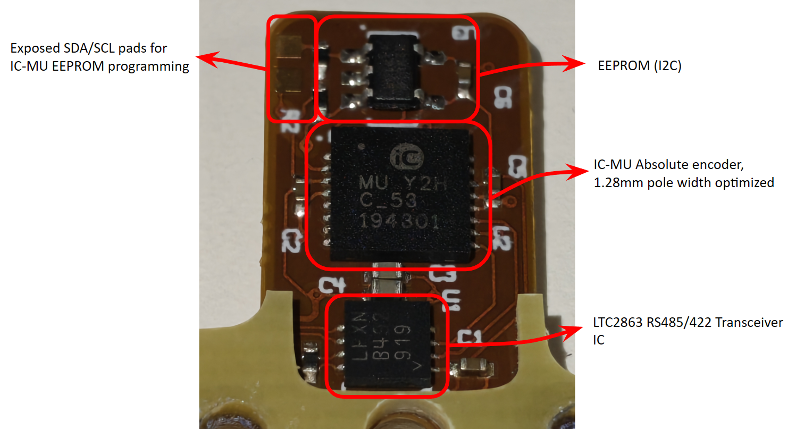{width=60%}

**Figure 27 —** The secondary output-encoder PCB, showing the iC-MU Hall-IC, the external
configuration EEPROM and the RS-485/RS-422 transceiver.

Probing established the board's wiring as a textbook **ExtSSI** slave node (Figure 28,
Table 6). Pin PA0 of the iC-MU is tied to ground, which selects the BiSS fall-back protocol; the
transceiver's receiver output (RO) drives PA1 (the clock input, MA), and the transceiver's
driver input (DI) is fed from PA3 (the slave data output, SLO); PA2 (slave in, SLI) is grounded,
correct for a single unchained slave. This is exactly the connection the iC-MU datasheet [5]
prescribes for its `MODEA=7` ExtSSI mode, and it is consistent between the boards inspected.

{width=60%}

**Figure 28 —** The iC-MU pinout and connections, wired as an ExtSSI slave node.

Table: **Table 6 —** iC-MU Port-A (ExtSSI, `MODEA=7`) pinout, as wired on the board and cross-checked against the datasheet [5].

| iC-MU pin | Function (MODEA=7) | Connection |
|---|---|---|
| PA0 | NPRES | tied to GND (selects BiSS fall-back) |
| PA1 | MA (clock in) | ← LTC2863 RO |
| PA2 | SLI (slave in) | GND (correct for a single, unchained slave) |
| PA3 | SLO (data out) | → LTC2863 DI |

## Configuration-EEPROM decode

To characterise the encoder's configuration, the contents of its external EEPROM were decoded
against the iC-MU datasheet [5], register by register. Per the datasheet, the iC-MU attempts to
load its configuration from this EEPROM three times at start-up and, failing that, boots on
default values, with the fall-back output protocol selected by PA0 (LOW → BiSS). The decode
established that the stored configuration is a coherent, datasheet-normal ExtSSI set-up rather
than anything corrupt or exotic: amplitude control is enabled (so the manual gain fields are
intentionally inert), Port A is configured as ExtSSI and Port B as ABZ, the interpolation filter
is set to the 14-bit / 39 dB `FILT4` setting, the master/nonius period count `MPC=5` gives up to
19-bit absolute resolution, and the config-range CRC16 (`0x52A8`) matches the value computed over
the configuration bytes. Table 8 lists the most diagnostic registers; the full annotated map is
given in Appendix B. The upper offset/preset region reads as erased (all `0xFF`) with a
non-matching CRC8, consistent with an unused absolute-offset block rather than a fault.

Table: **Table 8 —** Selected iC-MU EEPROM configuration registers (full annotated map in Appendix B).

| Addr | Raw | Field(s) | Decoded meaning |
|---|---|---|---|
| `0x05` | `88` | `ENAC=1`, `CIBM=8` | Amplitude control active; bias-current trim nominal (manual gains ignored). |
| `0x0B` | `07` | `MODEA=7`, `MODEB=0` | Port A = ExtSSI (NPRES/MA/SLI/SLO); Port B = ABZ. |
| `0x0E` | `14` | `LIN=1`, `FILT=4` | Linear/radial scanning; FILT4 = 39 dB, 14-bit interpolation. |
| `0x0F` | `05` | `MPC=5` | 32 master / 31 nonius periods; ≤19-bit absolute resolution. |
| `0x13-0x14` | `FF 0F` | `RESABZ=0x0FFF` | ABZ resolution = (0x0FFF + 1) × 4 = 16 384 edges. |
| `0x21-0x22` | `52 A8` | `CRC16` | Matches the CRC computed over the config ranges: configuration is intact. |
| `0x3E-0x3F` | `69 43` | `MFG_ID` | `0x6943` = ASCII "iC" (iC-Haus). |

The significance of this decode is that it removes configuration corruption from the list of
possible faults at the hardware level: the board's programmed set-up is internally consistent
and datasheet-normal. The complementary *comparative* result, the bench read that established
the faulty and healthy encoders to be byte-identical in their stored configuration, and hence
that the difference between them is physical rather than programmed, was performed on the signal
layer and is reported in [Ming, SS-TBD]; this report owns the decode, not that comparative read.

## Signal routing

Probing to trace the sensor signals out to the main motor connector showed that no such route
exists: none of the transceiver's differential A/B/Z/Y outputs reach the main connector.
Instead, the secondary output encoder is wired **directly to the motor driver's STM32
microcontroller**, which consumes the post-reduction joint angle locally, formats feedback, and
streams it to the main compute module over the driver's own CAN transceiver. This routing is a
hardware finding in its own right, and it also explains, at the hardware level, why the driver
rather than the main computer governs the joint's local behaviour; the control-loop
*consequences* of that routing are a signal-layer matter and are discussed in [Ming, SS-TBD].

## Bench read attempt and its limit

A final effort was made to read the iC-MU directly on the bench while it remained installed in
the actuator, so that the sensor's raw output could be observed as hardware. The differential
signal pairs proved inaccessible at the driver, but probing showed that the four test pads
beside the main connector are the transceiver's `A/B/Y/Z` differential pairs, with two further
pads providing +5 V and ground (Figure 30). Wires were soldered to these pads (Figure 31) and
the encoder section powered from a bench supply, drawing about 0.11 A at 5 V.

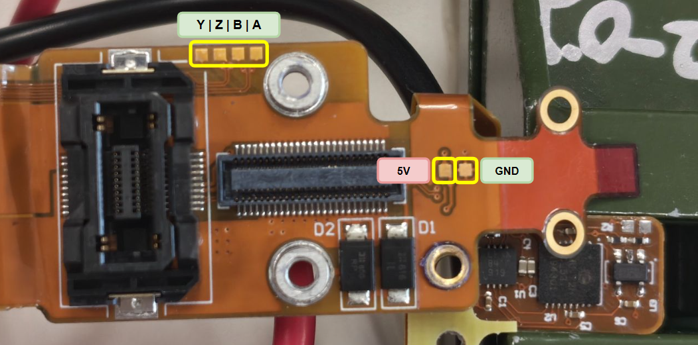{width=55%}

**Figure 30 —** The flex-PCB test-pad map: the four pads beside the main connector are the
transceiver's A/B/Y/Z differential pairs, with +5 V and ground alongside.

{width=48%}

**Figure 31 —** Wires soldered to the flex-PCB test pads to power and monitor the encoder
section on the bench.

The read did not succeed, and the reasons are themselves hardware findings. Establishing serial
communication with the iC-MU over its RS-485/RS-422 transceiver required either a matching
full-duplex four-wire transceiver or two standard RS-485 transceivers, neither of which was
available. The alternative, driving the sensor with the motor driver's own STM32 and observing
the transceiver output lines on an oscilloscope (Figure 32), was blocked by a power issue:
although the driver's 5 V rail measured a correct 4.994 V, the 3.3 V rail that supplies the STM32
sat at only about 0.4 V. Tracing the supply showed that the 5 V feeds an LT3029 LDO regulator [7]
whose 3.3 V output was the dead rail, and that the LDO appeared to be enabled by another rail
rather than by the 5 V supply, so the microcontroller never powered. Powering the STM32 directly
from the 3.3 V pad still produced no edges on the monitored `A` and `Y` lines, indicating that
the driver was not, under these bench conditions, periodically polling the sensor to generate an
output. The bench read therefore reached its limit: reading the sensor's raw registers requires
either the correct RS-485/RS-422 interface hardware or a way to command the driver's STM32 to
poll the encoder, and neither was available within the project's timeframe. This dead end is
carried forward as a limitation and a concrete piece of future work.

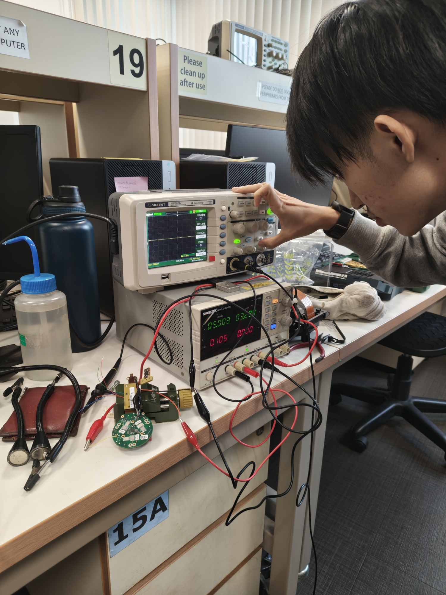{width=48%}

**Figure 32 —** The oscilloscope bench read attempt; no edges were observed on the monitored
transceiver lines, the driver STM32 remaining unpowered on its 3.3 V rail.

## The DB25 payload-port bypass

One further electrical obstacle stood between the restored power system and any motor test, and
it was resolved by reverse-engineering a connector. Enabling motor power raised an "uncovered
payload port" stop function: Spot detects whether its DB25 payload-port covers are fitted, and
one cover was missing. Inspection showed the cover contained no active components, only a mating
DB25 shell, so the detection had to be passive. Probing the cover for continuity revealed that
**four sets of pins are shorted together** inside it, and replicating those shorts on the open
port, first with tinned jumper wires, later with a female DB25 header wired to match, cleared
the lockout and allowed motor power to be enabled. The pin-short map is given in Appendix D.

# Evaluation, Limitations and Improvements

## Power system

Against its objective, the power-system work succeeded in full: both battery modules were
rebuilt on their original BMS boards in the OEM 14s4p form factor and both reached a **full,
balanced charge**, with pack #2 reporting an excellent balance index of 0.02. The single most
important finding is that the rebuild's reliability was governed almost entirely by **spot-weld
quality**: the same class of defect manifested first as cell-group imbalance and then as a
battery-fault lockout from one disconnected joint, and both traced back to bends and stress
points in the nickel-strip routing imposed by the first bracket design. The V2 pack turned that
finding into a design improvement: added bracing, OEM-derived spacer positions, laser-cut
slotted strips that avoid stacking, and captured-nut BMS mounting. The result was a pack that
welded cleanly and balanced correctly on the first attempt, assembled in a fraction of the time.
Two limitations remain. The OEM phase-change thermal filler was not reproduced, because no
workable off-the-shelf equivalent was found; the pack instead relies on the silicone thermal
sheet and the retained NTC monitoring, and sourcing a suitable PCM is a clear improvement for a
future build. And the pack #2 SoC repair depended on an improvised fastener (a cardboard shim in
place of the missing flex-connector fastener), which should be replaced with a proper part.

## Actuator, at the hardware level

The mechanical investigation met its objective of localising the fault to a physical part. By
moving each candidate part in turn between the faulty and healthy hind hip-X actuators, the
hardware work **physically ruled out** the driver electronics, the motor wiring, the rotor and
its magnet, and the primary rotor encoder as the location of the fault, because none of those
swaps carried the abnormal behaviour with the part. Conversely, interchanging the **secondary
output-encoder PCB** did move the behaviour between joints, localising the fault to a physical
hardware difference at that board. The subsequent electrical reverse-engineering then narrowed
what that difference could be: the board is a datasheet-normal ExtSSI iC-MU node whose stored
configuration decodes as internally consistent (CRC-valid), which removes configuration
corruption as an explanation and points to a physical device-level difference rather than a
programming one. The overarching limitation is that the hardware work stops, by design, at "the
fault is a physical hardware difference"; the confirmation of that fault at the signal level, the
comparative read establishing the two encoders' configurations byte-identical, and the eventual
repair are reported in [Ming, SS-TBD].

The most concrete hardware limitation was the **bench read that could not be completed**.
Reading the iC-MU's raw registers in situ was defeated by two independent obstacles: the absence
of a suitable RS-485/RS-422 interface (a full-duplex four-wire transceiver, or two RS-485
transceivers), and the driver STM32 remaining unpowered because its 3.3 V LDO rail did not come
up under bench conditions. Each obstacle implies its own improvement: procuring the correct
transceiver hardware to read the sensor directly, and working out the LDO's enable condition so
the driver can be powered and commanded to poll the encoder on the bench. A further, per-joint
limitation is the residual mechanical offset left after the encoder swap: correcting it by
re-clocking the rotor housing is possible only in coarse 45° steps given the eight securing
screws, so a finer calibration route would be needed to remove it cleanly. Finally, the epoxy
coating over the controller board prevented direct probing of several test points, a practical
constraint on any future in-situ electrical work.

# Conclusion

The hardware objectives of the project were met. Spot's power system was rebuilt from two dead
modules into two modules that charge to a full, balanced state, by replacing the degraded cells
with OEM-spec Samsung INR18650-30Q cells on the original BMS and, critically, by driving the
rebuild's reliability through spot-weld quality and a second-generation bracket design. In
parallel, the faulty hip-X actuator, a previously undocumented piece of hardware, was
characterised from the outside in: its 50:1 harmonic-drive, dual-encoder construction was
established by teardown; a disciplined sequence of component swaps localised the fault to a
physical difference at the secondary output-encoder board; and reverse-engineering that board
established its ExtSSI iC-MU design, pinout, direct-to-STM32 routing and CRC-valid configuration,
narrowing the fault to a physical device difference rather than a programming or wiring one.

The skills developed span the rebuild and characterisation of lithium battery systems and their
BMS, the mechanical teardown and reassembly of a precision harmonic-drive actuator, and the
electrical reverse-engineering of a Hall-encoder PCB, including datasheet-level EEPROM decoding
and pinout tracing. The principal thread of future work follows directly from the one hardware
task that could not be completed: instrumenting the iC-MU sensor with the correct
RS-485/RS-422 interface (or a powered, polled driver STM32) to read its raw output on the bench.
Beyond that, a physics-based simulation of the actuator and its encoder signal chain is proposed
as a means of exploring the fault without repeated teardown; it is noted here strictly as
**planned** work, no such simulation having been built within this project. The signal-layer
confirmation of the fault and the encoder repair that returned the joint toward service are
reported in the companion report [Ming, SS-TBD].

# References

[1] Boston Dynamics, "Spot Battery Safety Data Sheets (SDS)." Available: https://support.bostondynamics.com/s/article/Spot-Battery-Safety-Data-Sheets-SDS-49922

[2] Falcon PEV, "18650 Samsung 30Q 3000 mAh Battery Cell." Available: https://www.falconpev.com.sg/products/18650-samsung-30q-3000mah

[3] "Comprehensive Teardown Report of the Quadruped Robot Spot," r/IndiaTech, Reddit. Available: https://www.reddit.com/r/IndiaTech/comments/1nwsba2/comprehensive_teardown_report_of_the_quadruped/

[4] LHS Materials, "Thermal Regulation." Available: https://www.lhsmaterials.com/thermal-regulation

[5] iC-Haus, "iC-MU Position Encoder — Pole Width 1.28 mm," datasheet. Available: https://ave-nl.com/wp-content/uploads/2021/12/MU_datasheet_F2en_AVE.pdf

[6] Analog Devices, "LTC2863 — RS-485/RS-422 Transceiver," datasheet. Available: https://www.analog.com/media/en/technical-documentation/data-sheets/2862345fc.pdf

[7] Analog Devices, "LT3029 — Dual Low-Dropout Linear Regulator," datasheet. Available: https://www.analog.com/media/en/technical-documentation/data-sheets/3029fb.pdf

[8] Boston Dynamics, "Spot Software Updates." Available: https://support.bostondynamics.com/s/article/Spot-Software-Updates-70795

# Appendices {.unnumbered}

## Appendix A — Project timeline (Gantt) {.unnumbered}

The hardware work reported here ran from mid-May to mid-July 2026 across the phases below (dates
from the project's session logs). Diagnostic-interpretation and repair sessions on the signal
layer are the companion report's and are omitted.

| Phase | Sessions (2026) | Dates |
|---|---|---|
| Battery diagnosis & decision to rebuild | Inspection → restoration attempt → disassembly & sourcing | 13, 20, 21 May |
| Pack #1 design | Pack-design research; spacer CAD | 25 May |
| Pack #1 assembly & welding | Assembly sessions 1-4 | 28, 29 May; 2, 4 Jun |
| Pack #1 test, fault-find & rework | Cell-group diagnosis + DB25 bypass; weld rework & verify | 5, 11 Jun |
| Spot teardown / leg extraction | Teardown; pack #2 disassembly | 15 Jun |
| Pack #2 (V2) | V2 design; assembly; SoC-cable repair & full charge | 16, 17, 18 Jun |
| Actuator swaps | Driver & cable swaps | 18, 19 Jun |
| Motor disassembly | Secondary encoder identified | 25 Jun |
| Output-encoder swap | PCB-only swap; ROM/offset measurement | 30 Jun |
| Encoder electrical RE | EEPROM decode; routing; bench read attempt | Jun-16 Jul |

## Appendix B — iC-MU EEPROM configuration register map {.unnumbered}

Full annotated decode of the external configuration EEPROM against the iC-MU datasheet [5]. Raw
dump (hex), addresses `0x00`-`0x3F`:

```
00000000 00 00 00 00 00 88 00 00 00 00 00 07 00 00 14 05
00000010 00 4e 20 ff 0f 13 10 02 00 00 00 00 00 00 00 00
00000020 00 52 a8 ff ff ff ff ff ff ff ff ff ff ff ff ff
00000030 00 00 00 00 00 00 00 00 4d 55 07 00 00 00 69 43
```

| Addr | Raw | Register / fields | Decoded setting |
|---|---|---|---|
| `0x00` | `00` | `GC_M`, `GF_M` | Master coarse/fine gain 0 (ignored, amplitude control enabled). |
| `0x01` | `00` | `GX_M` | Master cosine gain adjust = 1.000. |
| `0x02` | `00` | `VOSS_M` | Master sine offset = 0 mV. |
| `0x03` | `00` | `VOSC_M` | Master cosine offset = 0 mV. |
| `0x04` | `00` | `PH_M` | Master phase adjust = 0°. |
| `0x05` | `88` | `ENAC=1`, `CIBM=8` | Amplitude control active; bias-current trim nominal 0%. |
| `0x06` | `00` | `GC_N`, `GF_N` | Nonius coarse/fine gain 0 (ignored). |
| `0x07` | `00` | `GX_N` | Nonius cosine gain adjust = 1.000. |
| `0x08` | `00` | `VOSS_N` | Nonius sine offset = 0 mV. |
| `0x09` | `00` | `VOSC_N` | Nonius cosine offset = 0 mV. |
| `0x0A` | `00` | `PH_N` | Nonius phase adjust = 0°. |
| `0x0B` | `07` | `MODEA=7`, `MODEB=0` | Port A = ExtSSI (NPRES/MA/SLI/SLO); Port B = ABZ (A/B/Z/NER). |
| `0x0C` | `00` | `CFGEW` | All error/warning messages enabled. |
| `0x0D` | `00` | `ACC_STAT`, `NCHK_CRC`, `NCHK_NON`, `ACRM_RES`, `EMTD` | Actual (non-accumulated) status; cyclic CRC + nonius verification active; no auto-reset; min error-display time 0 ms. |
| `0x0E` | `14` | `LIN=1`, `FILT=4` | Linear/radial scanning; FILT4 = 39 dB suppression, 14-bit interpolation. |
| `0x0F` | `05` | `MPC=5` | 32 master / 31 nonius periods; ≤19-bit absolute resolution. |
| `0x10` | `00` | `*_MT` | No external multiturn data; MT chain/verification disabled. |
| `0x11` | `4E` | `OUT_ZERO=2`, `OUT_MSB=14` | Serial output inserts 2 zero bits; output MSB = user-data bit 27. |
| `0x12` | `20` | `MODE_ST=2`, … | Binary output, no SSI ring; raw master/nonius track data; LSB = bit 0. |
| `0x13-0x14` | `FF 0F` | `RESABZ=0x0FFF` | ABZ / FlexCount resolution = (0x0FFF + 1) × 4 = 16 384 edges. |
| `0x15` | `13` | `SS_AB=1`, `FRQAB=3`, … | AB step 1; startup counting visible; AB limit ≈ 781.25 kHz (320 ns edge distance). |
| `0x16` | `10` | `LENZ`, `CHYS_AB=1`, `PP60UVW`, `INV_*` | Z index = 90°; AB hysteresis 0.175°; UVW 120°; A/B/Z not inverted. |
| `0x17` | `02` | `RPL=0`, `PPUVW=2` | Config mode, no restriction; UVW commutation = 1 pole pair. |
| `0x18` | `00` | `TEST` | Normal mode. |
| `0x19-0x20` | `00` | `SPO_BASE`, `SPO_0…14` | Nonius track-offset slopes all zero. |
| `0x21-0x22` | `52 A8` | `CRC16` | 0x52A8, matches CRC over config ranges 0x00-0x20, 0x30-0x3F. |
| `0x23-0x27` | `FF` | `OFF_ABZ` | Absolute-output offset block reads erased (unused). |
| `0x28-0x29` | `FF FF` | `OFF_UVW` | UVW offset reads erased. |
| `0x2A-0x2E` | `FF` | `PRES_POS` | Preset position reads erased. |
| `0x2F` | `FF` | `CRC8` | Does not match posted offset/preset bytes (block unused). |
| `0x30` | `00` | `PA0_CONF` | Falling edge on NPRES = NO_FUNCTION. |
| `0x31` | `00` | `EDSBANK` | No EDS. |
| `0x32-0x33` | `00 00` | `PROFILE_ID` | 0x0000. |
| `0x34-0x37` | `00` | `SERIAL` | 0x00000000. |
| `0x38-0x3D` | `4D 55 07 00 00 00` | `DEV_ID` | ASCII "MU", then 0x07 00 00 00. |
| `0x3E-0x3F` | `69 43` | `MFG_ID` | 0x6943 = ASCII "iC" (iC-Haus). |

## Appendix C — Encoder-board pinout {.unnumbered}

See Figure 28 and Table 6 for the ExtSSI wiring, and Figure 29 for the connector-flex test pads
(the transceiver's `A/B/Y/Z` differential pairs plus +5 V and ground) used for the bench read
attempt of Section 7.

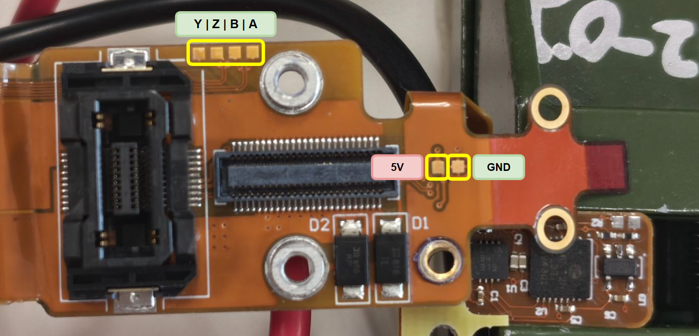{width=60%}

**Figure 29 —** The connector-flex test pads, mapping to the transceiver's A/B/Y/Z outputs and
the encoder supply rails.

## Appendix D — DB25 payload-port cover pin shorts {.unnumbered}

The four sets of pins shorted inside the OEM payload-port cover, reverse-engineered by continuity
probing and replicated on the open port to bypass the cover-detection lockout (Section 7).

{width=60%}

**Figure 33 —** The DB25 payload-port cover pin shorts. Replicating these four shorts on the open
port clears the "uncovered payload port" motor-power lockout.

## Appendix E — Battery CAD iterations {.unnumbered}

The V1 cell spacer (Figure 8) reproduced the irregular OEM cell positions in PC-CF. The V2
brackets (Figure 18) added bracing, OEM-derived spacer positions, ABS-GF construction and
captured-nut BMS mounting, and are compared against the cleaner pack #2 weld result in Figure 19.
